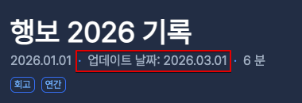

## 1. 명령어로 게시글 작성하기

```shell
# hugo new content posts/[제목(URL)]/index.md
hugo new content posts/hugo-blog-guide/index.md
```

- 명령어가 익숙하지 않으면 직접 만드는 방법이 간편하다고 생각할지도 모른다. 하지만 Hugo는 명령어를 사용했을 때 빛을 발한다. 익숙해지는 것을 강력 추천한다.
- IDE에서 따로 Live templates[^1], Snippets[^2]을 활용하지 않아도 기본 구조를 자동으로 넣어준다.

### 1.1 기본 템플릿 수정하기

> [!INFO] archetypes/default.md 수정

```text
+++
date = '{{ .Date }}'
draft = true
title = '{{ replace .File.ContentBaseName `-` ` ` | title }}'
+++
```

- 게시글을 쉽게 작성할 수 있도록 명령어를 사용했다. 하지만 기본 템플릿을 수정하지 않으면 front matter를 역시 추가 수정해야 한다. 마음에 들지 않는다.

```yaml
---
title: '{{ replace .File.ContentBaseName "-" " " | title }}'
date: '{{ .Date }}'
categories: []
tags: []
draft: true
---
```

- `Archetypes`를 사용하면 명령어로 만들어지는 기본 템플릿도 수정할 수 있다. 자신의 환경에 맞게 수정한다.
  - `yaml`, `toml`, `json` 형식을 지원한다. 가장 대중적으로 사용하는 `yaml` 형식을 추천한다.

## 2. 업데이트 날짜 표시하기

### 2.1 Front matter 수정하기

> [!INFO] config/_default/params.toml 수정



- `showDateUpdated` 옵션의 값을 `true`로 수정한다.

### 2.2 수정 날짜 자동으로 추가하기(feat. Git)

> [!INFO] config/_default/hugo.toml 수정

- `enableGitInfo = true`를 추가한다.
  - 옵션을 추가하지 않으면 front matter를 직접 수정해야 하는 번거로움이 발생한다.

## 마치며

### 참고 자료

- [Archetypes](https://gohugo.io/content-management/archetypes/)
- [Lastmod](https://gohugo.io/methods/page/lastmod/)
- [Gitinfo](https://gohugo.io/methods/page/gitinfo/)

[^1]: https://www.jetbrains.com/help/idea/using-live-templates.html
[^2]: https://code.visualstudio.com/docs/editing/userdefinedsnippets
