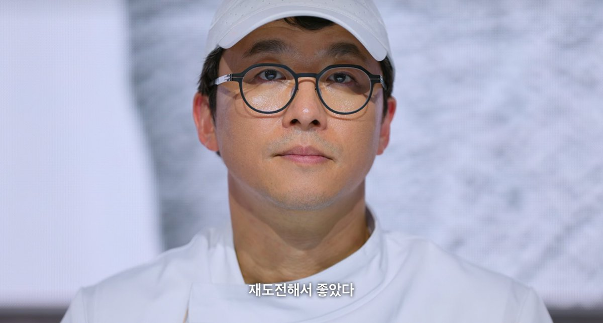



> 두려움은 정신을 죽인다. 두려움은 완전한 소멸을 초래하는 작은 죽음이다. 나는 두려움에 맞설 것이며 두려움이 나를 통해 지나가도록 허락할 것이다.
> 두려움이 지나가면 나는 마음의 눈으로 그것이 지나간 길을 살펴보리라. 두려움이 사라진 곳에는 아무 것도 없을 것이다. 오직 나만이 남아 있으리라. 
> <출처: 『듄 1(DUNE)』(프랭크 허버트, 황금가지, 2021)>

## 챌린지: Lose My Mind

- 3주 동안 [인프런 완강챌린지](https://inf.run/UV96r)에 참여했다.
- 완주는 했다. 하지만 아쉬움이 남는다.
- 라이브에 집중력이 떨어졌다.

## 도전: AEAO

- 블로그 테마 변경
- 프로젝트 1차 마무리
- 2025년 회고

## 마치며

<흑백요리사: 요리 계급 전쟁 시즌 2>에 최강록 씨의 마무리가 인상 깊었다. 재도전. 나의 재도전은 어디까지 갈 수 있을까. 어떤 방향이든 좋다. 마침표를 찍고 싶다.

미래는 여전히 불투명하다. 불안도 사라지지 않았다. 그래도 현재에 집중하려 한다. 오늘 할 수 있는 만큼만, 끝까지 연소하기를.

### 참고 자료

- [경항신문 '최강록 인터뷰'](https://www.khan.co.kr/article/202601161753001)

