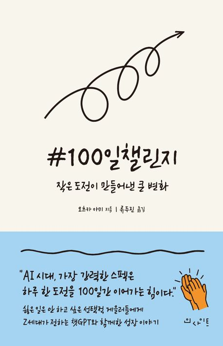

## 책 속으로

- 100일 챌린지는 네 인생의 방향을 바꾸는 전환점이 될 수 있어. 그 경험은 젊은 네 경력에서 무엇보다 소중한 자산이 될 거야. 그러니 반드시 끝까지 해내길 바란다.
- 프로그래머는 주어진 일을 코드로 구현하는 역할을 하지. 하지만 엔지니어는 시스템 전반을 바라보고 효율적인 알고리즘을 선택해서, 그 시스템을 어떻게 실현하고 확장할지,
  장기간에 걸쳐 운용할 수 있을지를 고민해야 해.
- 취업 준비생이 자기 PR을 잃어버리는 것처럼 나도 재사용 가능한 프로그램을 만들겠다고 자신했지만, 결국 매번 다시 새로 만들면서 '이게 정답이다'라는 확신을 점점 잃고 있었다.
  화면 속 코드는 마치 수정에 수정을 거쳐 정체성을 잃은 나 자신을 반영하는 것처럼 느껴졌다.
- 오후 10시가 되기 직전에야 겨우 X에 포스팅을 마쳤다. 이번에도 '이게 정답'이라고는 할 수 없다. 나중에 보면 또 고치고 싶어질지 모른다. 그래도 지금은 그저 다음을 향해 나아갈 수밖에 없다.
  정답만을 좇던 날들이 허무하게 느껴지더라도, 다음 한 걸음을 내디디지 않으면 아무것도 바뀌지 않는다. 나는 식어 버린 커피를 한 모금 마시고, 머릿속에서 다음 작품을 구상하기 시작했다.
- 프로그래밍 학습이 지속되지 않는 가장 큰 이유는 공부 방식이 지루해서다. 문법을 외우거나 코드를 베끼는 방식은 정말 재미가 없다. 반면에 바로 게임을 만들 수 있었던 내 방식은 분명 더 즐겁고
  몰입도도 높았다. 다만 그런 경험을 글이나 논리로 설득하는 건 어렵다. 그러니 직접 느낄 수 있도록 유사 경험을 제공하자. 허들이 높긴 하지만 도전해 보는 것이다.
- '학생이니까'라는 말은 더 이상 통하지 않고, 나 역시 그런 말에 기대고 싶지도 않다. Fake it till you make it. 이제는 진짜처럼 행동할 때다.
- '챗GPT가 알려 주는 건 문제의 최단 경로겠지. 하지만 그게 전체를 고려한 최선인지는 오직 나만이 판단할 수 있어.' 그래, 작품의 주체는 어디까지나 나 자신이다.

## 마치며

### 참고 자료

- [『#100일챌린지』(오츠키 아미, 인사이트, 2025)](https://product.kyobobook.co.kr/detail/S000217034649)

