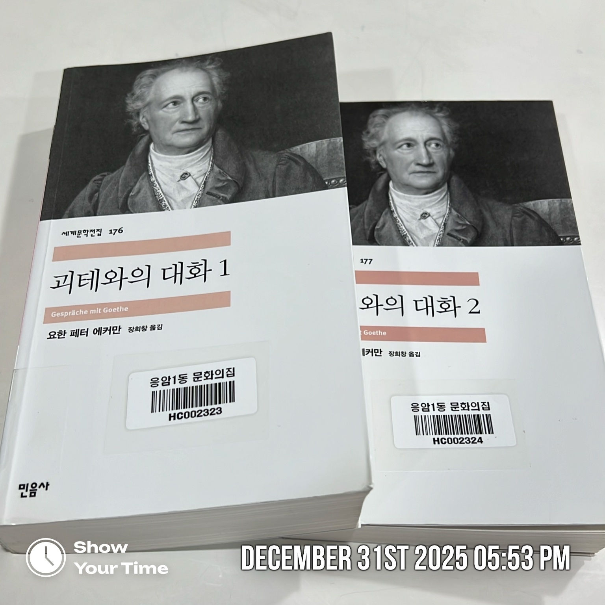

> 독일의 문호 괴테는 말했다. "아는 것만으로는 충분하지 않다. 활용해야 한다. 의욕만으로는 충분하지 않다. 실행해야 한다."

- 시간 관리법을 소개하는 책에서 소개한 위 문장을 읽고 괴테가 궁금했다.

## 책 속으로

### 괴테와의 대화 1

> 동물들은 그들의 기관(器官)을 통해 배운다고들 말한다. 하지만 나는 인간에 대해서는 이렇게 말하고 싶다. 
> 인간은 그가 아주 우연하게 행한 일을 통해서 자신에게 잠재해 있는 더욱 높은 것을배우게 되는 법이라고.

> 우리는 자기 위에 있는 것을 인정하지 않으려 함으로써 자유를 얻는 것이 아니라, 자기 위에 있는 것을 존중함으로써만 자유로워지는 거네.
> 왜냐하면 우리는 자기 위에 있는 것을 존경함으로써 자기를 거기까지 높이고, 위에 있는 것의 가치를 인정함으로써 우리 자신도 고귀한 것을 몸에 지니면서,
> 아울러 그것과 동등하게 될 가치가 있다는 점을 분명히 보여주기 때문이네.

> '나의 작품은 대중화 될 수가 없네.' 그러니 그렇게 하려고 생각하거나 노력하는 자는 오류를 범하고 있는 셈이지. 나의 작품은 대중을 위애 쓰인 것이 아니라,
> 그 어떤 비슷한 것을 원하고 추구하며 같은 방향으로 나아가고자 하는 소수의 사람들을 위한 것이네.

> 사람이란 무언가를 이우려고 한다면 우선 무언가가 '되어야' 한다네.

> "『파우스트』"는 헤어릴 수 없는 작품이네. 인간의 오성으로써 아무리 접근해 보았자 헛일이야. 게다가 이 제1부는 개인의 그 어떤 어두침침한 의식 상태에서
> 생겨났다는 점을 고려해야 하네. 하지만 바로 이 어두침침한 점이 사람들의 마음을 끌어당기고 있는 것이지. 그래서 사람들은 온갖 불가해한 문제에 매달릴 때와
> 마찬가지로 이것에 달라붙어 애를 쓰는 것이네."

> "사람이 혼자 있다는 건 좋은 일이 아니야." 하고 괴테가 말했다. "특히 혼자서 일을 한다는 건 좋지 않아. 무언가 일을 이루려고 하면 오히려 다른 사람의 협력과
> 자금이 필요한 거네."

> "충고를 한다는 것은 미묘한 일이네." 하고 괴테가 말했다. "이 세상의 일이란 사려 깊게 시도한다 하더라도 실패하는 경우가 있고 반면에 어처구니없는 일들이
> 성공하는 경우도 종종 있네. 그러므로 잠시나마 그러한 이치를 생각해 본 사람이라면 누군가에게 함부로 충고하지는 않을 테지. 결국 충고를 구한 자는 앞일을 내다
> 보지 못한 셈이 되고 충고를 하는 자도 주제넘게 되고 마니까 말이야. 그러므로 충고를 하려면 자기 자신도 함께 도울 수 있는 일에 한해야만 하네."

### 괴테와의 대화 2

> "자네는 활에 취미를 가지고 있다가 아주 훌륭한 지식을 얻게 되었군. 실제 체험으로만 얻을 수 있는 살아 있는 지식 말이야. 그 어떤 열정을 가진다는 건 그래서
> 언제나 좋은 걸세. 우리로 하여금 사물의 핵심으로 이끌어주니까. 또한 탐구하면서 오류를 범하는 것도 좋아. 그 과정에서 무언가를 배우게 되고, 사실 자체뿐만 아니라
> 그 전체 과정을 통찰하게 되니까 말이야."

> "그 어떤 책이 삶 그 자체보다 비도덕 적일 수 있다는 건 있기 어려운 일이네. 우리의 삶은 날이면 날마다 직접 보이지는 않지만 귀로 들려오는 파렴치한 장면들로
> 이미 넘쳐나고 있으니 말이야. 그러니 어린아이들의 경우라 할지라도, 어떤 책이나 연극 작품 때문에 나쁜 영향을 받지나 않을까 하고 염려할 필요는 조금도 없는 것이네.
> 방금 말했다시피 하루하루의 삶 자체가 가장 영향력이 큰 책보다 더 교훈적이니까 말이야."

## 마치며

- 괴테의 목소리가 들리고 눈에 보이는 경험을 만들어주는 책이다. 바이마르 현장으로 초대한다.
    - 굉장히 다양한 주제를 다뤘다. 의료, 문학, 예술, 새, 창작, 정치 등
- 소개한 작품 중 『파우스트』, 『색채론』이 가장 궁금하다.
- 괴테라는 인물에 대한 사전 지식 하나 없이 궁금증 하나로 시작했다. 중간에 그만두고 싶은 마음도 컸는데 끝까지 읽고 나니 뿌듯하다.

### 참고 자료

- [『괴테와의 대화 1』(요한 페터 에커만, 민음사, 2008)](https://product.kyobobook.co.kr/detail/S000000620313)
- [『괴테와의 대화 2』(요한 페터 에커만, 민음사, 2008)](https://product.kyobobook.co.kr/detail/S000000620314)
