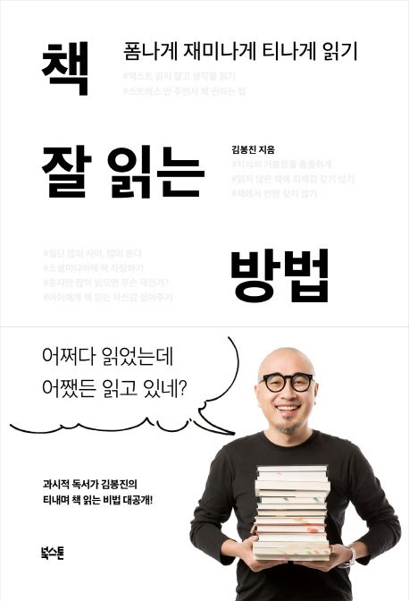

평소 독서를 즐긴다. 하지만 최근, 고민이 생겼다. '똑같은 시간, 효과적으로 읽을 수 없을까?' 고민을 안고 살던 중 『책 잘 읽는 방법』이라는 제목이 눈에 띄어 읽기 시작했다.

- 책 추천이 가장 인상 깊다. 각 절마다 주제에 맞는 책을 자연스럽게 추천해 줘서 사고를 확장시키기 좋았다. 심지어 부록도 따로 있다. 『논어』 언급이 많아 궁금증이 생겼다.
- 실용적 방법 보단 저자의 경험을 통해 독서를 바라보는 태도를 개선하기 좋았다.
- 최근 만화책을 주로 읽어 긴 글을 읽기 버겁게 느껴졌다. 하지만 이 책은 오히려 편안하게 다가왔다. 시집처럼 짧고 간결한 형식으로 구성되어 가볍게 넘기며 읽기 좋았다. 현재 독서가 부담처럼 느껴진다면 추천한다.
- 일주일에 한 권 읽기로 시작해서 어렵고 두꺼운 책 읽기도 도전하고 싶다.

**<참고 자료>**

- [『책 잘 읽는 방법』(김봉진, 북스톤, 2018)](https://product.kyobobook.co.kr/detail/S000001899585)