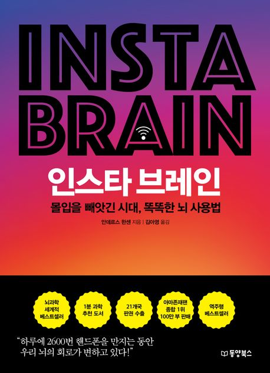

최근 들어 감정을 제대로 다스리지 못하는 순간이 잦았다. 충동적으로 행동하고 사소한 일에도 예민하게 반응했다.
왜 이런 반응을 하는지 실마리를 얻고 싶었다. 그러다 '뇌'라는 단어에 시선이 머물렀고 이 책을 선택했다.

이 책은 인간의 뇌가 디지털 환경 속에서 어떻게 반응하고 변하는지를 다룬다.
특히 [프로게이머 페이커 선수의 추천](https://nl.go.kr/NL/contents/N40800000000.do?schM=view&schId=EV-20250912162054723100)
이라 기대했다. 디지털 환경에 오래 머무르면서도 자기 관리와 끊임없는 성장을 위하 노력하는 그가 선택한 책이라면, 분명 나에게도 도움이 될 것이라 생각했다.

## 책 속으로

> 뇌는 상당히 많은 다양한 과정들을 동시에 다룰 수 있는 놀라운 능력을 가지고 있다.
> 하지만 우리의 정신적 대역폭(mental bandwidth)에서 심각하게 제한을 받는 영역이 있는데, 바로 집중력이다.
> 우리는 한 번에 오로지 한 가지 일에만 집중할 수 있다.

> 정보가 어딘가 다른 곳에 저장될 거라고 믿으면 뇌가 더는 신경을 쓰지 않는데, 이런 현상을 '구글 효과' 혹은 '디지털 기억 상실증'이라고 부른다.
> 뇌는 정보 그 자체가 아니라 정보가 어디에 저장되어 있는지를 우선순위로 삼는다.

> 살아남으려면 도파민을 분비시키는 대상에 집중하는 것이 중요하다. 그런데 24시간 동안 10분에 한 번씩 소량의 도파민 주사를 놓아주던 뭔가를 빼앗긴다면,
> 당연히 스트레스를 받게 되고 우리의 뇌는 생존에 필요한 뭔가가 사라졌다고 받아들인다.

> 세상을 살아가려면 특정한 지식이 필요하고 비판적인 질문도 던지면서 정보를 평가해야 한다. 점점 더 복잡해지는 시대이니만큼 이런 태도는 더욱 필요하다.

> 우리는 디지털 기기를 현명하게 사용해야만 하며 문제점이 있다는 사실을 주지해야 한다.
> 그렇지 않으면 간식 코너의 영양가 없는 칼로리 처럼 영양가 없는 디지털 칼로리에 적응해 버릴 위험이 있다.
> 휴대전화 기술은 우리를 2.0 버전으로 만들 수 있는가 하면 0.5 버전으로도 만들 수 있다.

## 마치며

- 후반부까지 몰입한 흔치 않은 책이다. 설득력 있는 문장과 논리적인 전개 덕분에 집중력을 잃지 않았다.
- 페이스북, 트위터, 스냅챗 등 일상에서 자주 접하는 다양한 소셜 미디어 사례를 제시하여 더욱 입체적으로 이해했다.
- 단순한 문제점을 나열하는 데 그치지 않고 반대 주장까지 제공한 점이 인상 깊었다. 덕분에 비판적으로 수용하고 스스로 생각해 보는 귀한 기회를 얻었다.
- 스티브 잡스가 자녀의 스마트폰 사용을 제한한 사례가 흥미로웠다.
- 디지털 환경을 바라보는 비판적인 시각을 넓히고 삶을 재정비하기에 적합한 책이다.
    - 행복, 불안, 과거, 운동 등 문제를 다양한 시선으로 바라본다.
    - 휴대전화 사용 시간을 확인하고 줄이기 시작했다.

### 참고 자료

- [『인스타 브레인』(안데르스 한센, 동양북스, 2020)](https://product.kyobobook.co.kr/detail/S000001758926)
- [만송이지 EZ '아이폰 사용시간 절반으로 줄이는 7가지 방법'](https://youtu.be/lhVRwZTrCkY?si=xkP1pZuOZRNarygL)
