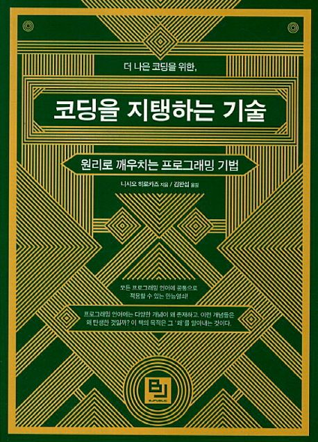

> 프로그래밍 언어. 누구냐, 너?

- 프로그래밍 언어에서 공통적으로 사용되는 문법의 발전과정을 파악할 수 있다. 역사책 같다.
- 정리와 저자의 조언이 인상 깊다. (학습법)
- 가볍게 읽기 좋다.
- 일부 번역이 자연스럽지 않다. (총칭형)
- 프로그래밍 언어는 왜 그럴까? 고민한 적 있다면 추천한다.

## 8장. 형(Type)

- **비트열은 해석 방법에 따라 전혀 다른 값이 된다. '어떤 종류의 값'인지 의미를 표현하기 위해 타입을 도입했다.**
- 타입 시스템은 단순한 타입 정의에서 동적 타입, 사용자 정의 타입, 객체 지향, 제네릭, 타입 추론등 다양한 방향으로 발전했다.
- 동적 타입 언어는 런타임에서 타입을 판별하기 때문에 타입 선언이 필요하지 않다. 대신 언어마다 공통된 인터페이스[^1]를 제공하여 메모리 상에서 다양한 타입을 일관된 방식으로 처리한다.

## 11장. 객체와 클래스

- 패키지는 관련있는 함수, 변수를 묶음으로 표현하기 위해 도입했다. 
  - Python과 Ruby는 모듈(Module)이라 한다.

[^1]: Python의 PyObject, Ruby의 VALUE, JavaScript의 tagged pointer, Nan boxing
