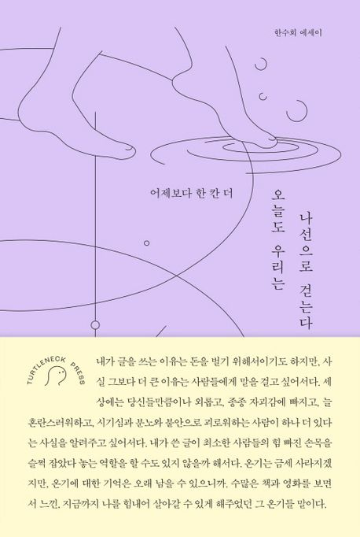

명절에 참여한 [챌린지](https://inf.run/nzwqP)에서 추천받은 인문학 책을 읽었다.

## 책속으로

> 마음이 조급해질 때는 오지 않는 기차를 다섯 시간 동안이나 기다리던 인도 사람들의 느긋함을 떠올린다. 바쁘고 힘들 때면 깨끗하고 고요한 거리들을 천천히 산책하던 시간과, 맛있는 커피를 앞에 두고 즐기던 시원한
> 오후와, 수영장에서의 망중한, 산호를 줍던 해변을 기억한다. 이 세상에는 길이 하나밖에 없고, 정답은 정해져 있다는 압박감을 느낄 때면 여행지에서 만난 수많은 인생을 생각한다. 나는 이런 것들을 위해서 여행을
> 떠나는 것이다.

> 나이를 먹을수록 새로운 사람을 만나 돈독한 우정을 쌓기는 점점 더 힘들어진다. 물론 학교나 직장에서처럼 내가 원하든 원하지 않든 다양한 사람과 매일 얼굴을 맞대야만 하는 상황이 줄었기 때문일 수도 있다. 하지만
> 진짜 이유는 따로 있다. 우리에게도 그간 기나긴 우정의 역사가 쌓였기 때문이다. 이제는 어떤 사람이 우리를 힘들게 하는지 알기 때문이다. 이제는 어떤 우정이 우리를 질식하게 만드는지도 알기 때문이다. 그리고 때로
> 안다는 것은 나를 가두는 담장이 된다.

> 인간의 개성은 타인과 내가 부딪치는 경계에서 마찰흔처럼 드러난다. 자기만의 방에 갇힌 채 내 좁은 시야 안에 들어오는 것들만을 세상의 전부로 여기지 않기 위하여, 나만 피해자라는, 내 인생만 망했다는 착각에서
> 헤어나기 위하여, 자기 자신을 있는 그대로 받아들이기 위하여 우리는 오늘도 문을 열고 타인과 지지고 볶는 삶을 향해 한 발을 내딛는 것이다.

> 가만히 앉아서 생각만 하는 건 쉽다. 하지만 그걸 눈에 보이는 무언가로 만들어내기 위해서는 거의 초인적인 노력이 필요하다. 그리고 나는 그 노력을 할 수 있느냐 없느냐가 뭔가를 해낸 사람과 하지 않은 사람의
> 결정적 차이라고 본다.

> 내가 글을 쓰는 이유는 돈을 벌기 위해서이기도 하지만, 사실 그보다 더 큰 이유는 사람들에게 말을 걸고 싶어서다. 세상에는 당신들만큼이나 외롭고, 종종 자괴감에 빠지고, 늘 혼란스러워하고, 시기심과 분노와
> 불안으로 괴로워하는 사람이 하나 더 있다는 사실을 알려주고 싶어서다. 내가 쓴 글이 최소한 사람들의 힘 빠진 손목을 슬쩍 잡았다 놓는 역할을 할 수도 있지 않을까 해서다. 온기는 금세 사라지겠지만,
> 온기에 대한 기억은 오래 남을 수 있으니까. 수많은 책과 영화를 보면서 느낀, 지금까지 나를 힘내어 살아갈 수 있게 해주었던 그 온기들 말이다.

집중력을 잃어갈 때 끝내 전달한 저자의 진심은 이 책을 다시 읽고 싶은 이유를 완성시켰다.

## 마치며

저자는 자신의 경험을 그가 사랑한 예술작품(책, 영화)과 함께 풀어낸다. 예술 작품과 함께 전하는 메시지는 때로 담담한 위로가 되고, 때로는 깊은 통찰로 다가왔다.

부제처럼 '어제보다 한 칸 더'나아가고 싶은데, 현실은 제자리걸음처럼 느껴진다면 이 책을 추천한다. 꾸밈없이 기록한 짧은 일기장은 온기를 넘어 기억으로 남을 것이다.

### 참고 자료

- [『오늘도 우리는 나선으로 걷는다』(한수희, 터틀넥프레스, 2023)](https://product.kyobobook.co.kr/detail/S000211600335)
