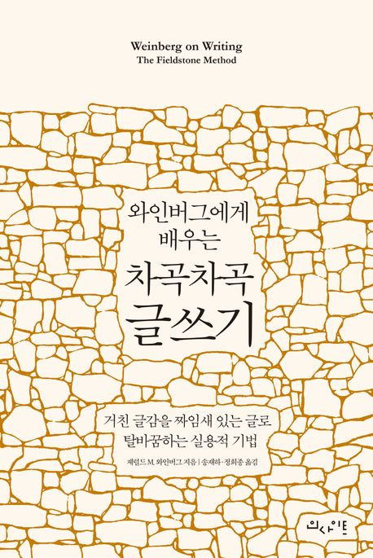

글쓰기는 언제나 어려운 숙제였다. 특히 기술적인 내용을 명확하게 전달하는 글을 쓰고 싶다는 욕구가 컸다.
그러던 중, 기술 분야에서 종사한 저자, 글쓰기, 재판까지 이어지는 소식은 이 책을 선택하게 만들었다. 특히 실용적 기법'을 강조하여 더욱 기대를 가졌다.

『와인버그에게 배우는 차곡차곡 글쓰기』는 글을 작성하는 전반적인 과정을 담았다. 글감을 수집하는 방법을 가장 강조하며 연습 방법을 조언한다.

## 책 속으로

- 영리한 사람이 행복해지는 한 가지 방법은 머릿속에서 불같이 일어나는 생각과 감정의 거대한 실타래를 세상에 풀어내 자신을 표현하는 것이다.
- 안전이란 허튼 믿음이다. 세상에 존재하지 않을 뿐 아니라 인간으로 태어난 이상 온전히 경험할 수도 없다. 지금 당장 피하고 보는 게 위험에 부딪치기보다
  안전하리란 생각은 길게 보면 착각에 지나지 않는다. 인생은 용감무쌍한 모험이 아니면 그저 공허할 따름이다.
- 좋은 돌을 모으고 싶다면 "이야, 완벽한 돌이군. 한데 들어 올리는 건 무리겠어."라는 말을 입 밖에 내서는 안 된다.
- 솔리테어 게임으로 정신 상태도 판단한다. 나는 걸핏하면 근육통이 도져 그때마다 머릿속에 '만성 먹구름'이 낀다. 먹구름이 끼면 먹구름 속에 있으면서도 그 속에 있는지조차 모르기 때문에 그 정신 상태로는
  글 구성처럼 어려운 작업은 금물이다. 이때 솔리테어 게임을 한판 해보고 정신 상태를 가늠해 본다. 무심코 게임을 해 봐서 못 이기면 글을 구성하는 일에 손을 대서는 안 된다. 이럴 때에는 낮잠을 한숨 자거나
  가볍게 체조를 해서 먹구름을 걷어 낸다.
- 엉성한 작품은 완벽한 작품의 반대말이 아니다. 엉성한 작품은 그 순간에 최선을 다한 작품의 반대말이다.

## 마치며

저자는 아이디어를 '돌'에 비유하여 글쓰기 방법을 설명했다. 하지만 비유가 낯설어 직관적으로 와닿지 않았다. 아마도 돌로 이뤄진 건축물을 흔히 볼 수 없어 발생한 문제라고 생각한다.
기대가 컸던 만큼, 아쉬움이 크다.

### 참고 자료

- [『와인버그에게 배우는 차곡차곡 글쓰기』(제럴드 M.와인버그, 인사이트, 2025)](https://product.kyobobook.co.kr/detail/S000215103627)