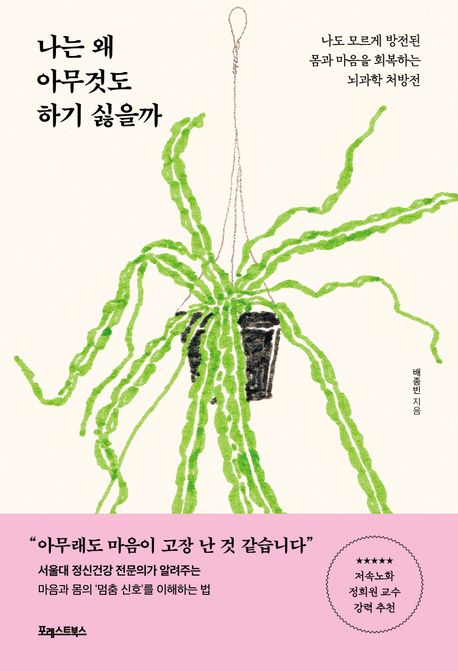

2025년, 벌써 절반이 지났다. 흥미도 사라지고 스트레스받는 일도 많아지면서 집중력을 완전히 잃었다. 제목을 본 순간 '읽어야겠다' 느꼈다. 문제 해결의 실마리를 얻고자 읽기 시작했다.

## 무기력 = ?

정신건강 전문의 저자가 진료실에서 쌓은 임상경험을 바탕으로 지친 마음을 위로한다. 과학적 근거와 사례를 추가하여 처방전을 전달한다.

- 무기력과 중독의 연관관계와 해결방법, 사례
- 편한 분위기에서 진료받는 느낌
- 얇고 큼직한 서체로 구성되어 읽는데 이틀도 걸리지 않음

> 무기력의 시간을 자연의 순환으로 바라보기를 권한다. 나무가 겨울 동안 잎을 떨구고 고요히 쉬듯, 무기력한 시간도 우리의 내면이 새로운 시작을 준비하는 과정일 수 있다. 봄이 오면 나무가 새싹을 틔우듯, 우리 역시
> 변화와 성장을 맞이할 날이 온다. 이처럼 무기력을 삶의 일부로 받아들이면, 지금의 시간이 영원하지 않다는 사실을 더 분명히 느낄 수 있다.

무기력을 개인의 의지 부족이 아닌 뇌와 감정의 자연스러운 반응으로 정의한 점이 가장 인상 깊다.

## 마치며

출구가 보이지 않는 끝없는 미로에 갇혀 막막하게만 느껴졌는데 위로를 받았다. 물론 무기력 상태가 완전히 사라졌다 할 수 없지만, 적어도 상태를 이해하고 인정하게 되었다.
앞으로 제안받은 실천법과 함께 작은 실천으로 조금씩 기운을 차렸으면 좋겠다.

**<참고 자료>**

- [『나는 왜 아무것도 하기 싫을까』(배종빈, 포레스트북스, 2025)](https://product.kyobobook.co.kr/detail/S000216482947)
