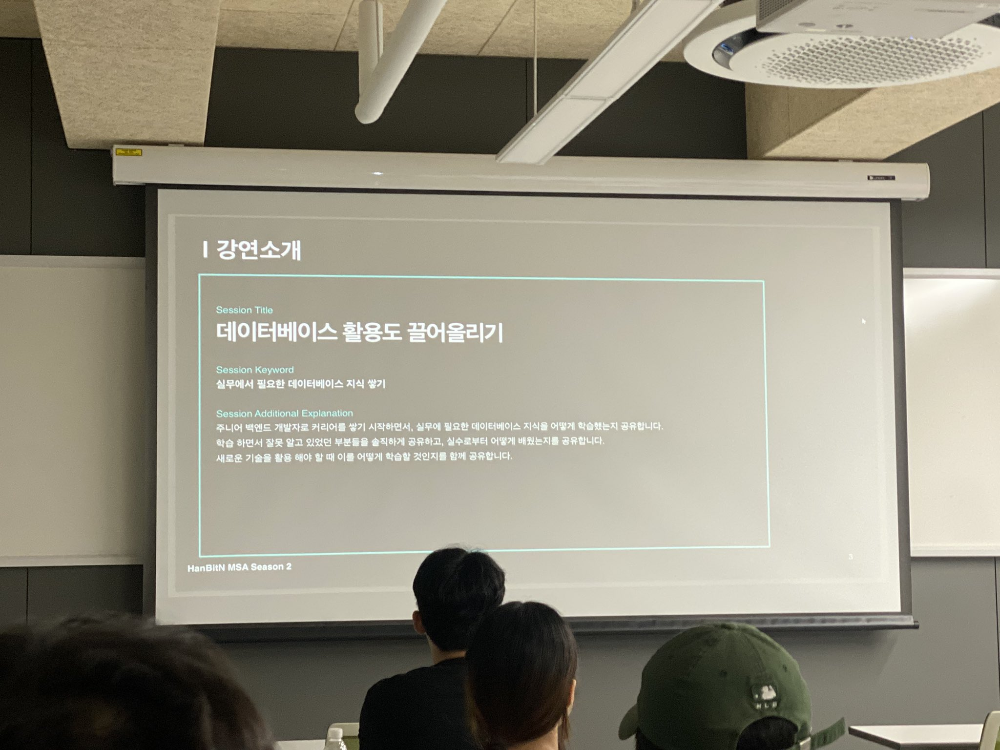

> 주니어 개발자를 대상으로 데이터베이스 운용 경험, 노하우를 공유한다.

7월 18일 목요일, 한빛앤에서 주최한 <데이터베이스 활용도 끌어올리기>에 다녀왔다.

마침 데이터베이스 관련 세미나가 열렸다. 우연히도 발표자분이 SNS에서 팔로우하고 있던 분이셨다.
주제도 흥미롭고, 어떤 이야기를 하실지 궁금해서 참석했다.

## 1. 비즈니스와 아키텍쳐의 관계

비즈니스란 무엇일까. 비즈니스란 '해결해야 하는 문제'다. 소프트웨어 아키텍처는 비즈니스를 해결하기 위해서 포괄하는 시스템이다.
흔히 아키텍처는 한 번 정해지면 바꿀 수 없다.

그렇다면 어떻게 하면 비즈니스 정보를 빠르게 얻을 수 있을까. 가장 빠르게 정보를 얻는 방법은 '동료들과의 대화'다. 비즈니스가 어떻게 구현되어 왔고 어느 상황에 있는지 이해하는 시간을 충분히
가지길 바란다.

## 2. 실무 적응하기: 데이터베이스 지식, 어디까지 알아야 할까?

가장 추천하는 방법은 동료와 '페어 프로그래밍(pair programming)'이다. 개인이 할 수 있는 최선은 '우선순위 정의하기'다.

## 3. 도메인 모델 패턴과 트랜잭션 스크립트 패턴

도메인 모델 패턴과 트랜잭션 스크립트 패턴에 자세한 내용은 책[^1]을 참고하자.

도메인 모델 패턴을 잘못 사용하게 되면 오히려 독이 된다. 비용이 커지는 작업이기 때문에 가급적이면 구성원과 함께 모범 사례(Best Practice)를 학습, 도입하는 방법을 권장한다.

## 4. 좋은 쿼리 작성하기

'N+1 문제'[^2]에 대해 이야기하신 것 같다.

## 5. 질문 & 답변

### Q. SQL이 어렵습니다. 어떻게 쉽게 접근할 수 있나요?

책과 펜을 쥐고 그림 그려보기를 추천한다.

### Q. 서버 인프라를 어떻게 배울 수 있을까요?

유튜브(YouTube), 기술문서 Hands-On Lab을 활용한다.

### Q. 괜찮은 데이터베이스 관리 툴이 있나요?

이전에 DBDiagram[^3]을 사용했다.

### Q. 한 가지를 깊게 하는 방법과 여러 제품을 포괄적으로 학습하는 방법 중 어떤 방법이 좋을까요?

자주 사용하는 데이터베이스로 API를 만들어보고 살을 붙이는 방법을 추천한다. 어떻게 설계할지를 자연스럽게 고민한다.

### Q. 추천하시는 책이 있나요?

필독! 개발자 온보딩 가이드[^4], 육각형 개발자: 시니어 개발자로 성장하기 위한 10가지 핵심 역량[^5]을 추천한다. 주니어 시니어 상관없이 읽기 괜찮은 책이다.

## 마치며

날씨가 좋지 않아서 발표가 지연됐다. 하마터면 어수선한 분위기로 진행될 뻔했다. 하지만 주최 측에서 현명하게 대처했다.
한빛미디어 책을 추첨해서 나눠주셨다. ~~눈여겨보던 책을 얻지 못해서 아쉬웠다.~~

"주니어 개발자, 그대들은 어떻게 살 것인가"

경험을 공유해 주신 발표도 흥미로웠지만 발표를 마치고 진행된 '네트워킹'도 인상 깊었다. 오랜만에 참석이라 낯을 가렸는데 슬기님께서 먼저 다가와주셔서 감사했다.
작년에 가장 재밌게 읽은 책을 슬기님께서도 흥미롭게 읽으신 것 같아서 반가웠다. 가볍게 담소를 나누고 다른 참가자 분들의 고민을 들었다.

경험을 공유하고 나누는 방법은 '재밌게 성장할 수 있는 한 가지 방법'이라고 생각한다. 막연한 미래지만 하고 싶은 일이 무엇인지 확고하게 다졌다.

**<참고 자료>**

- [Festa '한빛앤 MSA #2-8 데이터베이스 활용도 끌어올리기'](https://festa.io/events/5523)

[^1]: [마틴 파울러 『엔터프라이즈 애플리케이션 아키텍처 패턴』](https://product.kyobobook.co.kr/detail/S000001766248)
[^2]: [향로 'JPA N+1 문제 및 해결방안'](https://jojoldu.tistory.com/165)
[^3]: [DBDiagram](https://dbdiagram.io/home)
[^4]: [크리스 리코미니, 드미트리 리아보이 『필독! 개발자 온보딩 가이드』](https://product.kyobobook.co.kr/detail/S000202318866)
[^5]: [최범균 『육각형 개발자: 시니어 개발자로 성장하기 위한 10가지 핵심 역량』](https://product.kyobobook.co.kr/detail/S000203107475)
