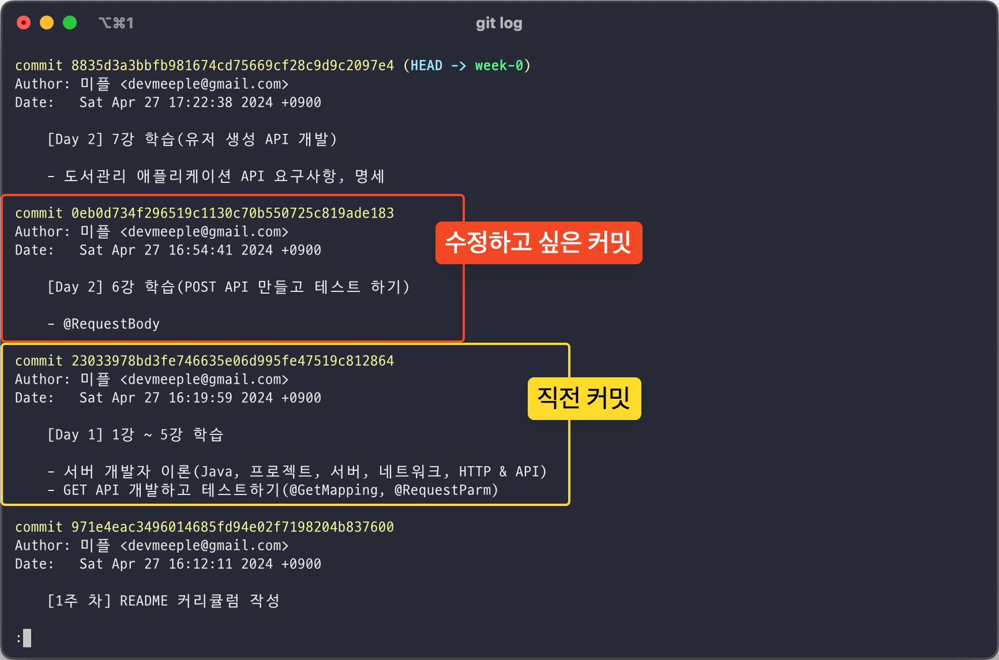
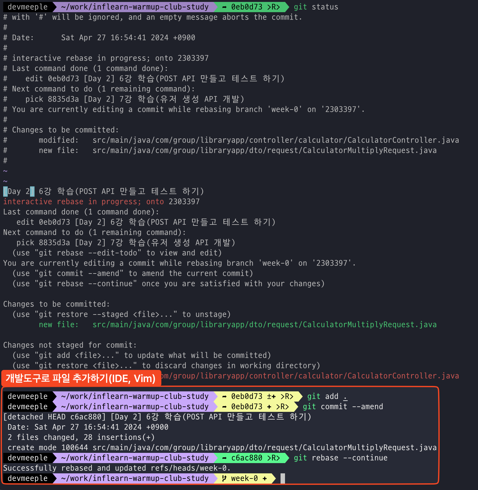

커밋을 작성할 때 수정한 파일을 제대로 확인하지 않았다. 여러 파일을 동시에 수정하거나 한 번에 커밋을 올리는 습관을 이어나가다 **결국 중요한 파일을 빼고 커밋했다.** 어떻게 문제를 해결할 수
있을까?

이전 커밋을 이야기할 때 흔히 마주하던 상황은 두 가지이다.

1. 최근커밋
2. 과거특정커밋

문제를 해결하기 위해서는 HEAD 위치를 이동해야 한다.

## 1. 최근커밋

```shell 
git commit --amend 
``` 

가장 긍정적이고 쉽게 해결할 수 있는 방법이다. 최근커밋의 경우 이미 HEAD가 마지막 커밋을 가리키고 있기 때문에 `--amend` 옵션으로 파일을 추가하거나, 커밋 메시지를 수정하면 된다.

## 2. 과거특정커밋

최근커밋에 비해서 골치 아프지만 반복하면 쉽게 해결할 수 있다. 먼저 수정하고 싶은 커밋을 알아보자.

```shell 
git log 
```



`git log` 명령을 실행해서 커밋내역을 확인한다. 예를 들어 **수정하고 싶은 커밋이 0eb0d7**로 시작하는 커밋일 때 HEAD를 바로 **직전커밋인 230339로 이동**해야 한다.

```shell
git rebase -i 230339 #<직전커밋>
```

직전커밋 로그로 이동하고 **pick으로 표시되는 해쉬값을 edit으로 수정한다.** 에디터로 작업을 마치면 해결하고 싶던 파일을 작성하고 추가하면 된다.



전체과정은 다음과 같다. 개발도구로 파일을 추가한 후 커밋 메시지를 수정했다.

## 마무리

흔히 마주하던 2가지 상황을 알아봤다. 커밋을 최소한의 단위로 잘 나눠야 된다고 한번 더 느꼈다. 분기를 잘 나눠야 충돌과 같은 다른 문제가 발생했을 때도 쉽게 해결할 수 있다. 

> 만약 협업을 진행 중이고 이미 원격저장소에 올린 상황이라면 추가 작업이 필요하다.
