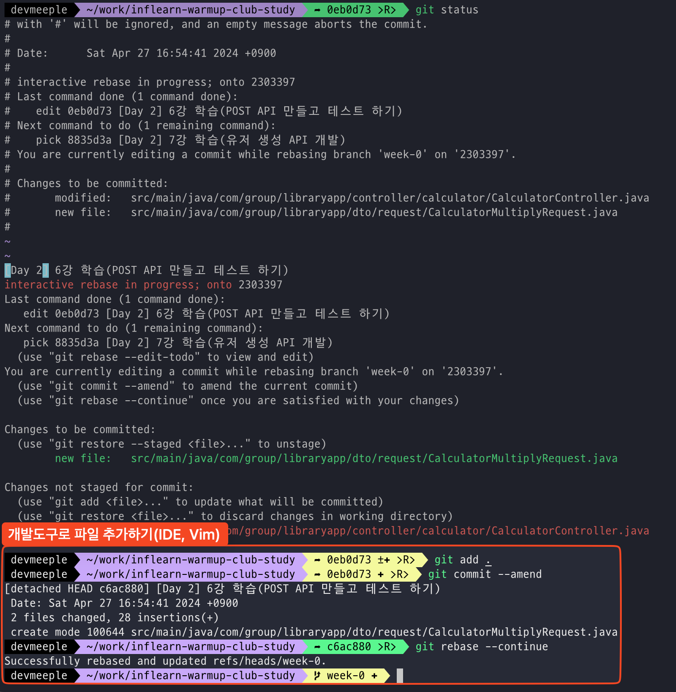

명료한 커밋 메시지를 통해 의도를 전달한다. 하지만 가끔은 실수한다. 잘못된 커밋메시지를 작성했는지 모르고 묵혔다. 어떻게 문제를 해결할 수 있을까?

이전 커밋을 이야기할 때 흔히 마주하던 상황은 두 가지이다.

1. 방금 만든 커밋
2. 과거 커밋

## 1. 방금 만든 커밋 수정하기

```shell 
git commit --amend 
```

방금 작성한 커밋을 수정하기 위해서는 다음과 같이 작성한다.`amend(수정)`을 사용해서 쉽게 덮어쓴다.

> `--force-with-lease`: 원격저장소에 푸시한 커밋은 똑같이 수정하고 '강제 푸시' 해야 한다.

## 2. 과거 커밋 수정하기

```shell 
git log 
```

먼저 수정하고 싶은 커밋을 확인하자.

> 방금 만든 커밋 수정하기에 비해 골치 아프다. 하지만 금방 익숙해질 수 있다.

### 2.1 여러 커밋

```shell 
git rebase -i HEAD~n 
``` 

1. 마지막 커밋 `n`개를 표시한다.
2. `pick`을 `reword`로 수정한다.
3. 수정한 커밋 메시지를 작성하고 종료한다.

### 2.2 조금 더 오래된 커밋


`git log` 명령을 실행해서 커밋내역을 확인한다. 예를 들어 수정하고 싶은 커밋이 `0eb0d7`로 시작하는 커밋일 때 `HEAD`를 바로 직전커밋인 `230339`로 이동해야 한다.

```shell 
git rebase -i 230339 #<직전커밋> 
``` 

수정하고 싶은 커밋에 직전커밋 로그로 이동하고 `pick`으로 표시되는 해쉬값을 `edit`으로 수정한다. 에디터로 작업을 마치면 해결하고 싶던 파일을 작성하고 추가하면 된다.



개발도구로 파일을 추가한 후 커밋 메시지를 수정했다.

### 2.3 정리하기

여러 커밋을 수정하는 두 가지 방법을 알아봤다. 비교적 최근 커밋을 수정한다면 첫 번째(`git rebase -i HEAD~n`) 방법이 편리하다. 반면 조금 더 오래된 커밋을 수정해야 한다면 내역을 확인하고 직전
커밋으로 확인하는 두 번째 방법이 유용하다.

## 마치며

흔히 마주하는 두 가지 상황을 알아봤다. 커밋을 최소한의 단위로 잘 나눠야 된다고 한번 더 느꼈다. 분기를 잘 나눠야 충돌과 같은 다른 문제가 발생했을 때도 쉽게 해결할 수 있다.
더불어 명료한, 좋은 커밋 메시지를 작성하는 방법도 관심이 생겼다.

> 협업을 진행 중이라면 한번 더 확인하자. 커밋 내역 수정을 조심하자.

**<참고 자료>**

- [GitHub Docs 'Changing a commit message'](https://docs.github.com/en/pull-requests/committing-changes-to-your-project/creating-and-editing-commits/changing-a-commit-message)
