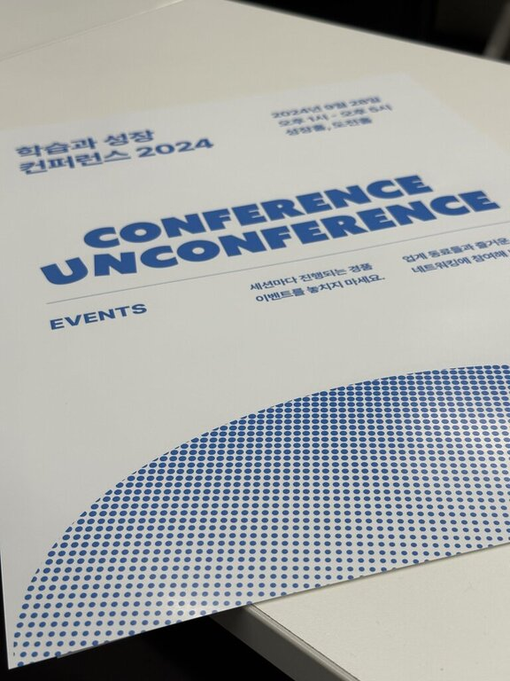

9월 28일, PuddingCamp '학습과 성장 컨퍼런스 2024'에 다녀왔다.
프로그램은 사전 공개 세션과 당일 공개 세션으로 진행됐다.

## 1. 도움을 주고 받으면서 배우고 성장하기 - 김태희·탐정토끼

'코칭의 삶'으로 어떻게 풍요롭게 변화했는지 들었다. 스터디 활용 방법과 위기를 기회로 바꿨던 경험을 공유해 주셔서 기억에 남았다.
탐정토끼님의 이야기를 들으니 시 한 편이 떠올랐다.

> 흔들리며 피는 꽃
>
>  흔들리지 않고 피는 꽃이 어디 있으랴 
> 이 세상 그 어떤 아름다운 꽃들도 
> 다 흔들리면서 피었나니 
> 흔들리면서 줄기를 곧게 세웠나니 
> 흔들리지 않고 가는 사랑이 어디 있으랴 
>  
> 젖지 않고 피는 꽃이 어디 있으랴 
> 이 세상 그 어떤 빛나는 꽃들도 
> 다 젖으며 젖으며 피었나니 
> 바람과 비에 젖으며 꽃잎 따뜻하게 피웠나니 
> 젖지 않고 가는 삶이 어디 있으랴

'열려있는 질문'으로 코칭 하시는 분이라고 느꼈다. 흔들릴수록 오히려 '자신'을 돌봐야 한다는 이야기에 동의한다.
탐정토끼님의 행보가 더욱 궁금해졌다.

## 2. 개발자, 개발 리더, 그리고 프로덕트 오너로! - 서지연·치즈

개발 리더의 관점은 한 번도 생각하지 않았다. 그런데 리더, 치즈님은 어떻게 문제를 바라보고 해결하려고 시도하시는지 들었다.

'리더도 똑같은 사람이다'라는 메시지가 느껴졌다. 예를 들어 동료가 출산휴가를 떠났을 때 슬랙봇 학습을 통해 문제를 해결하셨다는 이야기가 재밌었다.

치즈님이 아니었다면 '리더의 관점'이 당장 궁금하지는 않았을 것 같다. 하지만 이야기를 듣고 사고가 넓어졌다.
동료와 대화를 할 때 서로의 관점을 이야기한다면 '함께 성장하는 팀'에 한발 더 다가갈 수 있다고 생각한다.

팟캐스트를 들었던 시절이 떠올랐다. 최근에 쓰신 저서도 재밌게 읽었는데, 다음에 뵐 때는 꼭 사인받고 싶다.

## 3. 사이드 프로젝트가 너를 성장케 하리라(<u>예상치</u> 못한 방향으로) - 조단원·Chloé

사이드 프로젝트 1타 강사 콥셉트로로 긍정적인 에너지를 전달해 주셨다.

특히 '개발에 관심이 없을 때도 이용해 본 서비스'를 만든 개발자분의 이야기를 들어서 흥미로웠다. Chloé님의 초심이 기억에 남았다.
서비스를 시작한 이유, 운영할 때 중요하다고 생각하는 포인트를 참고했다.

올해는 산타파이브에서 어떤 서비스를 제공하실지 기대된다. 함께, 따뜻한 연말을 보내야지.

## 마치며

진행되는 세션도 좋았지만 사전 인터뷰가 인상 깊다. 다른 컨퍼런스에서 흔히 볼 수 없는 방식이고, 상세 비하인드가 궁금한 나의 니즈에 적합했다.
*인터뷰와 다시 보기를 함께 보면 재미가 배가 된다고 생각한다.

다양한 행사에 참여해도, 시작을 함께한 적은 없다. 운이 좋았다. 야구팬이 가을을 기다리듯이,
매년 가을이 기다려지는 또 하나의 컨퍼런스로 남길 바란다. 참여할 때마다 새로운 기분을 느끼고 싶다.
그리고 다음에는 커리어가 있는 상태로, 조금 더 네트워킹에도 적극적으로 참여하고 싶다.

**기대된다. 학습과 성장 컨퍼런스 2025**

**<참고 자료>**

- [PuddingCamp '학습과 성장 컨퍼런스 2024'](https://conference.puddingcamp.com/)
- [PuddingCamp '컨퍼런스'](https://puddingcamp.com/topics?page=1&category=conference)
