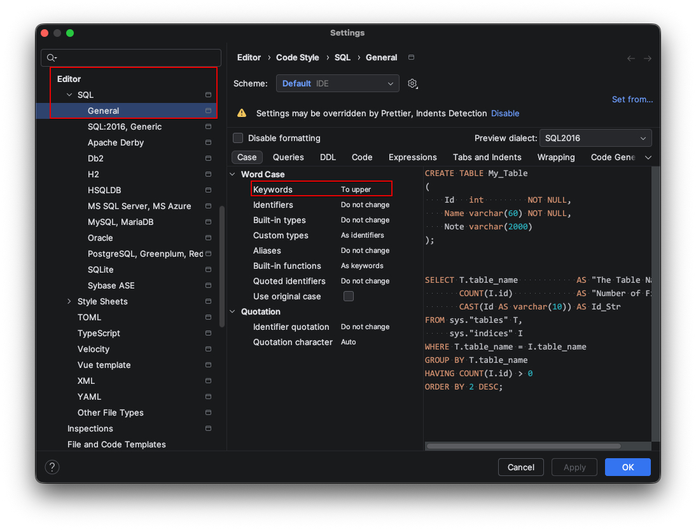

IDE에서 SQL을 작성하다 보면 `SELECT`, `FROM`, `WHERE` 같은 예약어를 소문자로 쓰기도, 대문자로 쓰기도 한다. 어떻게 하면 일관되게 작성할 수 있을까?

## 해결

작은 설정 하나로 일관성 있는 SQL 작성이 가능해졌다.

### IDE 설정하기

> File | Settings | Editor | Code Style | SQL | General > Case

**<참고 자료>**

- [데이터리안 'SQL 가독성을 높이는 다섯 가지 사소한 습관'](https://datarian.io/blog/good-sql-code)
