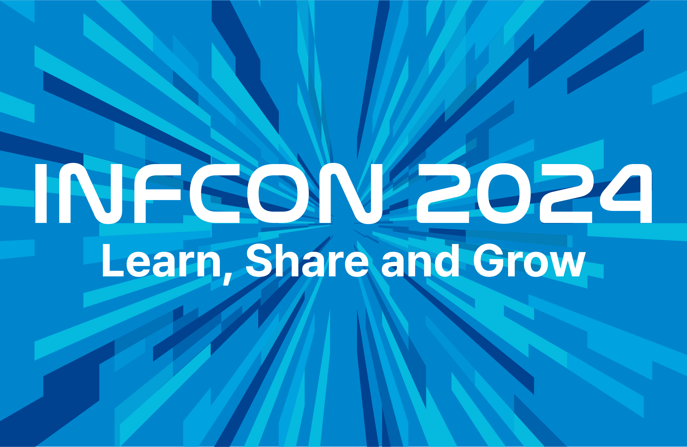

> 이 글은 인프런 라이브 방송과 인프콘 2024 공식 사이트를 기준으로 작성되었다. (2024. 07. 03)

## 들어가며

**인프콘(INFCON)은 인프런에서 주관하는 IT 콘퍼런스로, 2024년 8월 2일 금요일 코엑스에서 열린다.**

'우주'를 테마로 총 48개의 발표가 준비되어 있다.

### 무엇이 달라졌나요?

- 다양한 직무[^1]를 대상으로 진행된다.
- 딥다이브 세션[^2]이 추가됐다.

### 알아두면 유용한 정보

- 다양한 [이벤트](https://www.inflearn.com/conf/infcon-2024/info/event/)가 진행된다. 특히 스탬프 투어를 완료하면 한정판 굿즈를 받을 수 있다.
- 'MY 인프콘' 기능 활용을 권장한다.
    - 랠릿 이력서 연결: 네트워킹 파티에 참여하기 위해서 필수
        - 이력서 허브 등록은 이름, 연락처만 작성해도 등록가능하다.
    - 다양한 시간에 발표가 진행되므로 '나만의 시간표 만들기'(개인 시간표) 활용을 권장한다.
- 1층(그랜드볼룸)
    - 등록과 발표가 진행된다.
    - 인프런존에 포토존이 추가됐다.
    - 네트워킹 파티 사전 등록을 받는다.
    - 12개의 기업부스가 운영되고 다양한 선물을 제공한다.
- 2층(아셈볼룸)
    - 프로그램(딥다이브)이 진행된다.
    - 커뮤니티 부스, 발표 질의응답, 인프런 이벤트존&라이트닝, 네트워킹 파티가 진행된다.

## 인프런이 추천하는 직무별 추천발표

### 시작

- <a href="https://inflearn.com/conf/infcon-2024/session-detail/912/" target="_blank">인프랩 '인프랩의 도전: 글로벌 교육 플랫폼으로의 첫
  발걸음'</a>

### 백엔드

- <a href="https://inflearn.com/conf/infcon-2024/session-detail/877/" target="_blank">김재민 '지속 성장 가능한 설계를 만들어가는 방법'</a>
- <a href="https://inflearn.com/conf/infcon-2024/session-detail/880/" target="_blank">이일민(토비) '클린 스프링: 스프링 개발자를 위한 클린코드
  전략'</a>

### DevOps

- <a href="https://inflearn.com/conf/infcon-2024/session-detail/874/" target="_blank">심호진 '지난 4년간 6번의 무진장 행사를 통해 성장한
  DevOps 이야기'</a>

### 프론트엔드

- <a href="https://inflearn.com/conf/infcon-2024/session-detail/871/" target="_blank">하조은 'Next.js 블로그 모범 사례 탐구: Vercel
  리더십 블로그 아키텍처 파헤치기'</a>
- <a href="https://inflearn.com/conf/infcon-2024/session-detail/866/" target="_blank">유인동 '멀티패러다임 프로그래밍 언어의 시대 - 객체지향과
  함수형을 섞어야할 때!'</a>
    - 라이브코딩 진행예정

### 디자인

- <a href="https://inflearn.com/conf/infcon-2024/session-detail/891/" target="_blank">강영화 '10년 동안의 실패 이야기: 실패를 의미있는 일로
  탈바꿈하는 가장 쉬운 방법'</a>

### PM/PO

- <a href="https://inflearn.com/conf/infcon-2024/session-detail/899/" target="_blank">김영재 '성장하지 않아도 괜찮습니다'</a>

### 패널토크[^3]

- <a href="https://inflearn.com/conf/infcon-2024/session-detail/905/" target="_blank">원티드랩 패널토크 '디자인 시스템의 명과 암'</a>
- <a href="https://inflearn.com/conf/infcon-2024/session-detail/904/" target="_blank">인프랩 패널토크 '목적 조직 구조 안에서 개발팀이 일하는
  법'</a>
- <a href="https://inflearn.com/conf/infcon-2024/session-detail/901/" target="_blank">딜라이트룸 패널토크 '소수 인원으로 글로벌 1위 앱 서비스를
  만든 비결'</a>

## 질문 & 답변

### Q. 작년 경쟁률은 어땠나요? 몇 명을 뽑나요?

이전에 진행된 1, 2회의 경우 7대 1, 8대 1의 경쟁률을 기록했다. 최대 수용인원은 1800 ~ 2000명이다.

### Q. 환불은 어떻게 진행되나요?

추첨 선정자에 한해 참가권이 지급된다. 미선정자는 자동 환불 진행된다.

### Q. 모든 발표에 의자와 책상이 제공되나요?

의자는 모든 발표에 제공된다. 하지만 많은 인원을 수용하기 위해 2층에서 진행되는 딥다이브 프로그램만 책상이 제공된다.

### Q. 발표 진행 중, 이동이 가능한가요?

가능하다. 다만, 발표 분위기를 위해 문은 닫아둘 예정이다.

### Q. 특정 발표에 인원이 몰리면 어떻게 하나요?

안전문제로 수용에 제한이 생길 수 있다. 다만, 흔하지 않다.

### Q. 대학생도 네트워킹에 참가할 수 있을까요?

현장에 팀원, 서포터의 도움으로 무리 없이 참가가능하다.

### Q. 발표자료는 공유되나요?

발표자료는 발표자의 동의를 받고 있다. 동의된 자료와 영상은 인프런에서 강의형태로 공유될 예정이다.

### Q. 인프콘 영상 업로드 되나요?

인프런에 우선 올라가고, 유튜브는 추후 올라갈 예정이다.

## 마무리

참가신청은 [인프런](https://inf.run/NgR9K)에서 가능하다. 경쟁률이 아찔하지만 성장에 목마른 사람들을 만날 수 있는 축제의 장에 참가해 보자.

- [MY 인프콘](https://www.inflearn.com/conf/infcon-2024/share?year=2024&id=1148697&hash=devmeeple%40e53018af&name=%EB%AF%B8%ED%94%8C)

## 참고

- [INFCON 2024 공식 페이지](https://www.inflearn.com/conf/infcon-2024/)
- [유튜브 'INFCON 2024 즐기기 라이브 방송'](https://www.youtube.com/live/BICZOyzv7_0?si=POGyjIAPF2keDJyb)

[^1]: 개발자, PM/PO, 프로덕트 디자이너 등
[^2]: 소수 인원이 주제를 밀도 있게 깊이 있는 지식과 경험을 나눌 수 있는 특별한 시간
[^3]: 제품(Product)을 만들기 위해 여러 직군이 모여서 나누는 시간
