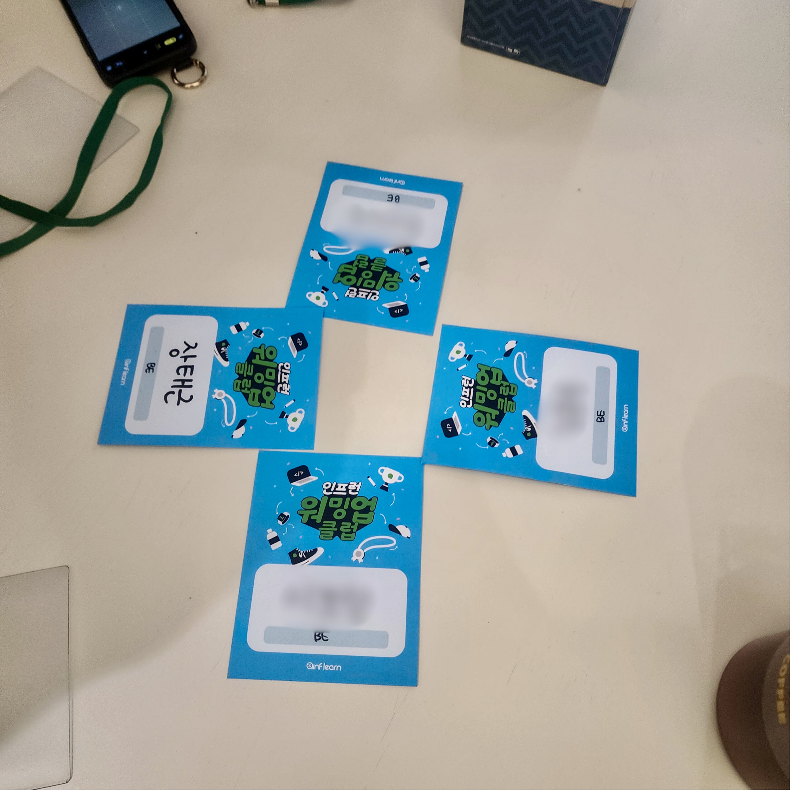

지난 4월 말부터 5월의 마지막날까지 한 달의 여정이 끝났다. 앞선 글에서 짧은 후기를 남겼다면 이번글에서는 전체적인 상세후기를 다룬다.

## 서론

스터디 참석 후기를 공유하기 전, 나를 먼저 소개하자면 개발자를 준비한 지 1년 됐다. 특성화고를 졸업한 반전공자다. 국비교육(자바 웹 개발 & AI)으로 다시 시작했고
6개월 과정이 종료된 후에는 독학 중이다. (취업준비생) 스터디 참여를 결정하기 전 끊임없이 고민했다. 고민했던 이유는 크게 3가지다.

- Java & Spring
- 의문과 반감
- 비용

### Java & Spring

국비교육에서 Java & Spring을 간단하게 배우고 [김영한 님 강의](https://www.inflearn.com/courses?s=%EA%B9%80%EC%98%81%ED%95%9C)도 짧게 봤었지만 현재는
주로 사용하고 있지 않다. 또한 깊게 다뤄본 적이 없다.

### 의문과 반감

이전에 참여했던 스터디에서 선입견이 생겼다. 발표형식과 프로젝트형식을 참여했는데 부정적인 감정이 더 컸다. 형식과 상관없이 편차가 컸고 중도 이탈이 많았다. 스터디의 성공과
실패에 상관없이(기준도 애매하지만) 함께 문제를 해결하는 느낌을 기대했던 나로선 아쉬움이 컸다.

### 비용

물론 인프런에서 깜짝 할인 쿠폰을 제공해 주신다. (백엔드 30%) 하지만 소득이 없는 나에겐 이마저 부담스러웠다. 입소문을 듣고 이미 장바구니에 있던 최태현 님의 강의였지만 그럼에도 심사숙고할 필요가 있었다.

하지만 고민 끝에 참여를 결정했다. Java & Spring 문제는 단순했다. 다른 언어, 프레임워크를 배울 때도 자연스럽게 Java & Spring 키워드로 검색해서 좋은 자료를 접했다. 그리고 돌아가는 길이
아닐까 고민도 했지만 언어와 프레임워크 상관없이 좋은 개발자에 대해 배울 수 있을 것 같았다. 선입견을 깨고 도전해 보자는 가벼운 마음으로 시작했다.

## 수료식

오프라인 수료식에 참여했다. 수료식은 네트워킹, 시상식, Q&A 순서로 진행됐다.

### 네트워킹

호기롭게 판교에 도착한 지 10시간이 지나 초췌한 모습으로 인프랩에 도착했다. 이미 도착하신 두 분이 계셨고 자연스럽게 합석했다. 처음 뵀지만 낯설지 않았다. 온라인으로 다른 러너, 서포터즈분들의 관점을 배워서
낯익었다. 심지어 어디서 뵌듯한 느낌이 들어서 조심스럽게 여쭤봤는데 [김영한 님 밋업 행사](https://devmeeple.github.io/2024-02/)에서 마주친 분들이 많으셨다. 몹시 반가워서 편하게
대화를 나눴다.

서포터즈중에 현직자분들도 계셔서 직장생활 후기도 들을 수 있었고, 취업준비생들의 고민, 그리고 대학생분의 이야기도 들을 수 있어서 재밌었다.

### 시상식

내색하지 않았지만 모두가 주목하던 시상식이 시작됐다. 셰리 님께서 인프런 워밍업 클럽이 시작하게 된 방향성을 먼저 소개해주셔서 감사했다. 개인적으로 궁금했던 내용이기 때문에 말씀해주시지 않았다면 직접 여쭤봤을 것
같다.

이어서 코치님들(최태현, John Ann, 볼드님)의 간단한 소개와 후기가 이어졌다. 온라인으로 뵙고 오프라인으로 처음 뵀는데 정말 똑같으셨다. 이어서 시상식이 이어졌는데, 운 좋게 우수러너에 선정됐다. 시상식을
진행하며 서포터즈분들께서 장난을 치셔서 괜히 기대를 했다 안되면 어떻게 하지 걱정을 했는데 다행이다. 좋았지만 괜히 쑥스러웠다. 참석하신 분들의 축하를 받으며 앞에 나가 상품을 받았다. 수상을 하지 않았더라도
이미 배운 점이 많아서 감사했는데 더욱 모든 분들께 감사했다.

### Q&A

Q&A는 오프라인, 온라인 동시에 진행됐다. 시작 전 남은 시간에 태현 님께서 세금강의를 해주셨는데 말씀을 정말 잘하신다고 느꼈다. 다음 강의가 혹시 세금강의인지 여쭤보고 싶을 정도다. Q&A는 이전 라이브세션과
비슷했다. 모두가 좋은 백엔드 개발자를 목표로 하고 있기 때문에 성장에 관련된 질문과 답변이 오갔다.

질문과 답변보다 인상 깊었던 점은 태현 님의 모습이다. 오래 개발을 하셨기 때문에 본인의 확고한 생각으로 단언하실 수 있다 생각한다. 하지만 강의, 라이브세션, Q&A 과정 전체 중 한 번도 단언하시는 모습을 볼 수
없었다. 항상 여러 가능성을 열어두고 조심스럽게 답변하시고 어떤 질문이라도 좋은 질문이라는 말씀을 빼먹지 않으셨다. 대한민국의 교육과정을 거쳐온 우리가 질문을 하는 건 굉장히 용기가 필요한 행동이라고 생각하는데 어떤
질문이라도 성심성의껏 답변하시는 모습이 인상 깊었다.

## 마치며

직장인의 생활을 체험하고자 호기롭게 나서 아침에 판교에 도착했다. 오전에는 카페에서 시간을 보내고 오후는 거리를 배회했다. 평소에 운동도 꾸준히 하고 있었기 때문에 체력이 늘지 않았을까 싶었는데 오산이었다. 일정을
마치고 집에 돌아오니 허리가 끊어질 것 같았다.

인프런 워밍업 클럽 백엔드 1기 생활이 정말 끝났다. 오랜 고민 끝에 참여한 스터디에서 **좋은 개발자란 무엇이고 어떻게 학습할 수 있을까를 배운 점**이 가장 큰 소득이다. 스터디가 끝이 났지만 활동에 지속적인
관심을 보낼 예정이다. 더욱 활성화되길 바란다. 끝으로 나와 비슷한 고민을 하시는 다른 미래러너분들의 선택에 도움이 되길 바라며 후기를 마친다.
