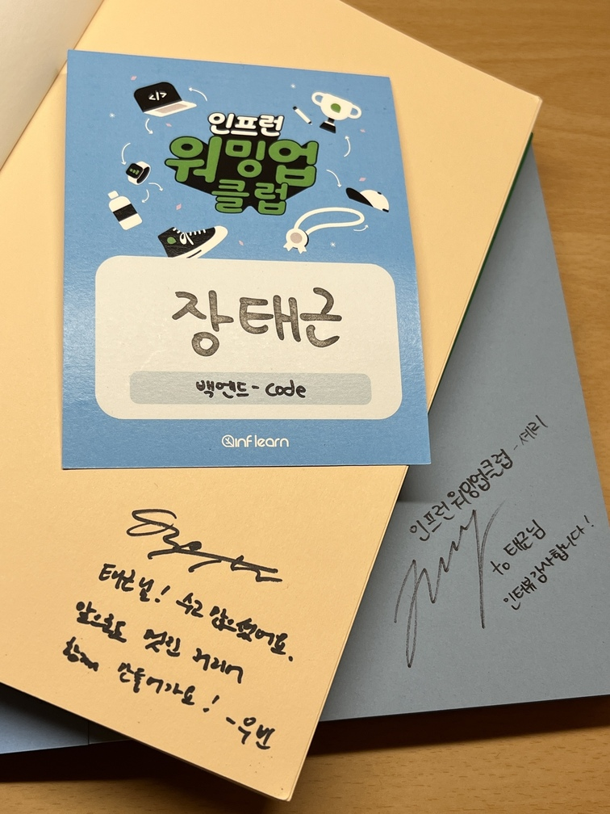
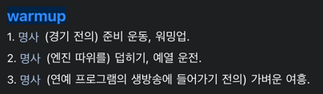

- 워밍업 클럽 1기에 이어 '2기 백엔드 클린 코드, 테스트 코드' 과정을 수료했다. 지난 과정은 간단한 애플리케이션 구현과 배포에 집중했다면, 이번 과정은 '코드를 다루는 마음가짐'을 배웠다.
- 9월 말부터 11월 시작까지 한 달의 여정이 끝났다.

## 참여까지: 왜 워밍업 클럽인가요?

지난 [7월 회고](https://devmeeple.github.io/retrospective-20240728/)에서 이어진 사연이 워밍업 클럽까지 이어질지 몰랐다.

워밍업 클럽 1기에 이어 '2기 백엔드 클린 코드, 테스트 코드' 과정을 수료했다. 지난 과정은 간단한 애플리케이션 구현과 배포에 집중했다면, 이번 과정은 '코드를 다루는 마음가짐'을 배웠다.
기술에 상관없이 기초지만 가장 많이 강조되는 부분이다.

### 학습 분량(강의 수강 시간 및 과제)은 적절했나?

참여 전에는 압축된 과정이 버겁게 느껴졌다. 그래서 '정말 하고 싶은 과정이 맞나?' 끊임없이 물었다. 특히 기존에 하고싶던 다른 과정과 겹쳐
더욱 고민했다. 하지만 약 일주일동안 충분히 고민했음에도 참여 하고 싶다는 마음이 변하지 않았다.

### 강의 및 과제 난이도는 적절했나?

하루에 호흡이 긴 강의를 듣는 부분을 제외하고는 괜찮았다.

### 워밍업 클럽 덕분에 성장을 했는가?

메타인지에 큰 도움을 얻었다. 앎과 모름의 경계를 넘나들었다.

### 스터디 참여에 가장 동기부여가 되었던 부분은 무엇인가?

가장 동기부여가 되었던 점은 우빈님께서 매일 올려주시는 공지사항이다. 강의에서도 학습 목표처럼 중요한 부분을 강조, 정리해 주시지만
별다른 생각 없이 수강했을 것 같다. 하지만 매일 어떤 부분을 집중하면 좋을지 의견과 격려의 메시지를 남겨주신 덕분에 과정을 마칠 수 있었다.

### 왜 참여했는가? 지난 스터디와는 무엇이 달랐나?

블로그에도 자주 언급했던 내용이었지만 테스트 코드가 항상 고민거리였다. 테스트 코드를 작성하는 방법에 힌트는 얻을 수 있었고 구현역량이 부족하다고 느꼈다.

## 오프라인 수료식

앞서 진행된 수료식과 다르게 시상식이 후면배치됐다.

### 전야제

- 운 좋게도 우수러너에 선정됐다.
- 싸인을 받았다

### 네트워킹

참석인원이 많아 홀에서 진행된 점이 유일하게 아쉽다.

지난 과정은 같은 과정을 함께 진행한 러너들의 생동감 있는 이야기를 들을 수 있었다.

### Q&A

### 시상식

뜨거운 열기속에 시상식이 진행됐다. 운 좋게 우수러너로 선정됐다. 참여자가 많아 무려 6명이 선정됐는데 사전에 알고있던 분들이 많아 반가웠다.

### 수료식이 끝난 후

우빈님께서 라이브 세션에서도 짧게 블로그 언급을 해주셔서 감사했다. 그런데 수료식이 끝나고 나눈 대화에서 한번 더 언급해주셔서 몸둘바를 몰랐다.

## 워밍업 클럽에서의 성장

> 과연 함께 자라기가 가능할까?

지난 과정까지 포함하여 워밍업 클럽이 진행된 기간은 총 2개월 밖에 되지 않는다. 하지만 하반기 전부를 책임졌다해도 과언이 아니다.
덕분에 학습법을 재고했다. 블로그, 문서화, 커뮤니티 참여 모두 워밍업 클럽에서 행했던 실험덕분에 이뤄낸 성과다.

이번 과정은 기술을 넘어 '친절'을 배웠다고 생각한다. 클린 코드와 테스트 코드가 친절이 없으면 따라올 수 없다고 생각한다.

우빈님, 셰리님, 워밍업 클럽 수료식까지 힘써주신 커뮤니티팀께 감사인사 드리며 다시 한 발 내딛는다.

## 마치며

열쇠를 건네 받았다. 스터디는 끝났지만 이제 진짜 시작이다. 열쇠로 다양한 문을 열고 일신우일신 하길 바란다.
이어지는 여정동안 우빈님을 몇 번 마주할 지 모르겠다.
가지고 있는 패를 어떻게 활용할 수 있을지 궁금하다.
