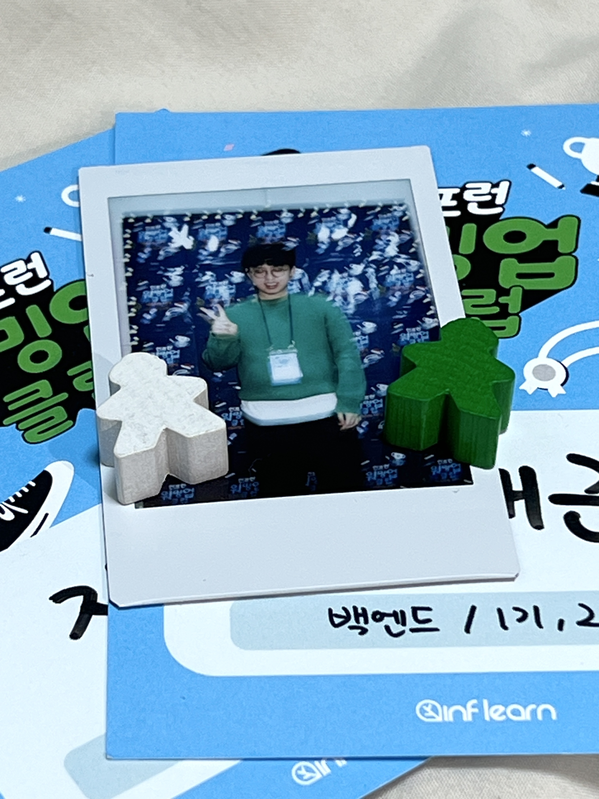

- [x] warmup-club-networkingday-2024-241213
- [ ] 굿즈, 이미지 편집을 합니다. 그런데 미플을 곁들인

- 체크인
- 행사 소개 및 인사 나누기

가장 먼저 도착했다. 운영진분들께서 배려해 주신 덕분에 가벼운 농담을 나누고 가운데 자리에 앉았다.

분위기에 취했다. 매번 다른 장소에서 진행[^1]되는 덕분에 새로웠다. 특히 예상하지 못한 폴라로이드, 음식 등 구성된 환경에 압도됐다.
하지만 숨 멎을 듯 침묵이 이어져 힘들었다. 그런데 이미 교류하던 혜린님께서 등장해 주셔서 몹시 감사했다. 빛!

행사가 시작됐다. 2기 코치로 참여하신 우빈님께서 바로 옆자리에 앉으셔서 웃음[^2]이 새어 나왔다. 운이 좋았다.

우연히도 우빈님이 바로 옆자리에 앉으셔서 편하게 질문드렸다.

## 식사 및 직무별 네트워킹(18:35~19:20)

> 네트워킹을 통해 얻을 수 있는 가장 큰 가치는 '지혜'다.

미디어가 아닌 행사에서 나누는 대화가 뜻깊다. 현직자 입장에서 바라보는 상황과 고민을 들을 수 있어 좋다. 현재 고려해 본 적 없던 이직과 기술적인 문제를 들었을 때
마치 소설을 읽는 기분이다. 상상을 하며 현재 상황을 위로받고 확장할 기회를 얻어 좋다.

우빈님께 현장에서 떠오른 질문을 드렸다.

### 코치님과 함께 춤을

> Q. 테스트 코드와 클린 코드를 기획한 배경, 유레카를 외쳤던 경험은 무엇인가요?

신입, 업무에 투입했을 때 가장 먼저 코드 베이스를 검토하고 테스트 케이스를 추가했다. 다양한 주제 중 오랫동안 관심 가졌던 주제여서 선택했다.

> Q. 지식공유자의 질문 & 답변 알람은 어떤 구조인가요?

메일로 알림이 온다.

Slack 알림을 따로 사용하시는 지식 공유자가 [^3] 떠올라 질문드렸다. 우빈님께서 '수강생과 지속적으로 소통하시는 지식 공유자'라고 생각하여 질문드렸다.

> Q. 수강 후기를 작성해도 될까요?

강의를 듣고 무엇을 얻었는지, 포부와 달라진 점은 무엇인지 비교하는 것을 좋아한다. 더불어 다른 수강생은 어떤 생각을 하는지 궁금했다.

책을 읽고 서평을 통해 사고를 확장하듯이 수강평을 넘어 다른 수강생들은 어떤 생각을 하는지 궁금했다. 수강평은 짧다! 도움을 받았다면 감사함을 표현할 줄 알아야 한다고 생각한다.
현재 할 수 있는 최선의 방법, 강점이 '글쓰기'라고 생각한다. 조금이라도 도움 되면 좋겠다.

## 발표: 제어의 역전

### 1. 나다운 커리어 여정 만들기, 양준식(제이든), 인프런 비즈니스 매니저


> 점(Dot)을 어떻게 연결, 이동, 기록할 수 있을까?

발표를 들으며 스스로 던질 수 있는 3가지 질문이 떠올랐다.

```text
- 왜 개발자가 되고 싶나요? (연결)
- 왜 이동하고 싶나요? (이동)
- 어떻게 표현할 수 있나요? (기록)
```

발표자료가 공유되면 가장 이상적이다. 하지만 발표자료 없이 참고 자료를 읽어도 어떤 발표를 진행하셨는지 배경을 이해할 수 있다. 참고 자료를 꼭 읽고 스스로 위 질문들에 답변을 작성하면 좋겠다.
새로운 멀티버스가 기다린다.

기술의 발전으로 더욱 생각을 덜 하고 쉽게 문제를 해결할 수 있도록 도움 받는다. 하지만 글, 발표, 코드 이하 표현하는 모든 방법에서 '나만의 경험'을 섞어 사람 냄새가 나는 작품을 만들어야 한다고 생각한다.
발표에서 울림이 느껴졌다.

솔직히 발표자의 배경을 전혀 몰라 큰 기대를 하지 않았다. 하지만 올해 들은 발표 중에 손꼽을 만큼 좋았다[^4]. '나만의 채용공고 만들기'라는 구체적인 방법이 인상 깊다. 더불어 제이든님께서 어떻게 도움,
영감을 얻는지 공유해 주셔서 감사했다.

**<참고 자료>**

- [MARKING DOT '2024 Jul | Hello, 인프런](https://medium.com/joonsikyang/2024-jul-hello-인프런-138d5f31db98)
- [인프랩 실Log '제이든 수습회고'](https://doc.clickup.com/d/3gfz7-5843/log/3gfz7-964996/%EC%A0%9C%EC%9D%B4%EB%93%A0%EC%9D%98-%EC%88%98%EC%8A%B5%ED%9A%8C%EA%B3%A0)

## 발표 2) 2024 이력서 안티패턴 톺아보기

- [ ] 강의 내용 참고

기존에 수강하던 강의 지식 공유자 분을 마주했다. 좋은 강의에 현장이라는 생동감이 추가되어 배가됐다.

발표를 들으며 워밍업 클럽에서 배웠던 추상화가 거듭 떠올랐다. 코드는 추상화를 어떻게 할 지 고민하는데 이력서는 오히려 추상화를 하지 않고 직관적으로 표현하는 방식으로 작성해야 한다고 느꼈다. (T발놈, 너 T야?)

승현님께서 굉장히 사려 깊은 분이라고 느꼈다. 발표가 마치고 발표 자료를 공유하며 주신 메일에서 울림이 있었다. 만약 이력서, 커리어를 고민중이라면 추천한다.

## 추첨 이벤트 및 자리 이동

장소, 분위기 전부 색달랐다. 인프랩 (거의) 전 직원분께서 운영에 힘써주셔서 재밌게 즐겼다. 물론 한정판 굿즈에 당첨되지 않아서 아쉬웠다!

## 자유 네트워킹

일부러 왕래, 교류가 없는 테이블을 선택했다. 프로덕트 디자이너, PM, 백엔드, B2B 매니저 다양한 직군이 앉아서 그런지 재밌었다. 전혀 다른 직군과 이야기 하고 싶다는 생각을 거듭 했는데 마무리 해서 기분
좋았다.

다른 경험이지만 전달하고 싶은 메시지를 생각했을 때 현재 나의 상황에 빗대어 볼 수 있는 경험이 많았다. 덕분에 더욱 알찬 시간으로 남았다.

새로운 사람들과 교류하여 확장하는 경험을 얻었다.

## 마무리: 그런데 단체 사진 촬영을 곁들인



- [x] 어색함을 참기 어려워한다. 숨이 멎을 것 같았다.
- [x] 노트북을 챙기지 않아 다행이다. 노트북을 사용하지 않고 메모하기와 글 작성하는 방법을 깨달았다.
- [x] 워밍업 클럽이 어떤 경험으로 남았는지 돌아봤다.
- [x] 올해 긍정적인 영향을 받았던 분들을 한 자리에서 마주했다. 감사함을 전할 수 있어 좋았다.
- [x] 운영까지 어떤 고충이 있었셨는지 궁금했다. 운영, 지식 공유자, 러너, 참여자 전원에게 감사드립니다.
- 랠릿 굿즈를 얻었다.

평소 어색한 상황에 처하면 몸 둘 바를 모른다. 오랜만에 진행된 네트워킹 시간이 그랬다. 숨이 당장 멎을 것 같았다. 하지만 테이블에 러너, 코치님께서 분위기를 형성해 주셔서
경험 공유, 감사함을 전달할 수 있어서 좋았다.

노트북을 챙기지 않아 다행이다. 노트북을 사용하지 않고 메모하기와 글 작성하는 방법을 깨달았다. 빠른 체력소진에 일조하던 노트북을 챙기지 않아 만족스러웠다.
앞으로 다른 행사에 참여할 때 장·단점을 비교해 보자.

어렸을 때 연말 시상식을 보며 마무리를 실감했듯이 이번 네트워킹 파티 덕분에 '2024 공식 여정 종료'를 느꼈다.

> 그래서 프로그램을 통해 무엇을 배웠나요?

만약 면접 질문이 주어진다면 긴 답변이 필요할 정도로 배움이 많다. 그래도 짧게 요약하면 '지식보단 지혜를 배우자고 생각하던 나에게 꾸준히 사유할 요소를 건네준 프로그램'이다.
덕분에 알차게 놀았다.

내년에도 운이 좋아 참여할 수 있다면 다른 직군, 확장의 기회를 찾아 도전하고 싶다. 혹여 그대로 백엔드에 참여하더라도 교류가 없던 러너와 함께 프로그램을 진행하거나
인터뷰하며 보내지 않을까 싶다.

> 도전 끝, 편안함에 이르렀다.

**<참고 자료>**

- [인프런 워밍업 클럽 네트워킹 데이](https://inf.run/92Mpr)
- [강승현 '서류합격률 4%를 탈출하는 개발자 이력서 작성법'](https://inf.run/6neUh)

[^1]: 프로그램이 다르더라도 장소가 매번 바뀌고 분위기가 달라진다는 게 신기하다. 운영진은 동일한데 어떻게 가능한 구조인지 알고 싶다.
[^2]: 우빈님께서 배려해 주신 덕분에 네트워킹 데이 이틀 전 우수러너 혜택, 멘토링을 진행했다. 잠깐 눈뜨고 일어나니 우빈님이 현장에 나타나셨다.
[^3]: [제로초(조현영)](https://www.inflearn.com/users/14793/@zerocho?srsltid=AfmBOorcxZBiBHK7hTFILD19O8V8359AQNfzUBx7rISSuJTXHHLkoI9C)
[^4]: 친한 형이 조언해 주듯이 맞춤 조언이 들어왔다. 따뜻하다. 
