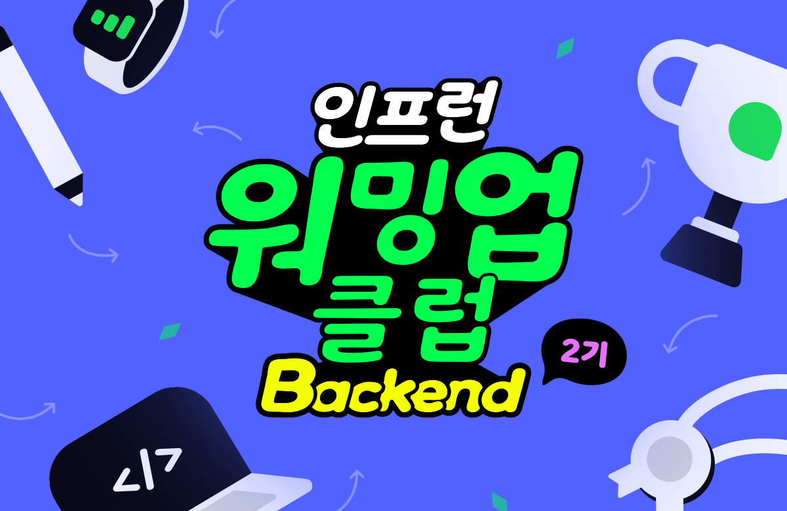

> *인프런 워밍업 클럽 2기, 18일차 미션을 '나만의 언어'로 정리한 글이다.

## 1. @Mock, @MockBean, @Spy, @SpyBean, @InjectMocks 차이는 무엇일까?

### 1.1 @Mock vs. @MockBean

`@Mock`은 Mockito에서 제공한다. 반면 `@MockBean`은 Spring에서 제공한다.

### 1.2 @Spy vs. @SpyBean

`@Spy`는 Mockito에서 제공한다. 반면 `@SpyBean`은 Spring에서 제공한다.

### 1.3 @InjectMocks

테스트 대상 객체(SUT, System Under Test)에 `@Mock`이 사용된 모의 객체 의존성을 편리하게 주입하기 위해 사용한다.
단위 테스트에 적합하고, 통합 테스트를 작성할 때는 `@Autowired`를 주로 사용한다.

### 1.4 결론

**테스트 코드를 작성할 때 '의도'를 전달할 수 있어야 한다.** 순수 단위 테스트가 필요하다면 `@Mock`, `@Spy`를 요구사항에 맞춰 사용한다.
반면 `Spring Context`가 필요한 통합 테스트라면 `@Bean 시리즈`를 사용해야 한다.

## 2. Test Fixture 구성하기

> *목표: `@BeforeEach`, `given`, `when`절에 어떻게 배치하면 좋을까?
>
> 요구사항
> - 게시판 게시물에 달리는 댓글을 담당하는 Service Test
> - 댓글을 달기 위해서는 게시물과 사용자가 필요하다.
> - 게시물을 올리기 위해서는 사용자가 필요하다.

시나리오는 위와 같다. 어떻게 구성하면 좋을까? 생각해 보자.

### 2.1 사용자가 댓글을 작성할 수 있다

- `setUp`
    - 사용자 생성에 필요한 내용 준비
    - 사용자 생성
- `given`
    - 게시물 생성에 필요한 내용 준비
    - 게시물 생성
    - 댓글 생성에 필요한 내용 준비
- `when`
    - 댓글 생성

### 2.2 사용자가 댓글을 수정할 수 있다

- `setUp`
    - 2.1과 동일하다.
- `given`
    - 2.1와 동일하다.
    - 댓글 생성
- `when`
    - 댓글 수정

### 2.3 자신이 작성한 댓글이 아니면 수정할 수 없다

- `setUp`
    - 2.1과 동일하다.
- `given`
    - 2.1와 동일하다.
    - 사용자 2 생성
    - 사용자 1의 댓글 생성
- `when`
    - 사용자 2가 사용자 1의 댓글 수정 시도

### 2.4 결론, 톺아보기

검증하고 싶은 부분은 '댓글'이다. 사용자와 게시글 모두 필요하다. 하지만 조금 더 중요한 부분은 '댓글'이라고 생각한다.
따라서 사용자를 생성하는 내용은 모두 `setUp`에 작성한다. 반면 댓글은 테스트 코드는 문서기 때문에 문맥을 이해할 때 필요하다.

**"테스트 코드는 `DRY`보다는 `DAMP` 하게 작성하자"**

## 마치며

마지막 미션인 만큼 의심을 한 번 더 했다. 특히 2번 문제, 'Test Fixture 구성하기'를 의심했다. '우빈 님께서 `setUp` 메서드에도
물음표를 사용하셨지만 함정이 아닐까?' 돌다리를 두드려 봤다. 하지만 거듭 생각해도 생각이 바뀌지 않았다.
미션, 과정 전부 끝났다. 배움이 많았다. 자세한 이야기는 '인프런 워밍업 클럽 2기 후기'로 알아보자.

**<참고 자료>**

- [박우빈 'Practical Testing: 실용적인 테스트 가이드'](https://inf.run/yoBRZ)
- [Baeldung 'Mockito.mock() vs @Mock vs @MockBean'](https://www.baeldung.com/java-spring-mockito-mock-mockbean)
- [Baeldung 'Difference Between @Spy and @SpyBean'](https://www.baeldung.com/spring-spy-vs-spybean)
- [Baeldung 'Using @Autowired and @InjectMocks in Spring Boot Tests'](https://www.baeldung.com/spring-test-autowired-injectmocks)
