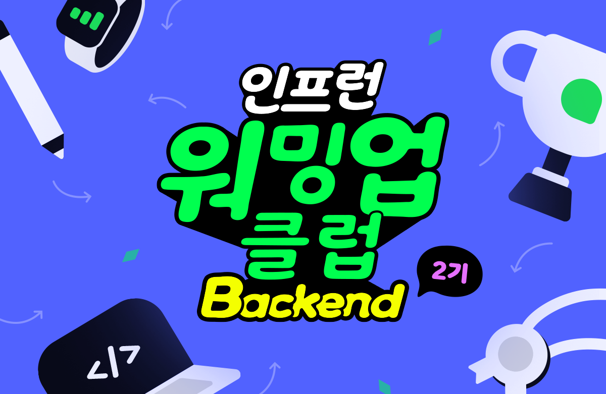

> *인프런 워밍업 클럽 2기, 18일차 미션을 '나만의 언어'로 정리한 글이다.

**"어떻게 코드를 읽기 좋게 작성할 수 있을까?"**

워밍업 클럽 1주 차, 3가지를 배웠다.

1. 추상과 구체
2. 논리, 사고의 흐름
3. 객체 지향 패러다임

학습한 내용을 정리, 연습하며 체화해 보자.

> 전체 코드는 [GitHub](https://github.com/devmeeple/readable-code/blob/mission/src/test/java/mission/OrderServiceTest.java)에서
> 만날 수 있다.

## 1. 리팩터링

```java
public boolean validateOrder(Order order) {
    if (order.getItems().size() == 0) {
        log.info("주문 항목이 없습니다.");
        return false;
    } else {
        if (order.getTotalPrice() > 0) {
            if (!order.hasCustomerInfo()) {
                log.info("사용자 정보가 없습니다.");
                return false;
            } else {
                return true;
            }
        } else if (!(order.getTotalPrice() > 0)) {
            log.info("올바르지 않은 총 가격입니다.");
            return false;
        }
    }
    return true;
}
```

사용자가 추가한 '주문'이 유효한지 검증하는 메서드다. 동작하는 코드지만 부자연스럽다.
리팩터링 전에 현재 상태를 글로 작성해 보자.

> (리팩터링 전)
>
> 주문을 검증한다.
>
> - 주문에서 아이템 한번 보자. 사이즈 0이야? 그러면 실패야.
> - 아니면 주문 총금액 가져와. 0원 넘어? 그리고 주문자 있어? 아니 없어? 그러면 실패야. 해당되는 거 없어? 그럼 성공이야.
> - 그런데 주문 총금액 0원 넘지? 아니야? 그러면 실패야.
> - 주문 성공이야.

놀랍게도 현재 코드가 전달하는 내용이 그렇다. 어떻게 개선하면 좋을까? 강의에서 제안한 3가지 해결 방안이 떠올랐다.

- 사고의 depth 줄이기
- 부정어를 대하는 자세
- 객체 설계하기

### 1.1 사고의 depth 줄이기

`if else` 키워드가 남용됐다. 특히 `else`가 없어도 되는 상황에서 사용하는 것은 '남용'이라 생각한다. 비용을 아껴보자.

```java
public boolean validateOrder(Order order) {
    if (order.getItems().size() == 0) {
        log.info("주문 항목이 없습니다.");
        return false;
    }

    if (!(order.getTotalPrice() > 0)) {
        log.info("올바르지 않은 총 가격입니다.");
        return false;
    }

    if (!order.hasCustomerInfo()) {
        log.info("사용자 정보가 없습니다.");
        return false;
    }

    return true;
}
```

조건 문의 depth를 조절하고, 순서를 바꿨다. 이전 코드는 총금액이 0원이 넘는지 검증하고 이어서 고객 정보 유무를 검증했다.
하지만 조건을 나눴다. 길게 작성된 문장을 한 문장으로 쪼개는 방법과 같다.

인지 비용 줄이기에 성공했다. 하지만 아직 부족하다.

### 1.2 부정어를 대하는 자세

부정어는 번역 투와 유사하다. '오늘 중으로 하지 않으면 안 된다'라는 표현은 부자연스럽다. '오늘 안에 해야 한다'처럼 코드도 직관적으로 바꿔보자.

```java
public boolean validateOrder(Order order) {
    if (order.getItems().size() == 0) {
        log.info("주문 항목이 없습니다.");
        return false;
    }

    if (order.getTotalPrice() <= 0) {
        log.info("올바르지 않은 총 가격입니다.");
        return false;
    }

    if (!order.hasCustomerInfo()) {
        log.info("사용자 정보가 없습니다.");
        return false;
    }

    return true;
}
```

부정어는 2곳이 사용되고 있다. 하지만 총금액을 묻는 조건만 수정했다. 이전 조건은 0원을 초과하는지 검증하고 뒤집었다.
전달하고 싶은 의미가 무엇일까?

0원을 넘지 않으면 실패한다. 사고를 바꾸면 부정어를 긍정으로 바꿀 수 있다.

남은 부정어를 해결하자.

### 1.3 객체 설계하기


부정어 외에도 현재 객체를 '폭력적'으로 사용하고 있다. 어떻게 격식을 차리고 객체를 존중할 수 있을까?

```java
public boolean validateOrder(Order order) {
    if (order.isEmpty()) {
        log.info("주문 항목이 없습니다.");
        return false;
    }

    if (order.isNotValidTotalPrice()) {
        log.info("올바르지 않은 총 가격입니다.");
        return false;
    }

    if (order.hasNoCustomerInfo()) {
        log.info("사용자 정보가 없습니다.");
        return false;
    }

    return true;
}
```

구현을 드러내지 않고 객체에게 물어보자.

**"객체님 알고 계시나요?"**

### 정리

> (리팩터링 후)
>
> 주문을 검증한다.
>
> - 주문 안 했어? 그러면 실패야.
> - 주문 총금액 0원 안 넘어? 그러면 실패야
> - 주문자가 없어? 그러면 실패야.
> - 주문 성공이야.

리팩터링 후는 위와 같다. 이전보다 추상적이지만 2가지가 마음에 걸린다.

- `log`가 아닌 `사용자 정의 Exception`을 사용하면 더욱 자연스럽지 않을까?
- 주문 성공을 의미하는 값 `true`, `false`를 개선할 수 없을까?

`log`또한 따로 `LoggerService`로 분리하고 적용했다. 그런데 에러를 정의하는 방법이 더 좋다고 생각했다. (물론 로그도 필요하다)

`true`, `false` 값이 추상화 레벨이 다르다고 생각한다. 주문이 성공하면 `Order.OK`, 실패하면 `Order.cancle`과 같은 방법을
적용하면 추상화 레벨을 맞출 수 있다고 생각한다.

## 2. SOLID

SOLID는 객체지향에서 가장 많이 이야기하는 주제다. 이유가 뭘까?

### 2.1 단일 책임 원칙

단일 책임 원칙(SRP: Single Responsibility Principle)은 변경으로 일어나는 '영향 범위 최소화'를 강조한다.

> *하나의 책임이란, 변경해야 할 이유가 하나여야 한다는 의미다.

### 2.2 개방 폐쇄 원칙

개방 폐쇄 원칙(OCP: Open-Closed Principle)은 '확장'을 강조한다.

> *추상화된 역할에 의존함으로 문제를 해결한다.

### 2.3 리스코프 치환 원칙

리스코프 치환 원칙(LSP: Liskov Substitution)이란 기본 클래스의 계약을 파생 클래스의 '치환 여부'를 강조한다.

> *인터페이스는 계약이고, 테스트는 계약 명세다.

### 2.4 인터페이스 분리 원칙

인터페이스 분리 원칙(ISP: Interface Segregation Principle)은 클라이언트가 '사용하지 않는 인터페이스에 의존하지 않아야 한다는 점'을 강조한다.

> 인터페이스의 크기를 작게 유지하고, 클래스는 필요한 기능에만 의존한다.

### 2.5 의존성 역전 원칙

의존성 역전 원칙(DIP: Dependency Inversion Principle)은 고수준/저수준 모듈이 '추상화'에 의존하도록 강조한다.

> *의존은 사용하기만 해도 관계가 만들어진다.

## 마치며


SOLID를 나만의 언어로 정리하고, 리팩터링을 연습했다. 아직 객체지향에 맞는 코드를 작성하지 못해서 아쉽다.
사고가 유연하지 않다.

하지만 다시 생각하면 코드를 재밌게 작성할 여지가 많이 남았다. 풀지 못한 문제가 많다.
단서를 모아 사건 해결에 앞장서야지.

**<참고 자료>**

- [박우빈 'Readable Code: 읽기 좋은 코드를 작성하는 사고법'](https://inf.run/kHiWM)
