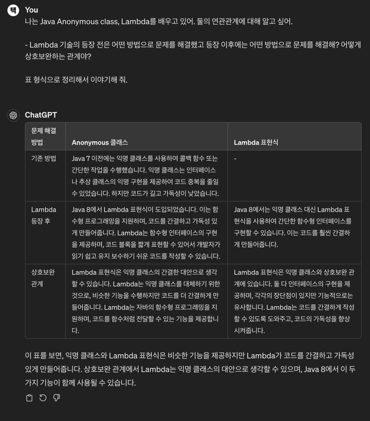

```text 
[질문] 

1. 자바의 람다식은 왜 등장했을까?
2. 람다식과 익명 클래스는 어떤 관계가 있을까? - 람다식의 문법은 어떻게 될까? 

```

3일 차는 익명 클래스(Anonymous Class)와 람다(Lambda)가 과제로 주어졌다. 둘은 함께 이야기되는 주제이다. 어떤 관계일까?

## 익명 클래스와 람다

익명 클래스로도 다양한 동작을 구현할 수 있었다. 하지만 Java SE 8에 등장한 람다는 복잡성을 줄이고 가독성을 높여 유지보수 하기 좋은 코드 작성을 위해 등장했다.

자세한 이론에 앞서 예제를 먼저 살펴보자.

```java
// 1. 익명 클래스로 구현한 아이템 가격 비교
Comparator<Item> byPrice = new Comparator<Item>() {
    public int compare(Item boots, Item mobilityBoots) {
        return boots.getPrice().compareTo(mobilityBoots.getPrice());
    }
};

// 2. 람다로 구현한 아이템 가격 비교
Comparator<Item> byPrice = (Item boots, Item mobilityBoots) -> boots.getPrice().compreTo(mobilityBoots.getPrice());
```

예제코드는 리그오브레전드 아이템 가격을 비교하고 더 비싼 아이템 가격을 반환한다. 같은 결과를 반환하지만 람다를 사용했을 때 더욱 간결하게 작성된 점을 확인할 수 있다.

### 익명 클래스

익명 클래스는 일회성으로 사용되는 클래스를 정의할 때 사용한다. 클래스를 따로 정의하지 않고 객체를 생성하고 사용하는 방법이다. 인터페이스나 추상 클래스의 단일 메서드를 구현해야 할 때 사용한다.

```text
new 생성자() { ... 구현 }
```

생성자 뒤에 중괄호가 나오고 `@Override`하여 구현한다.

```java

@Test
public void testAnonymousClass() {
    // given
    MathOperation add = new MathOperation() {
        @Override
        public int operate(int a, int b) {
            return a + b;
        }
    };

    // when
    int result = add.operate(10, 5);

    // then
    assertThat(result).isEqualTo(15);
}
```

### 람다

람다는 명확하고 가독성 좋은 동작을 구현하기 위해 등장했다.

앞서 익명 클래스로 살펴본 예제는 구현을 위해 자질구레한 코드가 많이 생겼다. 하지만 람다를 사용해서 간결하고 유연한 코드를 작성할 수 있다. 어떻게 작성할 수 있을까?

```text
(parameters) -> expression
```

람다의 기본문법은 파라미터, 화살표, 표현식으로 이뤄진다. 이외에도 다양한 형식을 지원한다.

```java

@Test
public void testSimpleLambda() {
    // given
    StringOperation operation = s -> s.toUpperCase();

    // when
    String result = operation.operate("java");

    // then
    assertThat(result).isEqualTo("JAVA");
}

@Test

public void testMultiStatementLambda() {
    // given
    StringOperation operation = s -> {
        String result = s.toUpperCase();
        return result + "!";
    };

    // when
    String result = operation.operate("spring");

    // then
    assertThat(result).isEqualTo("SPRING!");
}

@Test
public void testLambdaWithMultipleParameters() {
    // given
    MathOperation operation = (a, b) -> a * b;

    // when
    int result = operation.operate(10, 5);

    // then
    assertThat(result).isEqualTo(50);
}

@Test
public void testLambdaWithNoParameters() {
    // given
    Greeting greeting = () -> "Hello, World!";

    // when
    String result = greeting.greet();

    // then
    assertThat(result).isEqualTo("Hello, World!");
}
```

이외에도 메서드 참조, 스트림(Stream)과 함께 사용된다.

### 주의점

우아하게 느껴지지만 람다를 사용할 때 주의할 점이 있다.

> [책 <이펙티브 자바> by 조슈아 블로크](https://product.kyobobook.co.kr/detail/S000001033066)

**1. 람다는 이름이 없다. 따라서 문서화할 수 없다.**

간결한 코드와 의도를 명확히 드러날 때 강점을 가지지만, 명확하게 설명할 수 없을 때, 코드가 길어지면 다시 한번 검토해야 한다.

**2. 함수형 인터페이스(추상 메서드가 1개)에서만 쓰인다.**

추상 클래스를 인스턴스로 만들거나, 추상 메서드가 여러 개라면 익명 클래스를 사용한다.

**3. 람다의 this는 바깥 인스턴스를 가리킨다.**

자신을 참조해야 한다면 익명 클래스를 사용한다.

## 마무리

익명 클래스와 람다의 관계, 람다식의 등장배경과 사용방법에 대해 짧게 알아봤다. 어떤 기술의 등장은 결국 이전 문제를 해결하기 위해서(복잡성과 가독성) 등장했다를 몸소 느낄 수 있는 주제였고 다양한 생각이 들었다.

**1. 다른 프로그래밍언어에서 배우기**

다른 프로그래밍 언어와의 연관관계를 느낄 수 있었다. 이전에 람다를 처음 사용했을 때 공감 되지 않고 어려운 문법 중 하나라고 생각했다. 머리로는 이해해도 가슴으로 이해하지 못했다.

JavaScript를 배울 때 화살표 함수(Arrow function)를 배웠다. 화살표 함수를 밥먹듯이 사용했다. 스터디에 참가하고 다시 Java & Spring 조합을 사용할 기회가 주어졌다. 이전에 봤던 람다는
어색하고 어렵게만 느껴지는 존재였다. 하지만 이제는 가볍고 하나의 문제를 해결하는 하나의 방법이라고 느껴진다.

JavaScript에서 강조하는 일급 함수(First-class Function)도 공감되지 않았었다. (대단한 건가?) 그런데 Java가 어떤 식으로 함수형 프로그래밍을 지원하기 위해 기능을 추가했는지 과정을
살펴보니
반복해서 강조하는 이유를 알 것 같다.

학습을 꾸준히 하지 않았다면 극복하지 못했을 것이다.

**2. 배경지식**



기술을 배울 때 어려움을 느낀다. 다양한 이유 중 배경지식의 부제를 이야기하려 한다. 책 또는 인터넷 강의자료는 최대한 간결하게, 쉽게 개념을 전달한다. 이해가 바로 되면 가장 좋지만 **이해가 잘 가지 않을 땐
이전에 어떤 문제가 있었는지 여러 방법을 검토해 살펴보는 자세가 중요하다고 느꼈다.**

새로운 기술은 궁극적으로 유지보수성하기 좋고 간단하게 사용할 수 있도록 등장하는 것을 지켜봤다. 이해를 돕기 위해서는 과거 선배 개발자는 어떤 식으로 문제를 해결했는지 살펴보자. 유연한 사고가 중요하다.

과거의 나와 승부에서 이긴듯한 즐거운 기분을 느끼며 과제를 마친다.

> 추가 예제는 [GitHub](https://zrr.kr/kV9d)에 있다.

### 함께 자라기

- [책 <모던 자바 인 액션>](https://product.kyobobook.co.kr/detail/S000001810171): 람다, 스트림, 함수형 프로그래밍 방법을 밀도있게 설명
- [Baeldung [Lambda Expressions and Functional Interfaces: Tips and Best Practices]](https://www.baeldung.com/java-8-lambda-expressions-tips)
