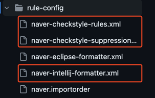
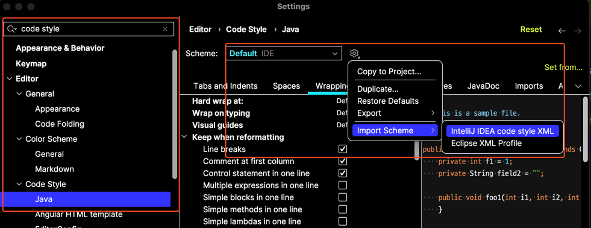
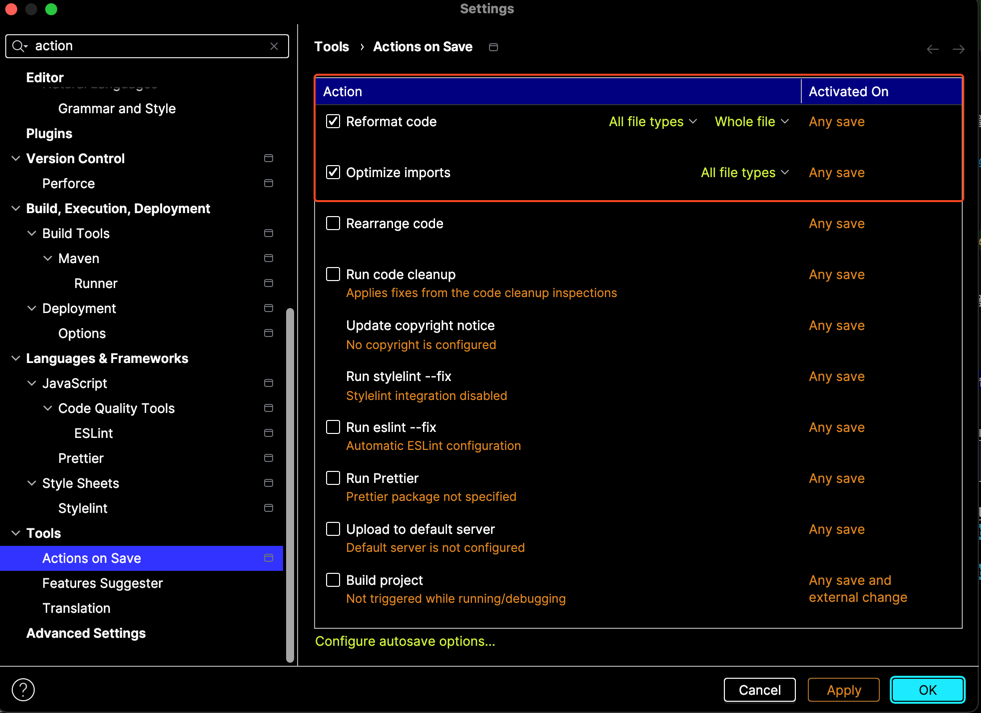
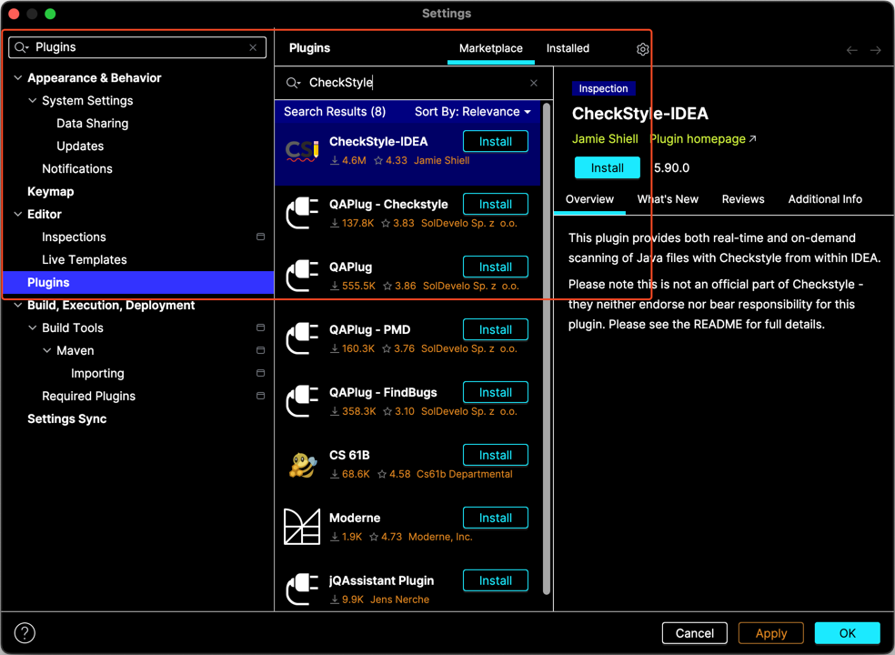
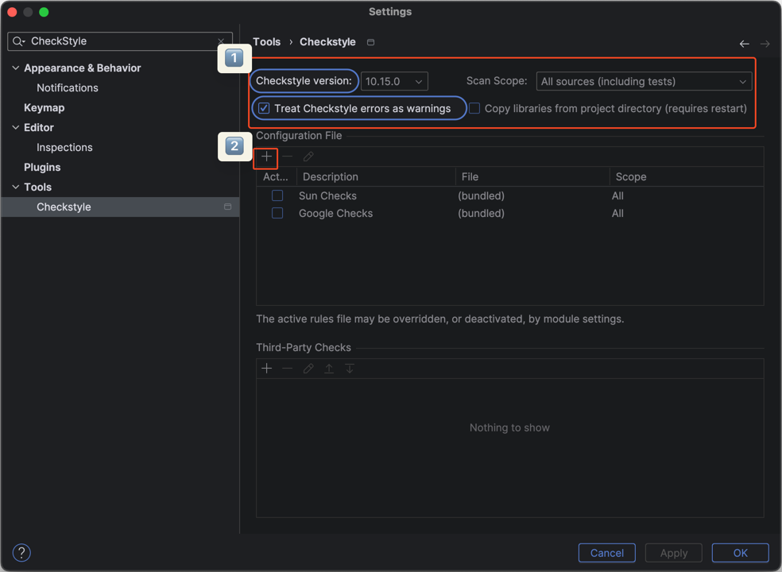
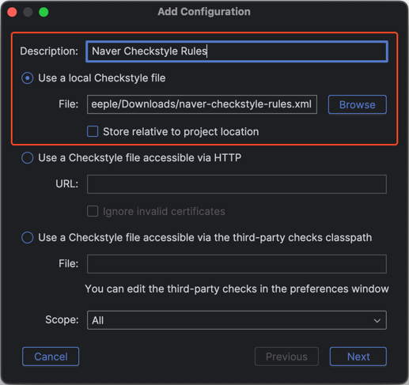
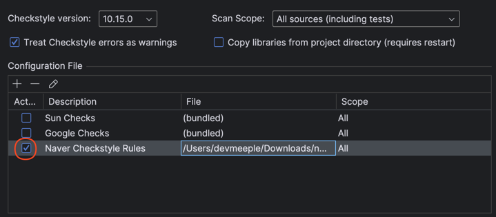
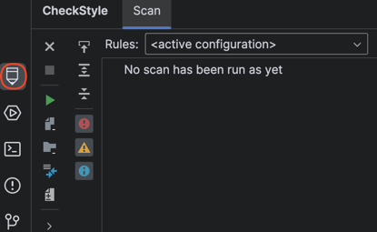

코드컨벤션을 지키면서 어떻게 프로그래밍할 수 있을까? IntelliJ에서 코드 컨벤션을 적용하는 방법을 알아보자.

## 준비하기

먼저 [저장소](https://github.com/naver/hackday-conventions-java/tree/master/rule-config)에서 설정에 필요한 파일을 다운로드 해야한다.

## Formatter

1. 다운로드한 `naver-intellij-formatter.xml` 를 import 한다.
2. 스키마의 이름을 설정한다. 다양한 컨벤션을 적용하는 상황에는 유의미한 이름을 권장한다.

### 자동 적용하기

자동으로 컨벤션이 적용될 수 있도록 추가설정을 해보자.

> - Reformat code: 자동으로 포맷 적용
> - Optimize imports: 사용하지 않는 import 제거

설정이 적용되지 않았다면 IDE 재시작이 필요하다.

## CheckStyle

컨벤션을 준수하여 코드를 작성했는지 확인하고 싶지 않나요? 정적 코드 분석도구를 설치해 보자.

1. CheckStyle-IDEA 플러그인을 설치하고 재시작하자.
2. 이미지와 같이 Scope와 Treat Checkstyle errors as warnings를 설정해야 한다. 표기되는 version은 다를 수 있지만 8.24 이상의 버전을 선택해야 한다.

3. 다운로드한 `naver-checkstyle-rules.xml`을 Browse 한다.

4. 예외 정책을 지정한다면 변숫값 `naver-checkstyle-suppressions.xml`를 지정한다.

5. 규칙을 사용하도록 꼭 체크해 주세요.

6. 설정을 완료하면 아래 CheckStyle이 표시된다.

## 마치며

추가설정이나 상세 설정은 공식문서를 참고하자.

### 함께 자라기

- [캠퍼스 핵데이 Java 코딩 컨벤션](https://naver.github.io/hackday-conventions-java/)
- [Code convention과 개발자가 지켜야할 수칙에 관하여](https://novemberde.github.io/post/2017/05/21/Javascript_policy/)
- [정적 분석(Static Analysis)이란?](https://hudi.blog/static-analysis/)
