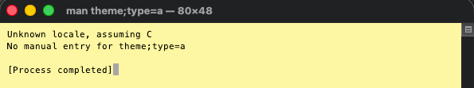
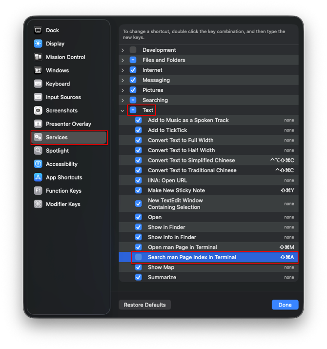

- 자주 사용하는 단축키, Find Actions(`Command + Shift + A`)이 정상 동작하지 않았다. 터미널이 실행됐다.

## 원인

- macOS 10.14.4에 새로운 기본 단축키, `Search man Page Index in Terminal` 기능이 추가되었다.
- man 페이지는 매뉴얼(Manual pages)을 의미한다. 유닉스 및 유닉스 계열의 운영체제에 기본 설치되는 문서다.

## 해결

- `Search man Page Index in Terminal` 기능을 비활성화 한다.

> System Settings | Keyboard | Keyboard Shortcuts | Services | Text |

### 참고 자료

- [Cmd+Shift+A hotkey opens Terminal with "apropos" search instead of the Find Action dialog](https://intellij-support.jetbrains.com/hc/en-us/articles/360005137400-Cmd-Shift-A-hotkey-opens-Terminal-with-apropos-search-instead-of-the-Find-Action-dialog)
