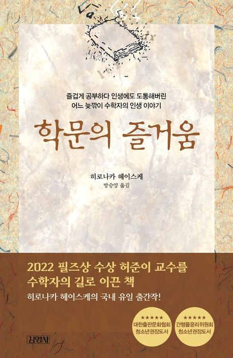

우연히 알고리즘에 들어온 허준이 교수의 영상을 시청했다. 흥미롭게 느껴졌고 세계적인 수학자는 어떤 생각을 할까라는 질문을 가지고 인터뷰까지 읽었다. 추천하는 책이 많았지만 수학자라는 직업을 선택하는데
이 책의 도움이 되었다는 부분에 이끌렸다.

> ―수학자가 되기로 결심한 계기는 무엇인가.
>
> “학부 마지막 학기 때, 서울대 석좌교수로 초빙된 일본의 세계적인 수학자이자 1970년 필즈상 수상자인 히로나카 헤이스케의 수업을 들으면서 수학자가 되기로 결심했다. 중학교 때 히로나카 교수님이 쓴 ‘학문의
> 즐거움’이란 책을 인상 깊게 읽었다. 교수님의 권유로 서울대 수학과 석사과정에 들어갔다.”

## ✍️ 기록

- '산다'는 것은 자기 스스로 벌어서 자기의 힘으로 살아가는 것이다. 누구에게도 의존하지 않고 자기 혼자의 힘으로 살아가기 위해서는,
  남들이 어떻게 생각할까 또는 남에게 어떻게 보일까 등에 신경 쓸 여유가 없다.(32쪽)
- 내가 논물을 쓸 수 없었던 이유도 이것과 비슷하다. 그러나 논문을 씀으로써 자기의 이론을 창조해 가지 않으면 수학자로의 길이 막힌다. 써야 하나, 쓰지 말아야 하나? 나는 계속 고민했다. (85쪽)
- 2년 동안이나 연구해 온 수학 이론이 젊은 학자에 의하여 풀렸다는 사실은 큰 충격이었다. 왜냐하면 '상대가 안된다'고 체념하고 '나는 바보니까'라고 자세를 바로 잡았기 때문이다. 그렇게 생각을 바꾸고 긍정적으로
  생각하지 않으면 다음의 새로운 문제에 손댈 수 없으며, 더 나아가서 새로운 창조의 여행을 떠날 수 없다. (106쪽)
- 소박한 마음을 잃지 않는 것, 그것이야말로 창조의 기반이 아닐까? 소심심고(素心深考) (108쪽)
- 둘째는, 욕망이 창조에 필요한 것은 두말 할 필요도 없지만, 어디까지나 자기 내부에서 생긴 것이 아니면 안 된다는 것을 뼈저리게 느꼈다. (177쪽)
- 나는 남보다 두 배의 시간을 들이는 것을 신조로 하고 있다. 그리고 끝까지 해내는 끈기를 의식적으로 키워 왔다. 끝까지 해내지 않으면 그 과정이 아무리 우수하더라도 결과가 생겨날 수 없기 때문이다. 아무리 두뇌가
  우수하더라도 업적을 쌓지 않으면 수학자라고 말할 자격이 없다. (187쪽)

## 마무리

5월 인프런 워밍업 클럽 스터디가 막바지에 다 달았을 때 읽기 시작했고 이틀이 체 걸리지 않았다. 문장이 간단명료해서 쉽고 몰입력 있었다. 물론 수학 이론을 근거로 저자의 생각을 풀어내는 부분은 이해가 잘 되지
않았다.

가장 좋았던 점은 기존의 생각을 견고히 할 수 있었다. 책을 읽기 전부터 꾸준함과 동기에 대해 여러 번 고민했다. 꾸준함을 얻기 위해서는 외부에서 주입하는 동기가 아닌 내면의 소리를 듣고 본인만의 동기를 찾아야
한다고 거듭 생각했는데 저자도 비슷한 생각을 하는 것 같아 반가웠다.

또 제목만 봤을 땐 학문이라는 어렵고 따분한 주제로 이야기를 풀어갈 것 같지만 전혀 그렇지 않다. 가장 많이 이야기하는 주제는 "창조"인데 남녀노소 불문하고 추천하고 싶은 내용이었다. 특히 개발자를 준비하는
나에게 와닿았고 개발자를 고민하는 다른 사람이 있다면 추천하고 싶다.

나는 만족스럽게 읽었지만 비판적인 의견도 있었다.

- 저자는 본인이 천재가 아니라고 이야기하지만 결국 천재들의 이야기다.
- 일반인이 읽기에는 부담스럽고 기대에 미치지 못한다.

받아들이기 나름이라고 생각한다. 천재라서 이렇게 할 수 있다기보단 이렇게 문제를 바라보고 해결하는 사람도 있구나라는 시각으로 읽었을 때 괜찮았다. 그리고 사람에 따라 어렵다고 생각할 수 있을 것 같다. (특히
초반)

> 수학은 인문학이라고 생각합니다. 천문학, 물리학 등은 자연이 만든 대상을 연구하는데 수학은 사람이 만들어 낸 걸 연구해요. 그런 면에서 철학, 문학과 오히려 결이 비슷하죠.

끝으로 왜 배워야 하는가라는 근본적인 질문에 답하고 지혜를 얻을 수 있는 책이었다. 완독을 마쳤을 때, CS(Computer science)가 더욱 궁금해졌다.

- [학문의 즐거움 추천 인터뷰 전문](https://www.donga.com/news/Economy/article/all/20220706/114308959/1)
- [수학은 인문학이라고 생각합니다 인터뷰 전문](https://www.chosun.com/national/weekend/2022/01/01/ASP3UHRZTBD3VC7XN3LGQCIS2A/)
