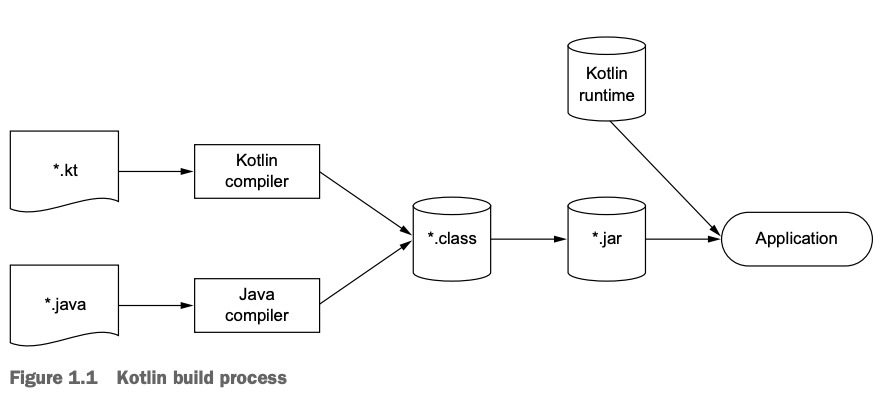

## 목표

- 자바, 코틀린 소스파일을 JVM으로 실행하는 과정 이해하기

## JVM이란 무엇인가

**JVM(Java Virtual Machine, 자바 가상 머신)은 자바 프로그램을 실행하기 위한 도구다.** 개발자는 작성한 자바 코드를 바로 실행할 수 없다. 소스파일을 JVM이 이해할 수 있는 바이트코드로 변환해야 한다. 변환한 바이트코드는 운영체제(OS)에 독립적으로 동작하기 때문에, 동일하게 프로그램을 실행할 수 있다. 덕분에 핵심 가치인 'WORA(Write Once, Run Anywhere)[^1]'를 제공한다. 즉, JVM은 동일한 환경에서 동작할 수 있도록 중간에서 도와주는 핵심 도구다.

## 컴파일 하는 방법

```shell 
javac <소스파일>
``` 

자바 소스파일(`.java`)은 `javac` 명령을 통해 컴파일된다. 명령을 실행하면 바이트 코드를 담은 `.class`파일을 생성한다.

```shell
kotlinc <소스파일 또는 디렉터리> -include-runtime -d <jar 이름>
``` 

코틀린 소스파일(`.kt`)은 `kotlinc`명령을 통해 컴파일하며 동일한 `.class`파일을 생성한다.



JVM은 언어와 상관없이 `.class` 파일을 실행한다. 하지만 코틀린은 코틀린 런타임 라이브러리(Kotlin Runtime Library)라는 추가 정보가 필요하다. 코틀린 런타임 라이브러리에는 코틀린 내장 클래스와 API 의존 관계가 담겨있다.

## 실행하는 방법

```shell
java HelloWorld
```

생성된 `.class`파일은 `java`명령을 통해 실행한다.

```shell
java -jar <jar 이름>
```

코틀린은 생성된 `JAR`파일을 실행한다. 

## 바이트코드란 무엇인가

바이트코드(Bytecode)는 소스 코드를 컴파일한 결과물이며, JVM이 이해하고 실행할 때 사용한다.

## JIT 컴파일러란 무엇이며 어떻게 동작하는지

- JIT(Just-In-Time) 컴파일러는 바이트코드를 실행 시점에 기계어로 변환하는 컴파일러다. JVM 성능 최적화에 핵심이다. JIT는 프로그램의 실행 과정에서 자주 사용되는 코드를 발견하고, 기계어로 변환하여 성능을 향상시킨다. 덕분에 반복 실행 시 높은 성능을 제공한다.

## JDK와 JRE의 차이

- JRE(Java Runtime Environment): JVM, 프로그램에 실행에 필요한 라이브러리를 포함하여 **프로그램을 실행하기 위한 환경을 제공한다.** JDK의 일부다.
- JDK(Java Development Kit): 컴파일러, 디버거 등 필요한 요소를 모두 포함한다. **프로그램을 만드는데 필요한 모든 것이 담겨있다.**

### 참고 자료

- [『Kotlin in Action: 2/e 』(세바스티안 아이그너·로만 엘리자로프·스베트라나 이사코바·드미트리 제메로프, 에이콘출판, 2025)](https://product.kyobobook.co.kr/detail/S000215768644)

[^1]: 한 번 작성하면 어디서든 실행 가능