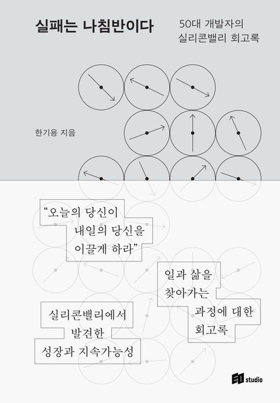
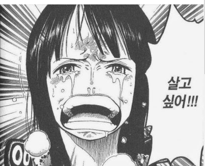

독특한 계기로 책을 선택했다. 먼저, 친구의 추천으로 우아한테크세미나 소식을 들었다. 두 번째는 스터디원의 블로그 글이었다. 세미나가 끝나고 다른 사람들과 의견을 교환할 수 있겠다는 생각에 강한 호기심이 들었다.

세미나 시청 전 한기용 님에 대해 듣기만 했고 영상을 보거나 책을 읽은 적은 없었다. 하지만 선택의 갈림길에서 사고방식을 듣는 순간 매료됐고 사람이 궁금했다. 이어 다른 영상도 시청했지만 짧게 느껴졌다. 결국
책을 선택했다.

책을 읽는데 얼마 걸리지 않았다. 가벼워서 들고 다니며 읽기 좋은 덕분에 산책하며 읽었다. 따로 기록을 하고 싶은 문장은 없었지만 올해 읽은 책 중에 가장 많은 질문을 던졌다.

> 책 내용은 담지 않고, 블로그 주인의 이야기가 전부다. 만약, 이유만 궁금하다면 마무리로 이동하세요.

## 고등학생, 꽃길만 걷게 해 줄게

2012년, 좋지 않은 성적으로 특성화고에 진학했다. 중학교 때 성적관리를 하지 못한 아쉬움에 고등학생 때는 다양한 활동을 하자고 마음먹었다. 돌이켜 생각하면 추상적이고, 구체적인 계획도 없었는데 졸업할 땐
학생대표로 상도 받고 할 수 있는 활동은 다한 것 같아 만족스러웠다. 관심도 많이 받으면서 선생님께서도 신경을 써주셔서 괜찮은 스타트업에 들어갔다.

## 공백의 10년, 운이 좋았지

운이 좋았다. 더할 나위 없는 직장에 취업했다. 걸어서 10분 거리였고 당시 개발자 인식을 생각하면 회사 분위기도 좋았다. 꿈을 펼치기 좋은 환경이었다. 꽃길이 보였다.

하지만 차가운 현실을 마주했다. 재정은 급격하게 어려워졌고 월급이 밀렸다. 결국 권고사직을 당했다. 병역특례를 기대하던 19살, 1년 차의 나에겐 청천벽력 같은 소식이었다.

직무를 살려 이직하는 방법도 있었지만 당시의 나는 이겨낼 힘이 없었다. 한 번도 하고 싶은 일에 대해 고민해 본 적 없고 다른 사람과 비교하며 지냈다. 나에게 집중하기보단 보이는 모습이 중요했다. 특성화고에서
졸업하면 대학보다 취업을 선택하는 게 정석이라고 생각했다. 규격 외의 삶을 살고 싶지 않았다. 결국 직무를 살리지 않고 입대를 선택했다.

군생활을 마치고 본격적인 방황이 시작됐다. 병들고 지친 나를 이끌어주는 사람이 많았지만 굳게 닫힌 마음을 열 수 없었다. 오랜 시간 움츠렸다.

## 2023년, 27살, 안식년

드디어 선택의 갈림길에 섰다. 아르바이트도 즐거웠지만 직업을 가지고 싶었다. 방황을 할 때는 고슴도치와 같아서 고민 없이 지냈다. 하지만 직업을 선택하기 위해선 대화가 필요했다.

살아생전 처음으로 나와 대화를 시작했다. 다행히도 이미 오랜 방황을 했기 때문에 자료가 충분했다. 처음부터 대화가 잘되지는 않았지만 계속 질문하고 답했다. 결국 무엇을 하며 어떻게 살고 싶은가라는 질문에 답할 수
있었다.

살고자 하는 의지를 보이자 묵묵히 지켜봐 주던 친구의 도움을 받았다. 항상 피하기만 했는데 그날따라 내밀어 주던 손이 반갑게 느껴졌다. 마침내 복귀를 결심했다.

외줄 타기가 시작됐다. 개발자가 아니더라도 다른 직업을 선택하면 그만이다라는 생각을 했다. 걱정과 의심도 많았는데 무식하게라도 했다. 다른 사람들이 보면 전혀 효율적이지 않은 공부방법이다라고 조언할만한
방법들이 나에겐 너무나 소중한 경험들로 남았다.

> 요즘 들어 느끼지만 다른 사람이 내 모습을 바라보고 평가할 땐 결과를 보는 게 당연하다고 느낀다. 하지만 전지적 시점에서는 경험이 쌓여야 지혜도 쌓이고 사고력도 확장된다고 생각한다.

[이전 글](https://devmeeple.github.io/2023/)에서 배경 없이 핵심만 짧게 작성했는데, 꾸준함을 목표로 잡았다. 목표로 설정한 이유는 방황 덕분이다. 단기 레이스에서는 좋은 성적을
받을 수 있었지만 한 번도 장기 레이스를 완주 한 경험이 없었다. 지금 도전하지 않으면 또 다른 위기가 찾아와도 흔들리고 쓰러질 것 같았다. 이겨낼 힘을 기르기 위해 꾸준함을 선택했다.

> 꾸준함을 기르기 위해 어떤 고민과 선택을 했는지 다음에 나눌 수 있는 기회가 있으면 좋겠다.

## 마무리

기존 서평과 다르게 이런 방법을 선택한 이유는 책이 나에게 선사해 준 경험 때문이다. 문장마다 질문을 던졌다. 취업에 성공하면 담아내고자 했던 내용인데, 책 내용이 훌륭해서 작성하지 않을 수 없었다.

읽으면서 이미 비슷한 내용의 책이 많은데 더욱 공감이 됐던 이유가 무엇일지 생각했다. 아마 한기용 님께서 20대 중반 본인에게 해주고 싶은 이야기를 풀어내셔서 그런 것 같다. 공감되는 내용들이 많았고 이후
만나 뵐 수 있는 기회가 생긴다면 감사하다는 말씀을 드리고 싶다.

직무와 상관없이 현재 방황을 하고 있거나, 걱정, 의심이 든다면 가볍게 읽기 좋다. 다른 분들도 자신과 대화하는 경험을 하시길 바라며 이 책을 추천한다.

- [6월 우아한테크세미나 - 글로벌 개발자로 성장하는 법](https://www.youtube.com/live/Nb2RnQzxu4I?si=NZPPBOX-TFBY4Nc6)
- [인프런 - 실리콘밸리에서 인정받는 개발자의 특징](https://inf.run/9SRzN)
