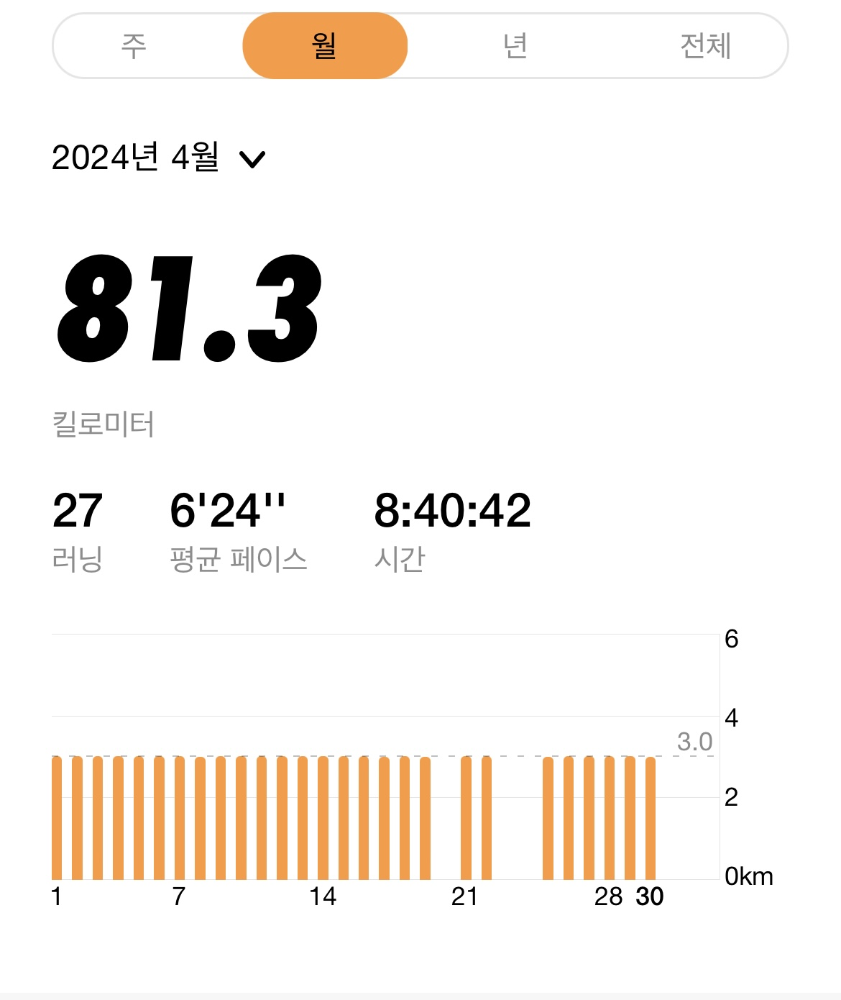

봄은 즐길 틈도 남기지 않고 떠났다. 더위 가득한 4월이 찾아왔다.

3월의 아쉬움을 기억한다. 견고하지 않은 시스템을 되돌아보는 한 달이었다. 아쉬움이 4월에도 이어졌다.
푹 잠들지 못하고 고민이 잦았다. 의심되는 문제점이 있었지만 정작 실행하지 못했다.

호흡을 되찾는데 집중했다. 조금만 방심하면 난이도가 기하급수적으로 증가했다. 문제를 정의하고 최대한 잘게 쪼갰다. 위닝 멘탈리티가 필요했다.
과정을 반복하니 문제를 인식할 여유도 없었다. 주어진 일을 해낸다는 한 가지 생각밖에 없었다. 이외에도 다양한 시도를 했다. 어떤 시도를 했는지 알아보자.

## 화성에서 온 Node.js 개발자

의문점이 많았다. 대표적으로 테스트 코드 작성과 아키텍처다. 입맛에 맞는 자료를 찾을 수 없었다. 자연스럽게 이전에 사용했던 Spring 자료들을 검토했다. 결국 **해결하려고 하는 문제는 다르지 않다**는 결론을
내렸다.

Java & Spring 조합과 TypeScript & NestJS 조합이 상호작용 됐다. (A를 사용하면 B가 사랑스럽게 느껴지고, B를 사용하면 A가 사랑스러웠다.)

### 인프런 워밍업 클럽 - 스터디 1기

때 마침 [인프런 워밍업 클럽 - 스터디 1기](https://www.inflearn.com/course/inflearn-warmup-club-study-1)가 열렸다. 이전에도 다른 기회가 찾아왔었다. 찾아온
기회도 Spring 학습이었고 의도와 다르게 흘러가지 않을까 고민하다 끝내 포기했다. 하지만 포기하고 기간이 지나니 아쉬웠다. 결정적으로 좋으나 싫으나 학습을 하다 보면 자연스럽게 Spring
자료를 접했다. 이왕 공부하는 거 함께 공부하자 생각해서 오랜만에 스터디 참여를 결정했다. 이제 시작한 지 이틀이 지났다. 초반이라 그런지 정적이 감돈다. 아직 함께 자라는 느낌은 크게 느낄 수 없다. 일주일이
지나고
나면 더 많이 이야기할 수 있을 것 같다.

그럼에도 불구하고 벌써부터 스터디 운영의 노고를 느낄 수 있다. 인프런 관계자분들과 스터디 운영진 분들께서 빠른 피드백에 힘써주시는 모습에 감사함을 느낀다. (누구보다 적극적으로 참여 중이다)

5월에 스터디가 종료된다. **다양한 관점으로 문제 바라보기, 문제해결 능력도 물론 중요하지만 함께 자라는 느낌을 기대한다.**

## 운동

운동을 많이 쉬었던 걸로 기억하는데 의외로 3번밖에 쉬지 않았다. 매일 하지 못해서 아쉽다. 매번 느끼지만 운동이 없었으면 소리소문 없이 사라지지 않았을까 싶다. 기분 탓인지는 몰라도 허리도 많이 좋아진 것 같다.
원래
오래 앉아있지 못했는데 이제 장시간도 앉아있는다. 운동 역시 꾸준히 해야겠다.

## 마무리

<iframe width="100%" height="400" src="https://www.youtube.com/embed/xMZMwFUscDc?si=yECRYXa4MtcaJBrb" title="YouTube video player" frameborder="0" allow="accelerometer; autoplay; clipboard-write; encrypted-media; gyroscope; picture-in-picture; web-share" referrerpolicy="strict-origin-when-cross-origin" allowfullscreen></iframe>

끝으로 한 달 동안 이 노래를 가장 많이 들었다. 친한 형이 이야기를 풀어내는 듯한 덤덤한 발성에 위로를 받았다. 이제는 어떻게 흘러갈지 예상이 되지 않는다. 그저 현재를 즐기며 살아야지. 할 일을 다하고 하늘의
뜻을 기다리자.
