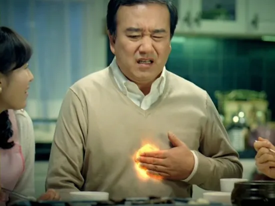

호기심이 폭발했다. 여러 가지 문제에 대해 사유하고 성찰로 이어지는 과정을 거쳤다.

## 응급실

몸이 좋지 않았다. 운동 중 발생한 통증을 무시하다 응급실에 다녀왔다. 웬만하면 통증을 참는데 몸이 심상치 않았다.

병원에서 응급실에 즉시 가라는 조치를 받았다. 황급히 도착한 응급실은 대기, 진료, 의료진분들의 모습까지 모두 낯설었다. 몸은 불편했지만 정신은 차릴 수 있었는데, 시간이 지나자 점점 정신이 분열됐다.
**'이곳은 어디, 나는 누구인가?'** 식은 땀을 흘리며 병상에서 대기하는 모습이 이질적으로 느껴졌다. 불안이 영혼을 잠식시키는 과정을 보니 큰일 날 것 같았다. 겨우 잠에 들었다.

오랜 대기와 진료(총 8시간)끝에 큰 문제는 발견되지 않았다는 소견을 들었다. 다행히도 약을 먹으며 일상생활 하는데는 문제가 없었다. 하지만 유지하던 습관(운동, 개발)은 변화가 필요했다. 달리지 못하고 오랜시간
앉아 있을 수 없다는 사실은 고역이었다. 다행인건, 독서로 대체됐다. 미뤄왔던 책을 읽으며 '글쓰기'로 관심을 돌렸다.

## 책책책! 책을 읽읍시다

몸이 좋지 않은 덕분에 미뤄왔던 책을 읽었다. 특히 기술이 아닌 일반도서를 주로 읽었다.

이전에 책을 선택할때는 기준이 없었다. 남들이 추천하는 'OOO 선정 100선'을 주로 선택했다. 하지만 계속 책을
읽다보니 나만의 기준이 생겼다. (물론, 기술과 일반에 따라 다르다.)

### 1. 호기심

- 기술: 구현과 결과, 반복하여 나오는 키워드, 오랜 시간 품어도 해결되지 않은 내용,
    - 예) 데이터베이스, 일급객체, NestJS, 리팩터링
- 일반: 인간관계, 인물
    - 예) 상대방 또는 유명인물의 사고방식

### 2. 휴대성

- 앉아서 읽기: 기술
- 이동 중 읽기: 주로 일반서, O'Reilly Media는 예외

### 3. 이외에도

주로 2가지 기준으로 선택한다. 하지만 이외에도 출판사, 번역가를 고려한다.

## 블로그 일주일 1포스팅 챌린지

<인프런 워밍업 클럽>이 종료되고 러너(참가자)들이 모여 운영되는 스터디가 흥미롭다. 4번밖에 진행되지 않았지만, 체감은 10회 이상 진행된 스터디 같다.

스터디는 한주간 공부한 내용을 정리해서 포스팅하며 진행된다. 관심사와 관점이 다양하다고 여러번 느꼈다. 객체지향 프로그래밍, AI, 쿠키, 테스트에 대해 이야기했던 시간이 가장 기억에
남는다.

**삶에서 가장 큰 재미를 느낄때는 의견교환이다.** 스터디에 참여하길 잘했다는 생각이 든다. 선입견을 가졌었는데 긍정적인 방향으로 흘러가고 있다. 같은 관심사를 가진 사람들이 모여 함께 자라는 느낌을
받아서 즐겁다.

어떻게 하면 더욱 활성화될 수 있을까에 대해 고민한적이 있는데 같은 고민을 하신분이 있으셔서 반가웠다. 포스팅을 하며 생각을 정리하는 습관도 쌓고 여러 관점도 접하고 일거양득이다.

## 마무리

건강의 중요성에 대해 한번 더 생각했다. 통증 덕분에 평소에 고민하지 않던 내용도 고민한건 좋았지만, 불편한건 부정할 수 없다. 평소에는 최대한 긍정적으로 사고하려 의식하는데, 몸이 좋지 않으니 어려웠다. 하고싶어서
계속 즐거워 하며 하던 일에도 부담을 느꼈다. 그럼에도 다행인건 지금은 많이 호전됐다.

**"컴포트존(Comfort Zone)에서 벗어나자."**

다음을 위해서는 결국 도전을 해야한다는 사실을 알면서도 컴포트존에 머무르고 있었다. 미지의 세계가 두렵고, 부담되지만 이겨내야 한다.
도전하기 좋은 적기다.

<iframe width="100%" height="400" src="https://www.youtube.com/embed/dhZUsNJ-LQU?si=lLxvUqTK1gvnEVA8" title="YouTube video player" frameborder="0" allow="accelerometer; autoplay; clipboard-write; encrypted-media; gyroscope; picture-in-picture; web-share" referrerpolicy="strict-origin-when-cross-origin" allowfullscreen></iframe>
