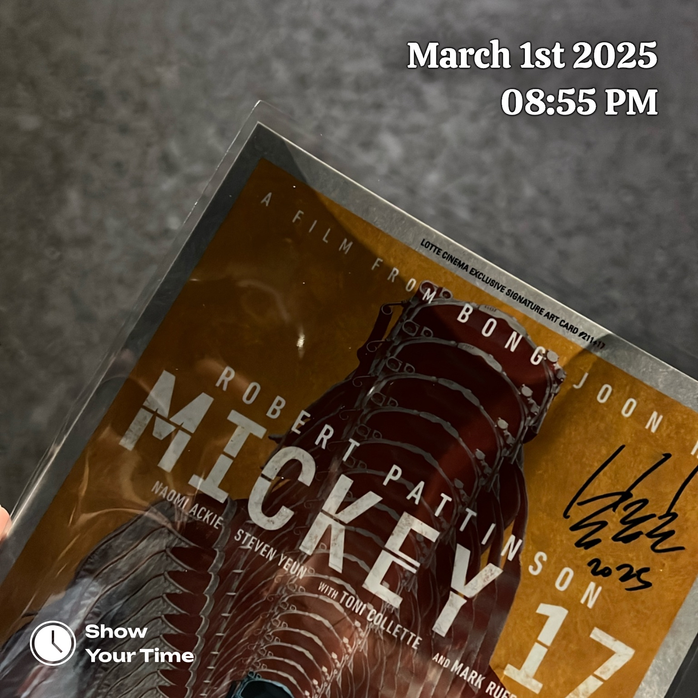

<iframe style="border-radius:12px" src="https://open.spotify.com/embed/track/4644JaCBBX7EpiZY1XXJaW?utm_source=generator" width="100%" height="152" frameBorder="0" allowfullscreen="" allow="autoplay; clipboard-write; encrypted-media; fullscreen; picture-in-picture" loading="lazy"></iframe>

**아무것도 하기 싫어. 우리는 그늘을 찾았네.**

## 워밍업 클럽: 서포터

> 전략적이 아닌, 적극적으로 다가가기

드디어 올해 워밍업 클럽이 시작됐다. 우연히 기회를 잡았다. 인연을 맺어준 활동인 만큼 올해는 어떤 즐거움과 어려움이 다가올지 기대된다. 운영팀과 러너의 사이에서 원활한 활로가 되고싶다.

## 영화: 미키17

> 죽는건 어떤 느낌이야? 비범한 하루

- '미키 17'은 평점보다 중요한 질문을 남겼다.
- 행복은 과연 어디에 있는 것일까? 미키가 행복을 느꼈던 순간은 '우주'라는 도피처를 찾았을 때 아니었을까.
- 죽고 또 죽었지만 고통 속에서 더욱 강해지는 미키가 인상 깊다. 포기하지 않고 살고 싶은 의지를 표현한 결과로 느껴졌다.

> 현대사회 과학기술윤리, 당신은 어떤 사람으로 남아 선택하고 싶은가

- 애석하게도 가장 두려웠던 존재가 삶에 가장 큰 위안거리로 다가왔다.
- 등가교환, 누군가의 희생덕에 비로소 존재한다.
- 계약서를 한번 더 검토하세요.
- 익숙한 배우들이 표현하는 다채로움
- 강철의 연금술사, 호문클로스, 연금술과 연성
- 미키 17의 연장선, [실리카겔 (Silica GEL) - 2집 : POWER ANDRE 99](https://www.yes24.com/Product/Goods/124520301)

## 마치며

기록을 좋아한다. 지금까지 기록은 '나'를 위해 존재했다. 앞으로 '일간 장태근' 시리즈로 정재된 가벼운 하루를 표현하고 싶다.
