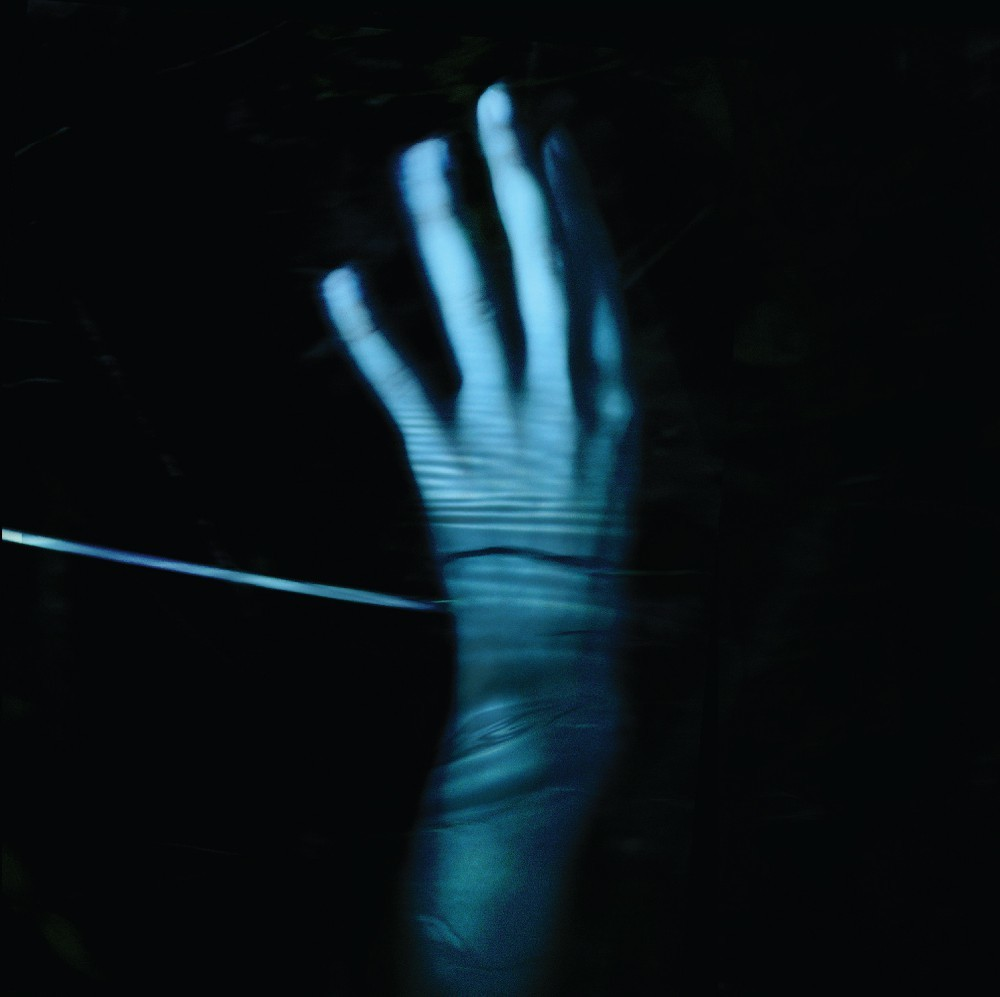

아무것도 하기 싫어. 우리는 그늘을 찾았네.

## 1. Permanent Note

### 1.1 워밍업 클럽: 서포터

드디어 올해 워밍업 클럽이 시작됐다. 우연히 기회를 잡았다. 작년 인연을 맺게 도와준 스터디인 만큼 올해는 어떤 즐거움과 어려움이 기다릴지 기대된다.
운영 관점에서 문제를 해결하는 방법을 배우고 싶다. 전략적이진 않지만, 적극적으로.

- 첫 번째 회의를 마쳤다.

### 1.2 영화: 미키17

> 죽는건 어떤 느낌이야? 비범한 하루

엔딩 크레딧이 올라갈 때 평점을 매겼다. 바보 같은 선택이다. '미키 17'은 평점보다 중요한 질문을 남겼다.

- 행복은 과연 어디에 있는 것일까? 미키가 행복을 느꼈던 순간은 '우주'라는 도피처를 찾았을 때 아니었을까.
- 죽고 또 죽었지만 고통 속에서 더욱 강해지는 미키가 인상 깊다. 포기하지 않고 살고 싶은 의지를 표현한 결과다.

> 현대사회 과학기술윤리, 당신은 어떤 사람으로 남아 선택하고 싶은가

- 애석하게도 가장 두려웠던 존재가 삶에 가장 큰 위안거리로 다가왔다.
- 등가교환, 누군가의 희생덕에 비로소 존재한다.
- 계약서를 한번 더 검토하세요.
- 익숙한 배우들이 표현하는 다채로움
- 강철의 연금술사, 호문클로스, 연금술과 연성

## 2. Literature Note

- [실리카겔 (Silica GEL) - 2집 : POWER ANDRE 99](https://www.yes24.com/Product/Goods/124520301): 미키 17의 연장선

## 마치며

- 기록을 좋아한다. 지금까지 기록은 '나'를 위해 존재했다.
- 앞으로 '일간 장태근' 시리즈로 정재된 가벼운 하루를 표현하고 싶다.
