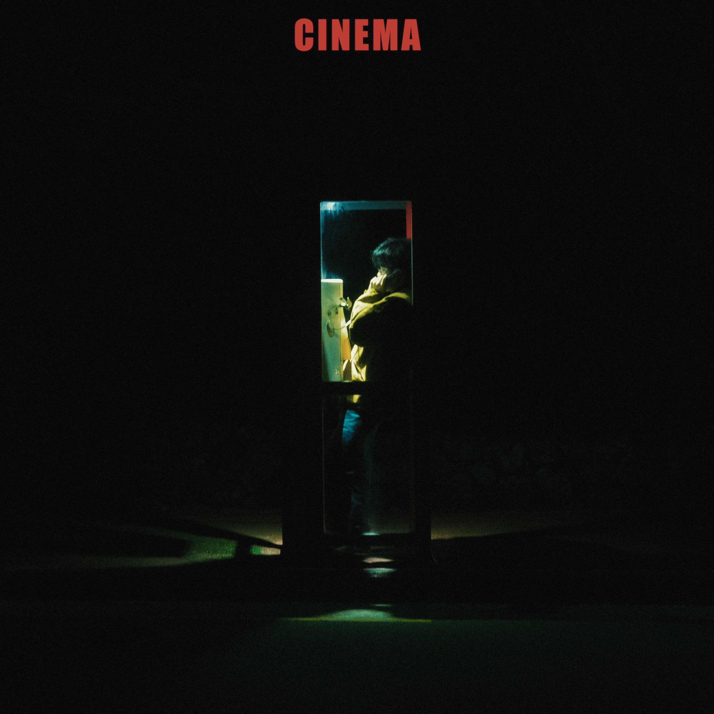
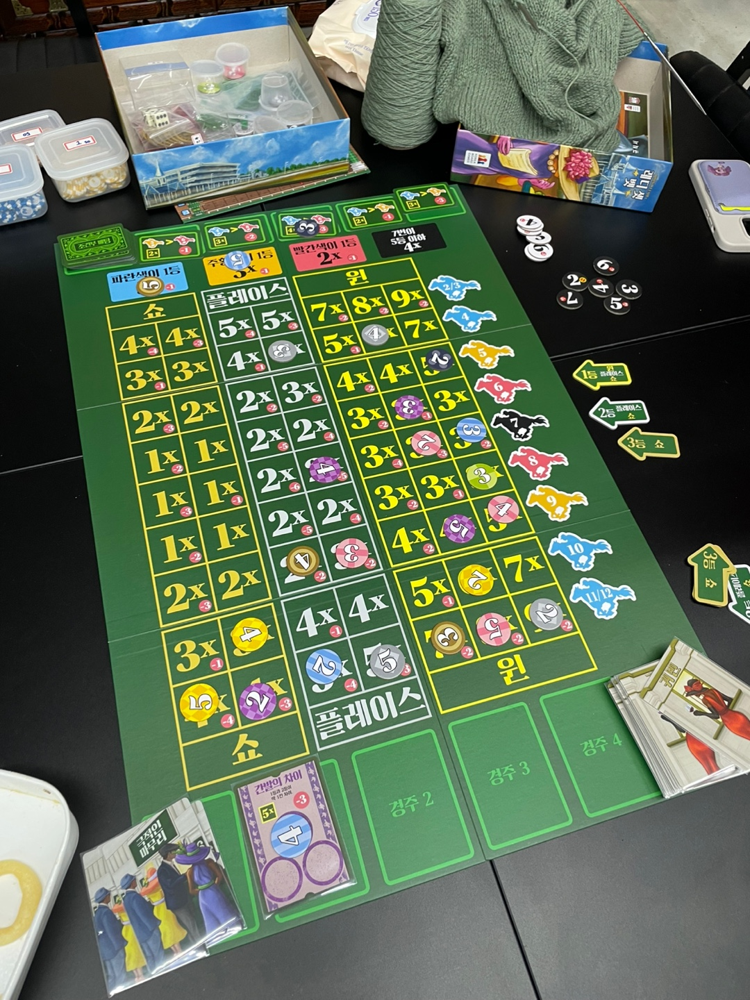

예술이야.

## 1. Permanent Note

### 1.1 트러블슈팅(Troubleshooting)

이미지가 출력되지 않았다. `Gatsby`로 블로그를 운영한 지 1년, 처음 겪는 오류다. 보통 패키지 버전 충돌이 전부였는데, 이번에는 로그조차 없었다.
해결 방법을 검색하기 전, 상황을 정리했다.

- 운영체제
- 이미지 포맷
- 캐시

**1. 운영체제**

macOS와 Windows를 모두 사용한다. Windows 문제인가 싶었지만, macOS에서도 동일한 증상을 보였다.

**2. 이미지 포맷**

이미지 포맷으로 `PNG`, `JPEG`, `AVIF`[^1]를 섞어 쓴다. 특정 이미지 포맷에서 발생한 문제인가 싶었지만, 그러기엔 뜬금없다.
더불어 해결해야 할 과제가 많았고, 언제 문제가 또 생겨도 이상하지 않았다. 아니길 빌었다.

**3. 캐시**

Mac mini와 MacBook Air를 번갈아 쓰는데, 둘 다 에러가 발생했다. 환경설정 문제라고 강하게 느꼈다.

**해결방안**

문제는 캐시였다. `yarn run deploy-gh`는 빌드 결과물을 배포한다. 노트북에서 혼자 작업할 때는 문제가 없었지만, 여러 컴퓨터를 사용하다 보니
누락되고 빌드된 것이다. `.cache`를 삭제하고 `gatsby clean`을 실행한 뒤 다시 빌드하니 정상 동작했다.

### 1.2 GitHub Actions

매일 글을 작성하니 배포가 번거로웠다. 자동화가 절실했다.

**요구사항**

- 오후 10시 저장소에 쌓인 `commit`을 배포한다.

**해결방안**

- `GitHub Actions`에서 `cron schedule` 사용

유레카, `GitHub Actions`에서 `cron schedule`을 사용해 문제를 해결하면 되겠다!

단순해 보였으나, 아직 해결하지 못했다. 스케줄링은 잡히지만 실제 배포가 이뤄지지 않는다. 해결하고 싶다.

### 1.3 보드게임

동굴 속에서 빛도 없이 1년을 굶었는데, 드디어 나왔다. [^2] 마감기한을 지켜 부하된 머리도 식히고 푹 쉬었다.

오랜만에 룰북을 준비하며 '테스트 코드 연습'에 적합하다 느꼈다. 요구사항과 결과가 분명해서 영어 학습자료로도 적합하다.

스터디를 운영하게 되면 IT종사자를 모아 보드게임을 진행하고 싶다.

- **개발자에게 적합한 보드게임 추천(논리)**
    - [튜링 머신(Turing machines)](https://boardm.co.kr/front/product/product_detail.php?seq=18603&pinid=): 현대 컴퓨터의 기반,
      튜링머신이 보드게임으로
      탄생했다.
    - [리코셰 로봇(Ricochet Robot)](https://boardm.co.kr/front/product/product_detail.php?seq=12847&pinid=): 알고리즘 사고 능력 향상
      코딩게임
- 『리팩터링』으로 유명한 [마틴 파울러(Martin Fowler)](https://martinfowler.com/tags/board%20games.html)씨 또한 유명한 보드게임 마니아다.

## 마치며

예정된 일정 덕분에 더욱 바삐 움직였다. 독학을 선택한 지 1년 넘었다. 스스로 정한 마감은 어느 정도 지켜왔지만, 다른 사람과 약속한 마감은 또 다른 무게가 있다.
마치 퀘스트를 깨는 게임 캐릭터가 된 기분이었다. 전략적으로 이용해야겠다.

입춘은 지났어도 진짜 봄은 이제부터다. 개학이다. 포근해진 얼음도 녹아내리길 바란다.

[^1]: [AVIF는 웹 이미지의 미래다](https://news.hada.io/topic?id=13927)
[^2]: 개발이나 운동외에 외출없이 산다.
