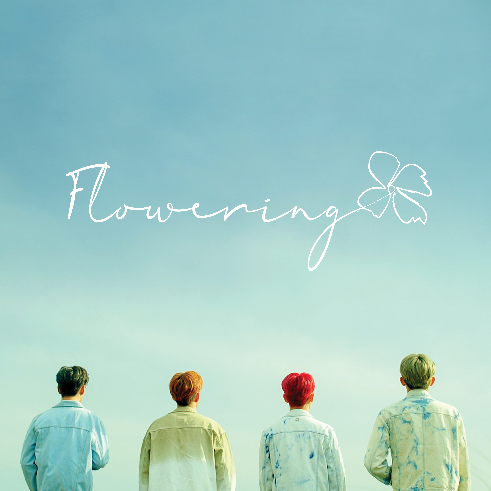

마침내 봄을 시작한다.

## 1. Permanent Note

### 1.1 워밍업 클럽

- [Gilded Rose Refactoring Kata by: Dmitry Kandalov](https://youtu.be/AxxNHKCldzA?si=orgrmn8QGkUYKhVR)
- 추상이란 무엇일까?

지난 기수에서 배운 클린 코드와 테스트 코드 복습을 시작했다. 부족한 부분은 강의로 보충하고 영상을 따라하는 중이다.

## 2. Literature Note

- [『세컨드 브레인은 옵시디언』(시안, 골든래빗(주), 2024)](https://product.kyobobook.co.kr/detail/S000213513105): 옵시디언 기초 배우기
- [『Clean Code(클린 코드)』(로버트 C.마틴, 인사이트, 2013)](https://product.kyobobook.co.kr/detail/S000001032980): 왜 중요할까?

## 마치며

미루다 운동을 하지 못해 아쉽다. 아침에 하지 않으면 계속 포기하는 운동, 가볍게 시작하면 좋겠다.