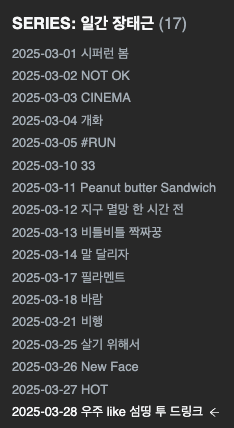

## 착수

벚꽃과 눈이 공존할 수 있음을 체험하는 3월을 보냈다.

## <일간 장태근> 부검

학습한 내용을 한 수 복기하듯 정리했지만 쉽게 발행까지는 이어지지 않았다. 미처 완생 하지 못한 글을 바라볼 때마다 숨 쉬듯 아쉬웠다.
시리즈 덕분에 기술 글쓰기, 테크니컬 라이팅에 걸린 부담을 덜었다. 뜻밖의 수확도 많았다. 일상엔 소소한 규칙이 포석처럼 놓였고 곧 삶의 리듬이 됐다. 기록과 발행이 즐겁다.

임시로 둔 두 편을 빼고 총 열다섯 편을 작성했다. **스무 번의 기회중 열다섯이니, 75% 성과를 이뤘다.** 발행하지 못한 기록을 추가할 까 했으나, 끝내 부자연스럽다는 결론을 내렸다.
미생에 사활을 걸지 않은 덕에 다음을 기약한다.

## 마치며 
