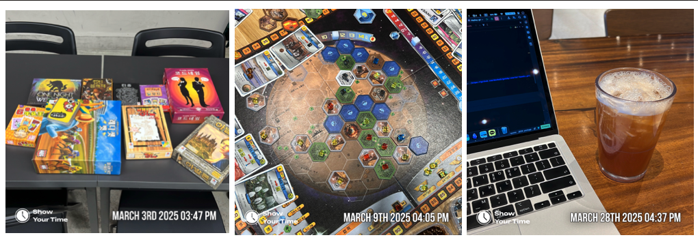

## 착수

> 작년 <월간 장태근> 시리즈는 자유롭게 한 달 일상을 정리했다. 이번 시리즈는 테마를 만들고 싶다는 생각이 들었다. 이번 글은 『미생』을 참고했다.

벚꽃과 눈이 공존할 수 있음을 체험하는 3월을 보냈다.

## <일간 장태근> 부검

학습한 내용을 한 수 복기하듯 정리했지만 쉽게 발행까지는 이어지지 않았다. 미처 완생 하지 못한 글을 바라볼 때마다 숨 쉬듯 아쉬웠다.
시리즈 덕분에 기술 글쓰기, 테크니컬 라이팅에 걸린 부담을 덜었다. 뜻밖의 수확도 많았다. 일상엔 소소한 규칙이 포석처럼 놓였고 곧 삶의 리듬이 됐다. 기록과 발행이 즐겁다.

임시로 둔 두 편을 빼고 총 열다섯 편을 작성했다. **스무 번의 기회중 열다섯이니, 75% 성과를 이뤘다.** 발행하지 못한 기록을 추가할 까 했으나, 끝내 부자연스럽다는 결론을 내렸다.
미생에 사활을 걸지 않은 덕에 다음을 기약한다.

## 강철의 연금술사

> 강철의 연금술사 캐릭터들의 대사에는 인사와 감사의 말을 되도록 신경을 썼다. 인사는 자신과 타인을 잇는 커뮤니케이션 방법 중 가장 간단히 할 수 있는 것. 
> 감사의 말은 "사람은 주의 사람과 서로 도우며 살고 있다는 것"을 실감하게 해주는 것이라고 생각하기 때문이다. 그리고 이 연재를 마친 지금, 이 작품에 관여해 주신 모든 분들께 
> "어디선가 다시 만나요"와 "정말 고마웠습니다"를 바칩니다.
>  
> <출처: 강철의 연금술사>

강철의 연금술사 명예회원이 있다면 정기적으로 후원하고 싶다. 미쳤다. 생일선물로 받은 기회가 전권 소장으로 이어졌다. 덕분에 과거의 '나'와 또다시 연결됐다. 
'읽기'에 거부감 없던 비결은 만화책 덕분이었다. 너무 재밌어서 용돈을 쪼개고, 언덕을 넘어 빌려있던 시절의 풍경이 선명하다. 웃음이 새어 나온다. 
앞으로 더 많은 만화책을 만나고, 따뜻한 감상을 블로그에 자주 녹여내고 싶다. 함께여서 행복하다.

## 이달의 인터뷰: CREDIT

질문과 답변을 모아 인터뷰 형식으로 정리했다. 

### Q. 학습 동기, 원동력이 무엇인가요?

> 이찬혁 가스라이팅

생존확률을 높이기 위해 포석을 깔았다. 다른 선택지는 애초에 없다고, 삶을 인정하고 각인시켰다. **정석이나 수 읽기보다 중요한 건 적극적으로 임하는 자세라고 생각한다.** 
누구도 다음 수를 알려줄 수 없다. 스스로 묻고, 탐색하는 수순만이 유일한 최선이라 믿는다. 매 순간이 미생이겠지만, 그래서 두어볼 가치가 있다.

### Q. 블로그의 방향성이 있나요?

따뜻한 봄과 함께 친구를 유독 자주 만났다. 마음껏 대화를 나누고, 보드게임도 원 없이 즐겼다. 흔한 "어떻게 지냈어" 인사 속에도 가끔은 사려 깊은 마음이 묻어나 있다.
자연스레 좋아하는 글쓰기 이야기를 꺼냈고, 블로그도 소개했다. "이해하기 어렵다", "무슨 말을 하는지 모르겠다"라는 반응을 흘려들을 수도 있었지만, 이번엔 조금 더 주목하고 싶다.
누군가의 이야기를 귀담아듣듯, 친절한 글을 쓰고 싶다.

## 마치며
