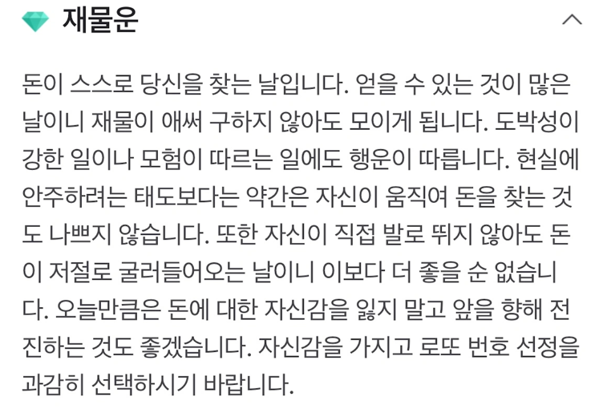
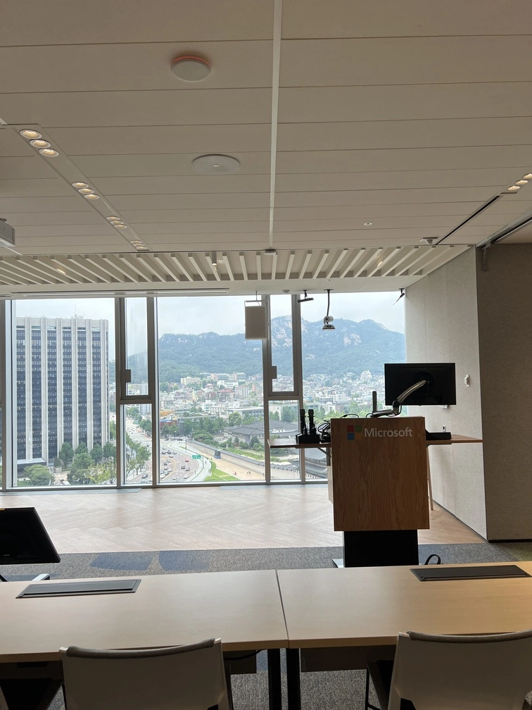

<iframe width="100%" height="400" src="https://www.youtube.com/embed/8i-B1ieI_kY?si=VDSK-up06aLKIp7g" title="YouTube video player" frameborder="0" allow="accelerometer; autoplay; clipboard-write; encrypted-media; gyroscope; picture-in-picture; web-share" referrerpolicy="strict-origin-when-cross-origin" allowfullscreen></iframe>

## 경찰서

믿기지 않는 상황이 펼쳐졌다. 새벽에 집을 나왔다. 골목길은 항상 더러웠다. 하지만 그날따라 깨끗했다.
무엇 앤가 이끌린 듯 고개를 돌렸다. 돈이 떨어져 있었다. 가로등 아래 빛나는 황색 지폐는 흡사 금덩이 같았다.
그런데 이게 무슨 일일까. 지폐가 아니라 돈다발이었다. 무려 500만 원이었다. 어이가 없었다.

일정을 미루고 경찰서로 몸을 돌렸다. 새벽 4시 30분, 한적한 경찰서에 돈다발을 들고 등장했다. 경찰관 분들과 함께 놀랐다.

신고를 마치고 집으로 돌아가는 길이 재밌었다. 돈에 허덕임에도 불구하고 한치의 망설임 없었다.
당연히 해야 할 일을 한 거지만 스스로가 대견했다. 그리고 부모님께 감사했다.

## 함께 자라기

특강부터 세미나까지, 다양한 활동에 참여했다. 퍼스널 브랜딩, 데이터베이스, 성장, 각기 다른 주제는 매력적으로 다가왔다. 하지만 활동으로 얻은 가장 큰 수확은 '회고'다.

개발자를 포기하고 일했던 분야는 모두 '덕업일치'를 이뤘다. 어떻게 하면 생산성을 높일 수 있을지 고민하니 자연스레 다가왔다.
반면 개발은 드디어 덕업일치를 이룬다고 생각했다. 하지만 아니었다. 이전에도 DEVIEW, 생활코딩 오프라인 수업 등 다양한 활동에 참여했다. 시켜서 하던 일이 아니었다.

스터디에 참여하길 잘했다고 거듭 느꼈다. 함께 공부하라는 조언을 흔히 듣는다. 하지만 맞지 않는 옷 같았다. 주로 혼자 공부했다. 나에게 맞는 방법을 실행하고 수정하며 여러 애로사항을 겪었다.
그러다 결국 '풀리지 않는 문제'라는 벽에 부딪혔다.

기존의 방법에서 변화를 주고자 스터디에 참여했다. 돌이켜보면 적절했다. 덕분에 여러 기회를 얻었다. 생각하지 못했던 관점을 듣고 의견을 토로하는 과정이 즐겁다.

## 도서관

* [월리엄 진서 『글쓰기 생각쓰기』](https://product.kyobobook.co.kr/detail/S000001110694): '글쓰기 스테디 셀러' 글쓰기 종류와 형식을 설명하는 예제가 풍부하다. 하지만 번역이 매끄럽지 않다. 3.5/5

## 마무리

다양한 시도를 했다. 언어와 상관없이 '기본기'라고 이야기하는 여러 주제 중[^1] 테스트에 특히 집중했다. 테스트는 오랜 숙원이다. 의도와 다르게 발효된 테스트는 마치 묵은지 같았다.
고약한 냄새가 날 지경이었다. 질문도 하고 책도 보고 다양한 시도를 했다. 명쾌하지 않았다.

테스트 대역과 프레임워크에 어떻게 접목시키는지 궁금했다. 아무리 봐도 단위 테스트가 아니었고 생산성도 떨어졌다.
그런데 역시 좋은 자료와 더불어 '백문이 불여일타' 직접 실행해야 한다.

결국 기본기는 연결되어 있다. 테스트를 공부하면 자연스럽게 객체지향과 설계에 손이갔다.

"당신의 테스트 코드가 테스트하기 어려운 이유는 설계의 문제일 수 있다" 관점이 충격적이었다. 기존의 생각과 학습 이후 변화를 글로 표현할 때다.

"아침에 눈을 뜨면 지난밤이 궁금해 오늘은 어떤 사건이 날 부를까" 흡사 명탐정 코난 같다. 올해 중 유독 재밌는 한 달을 보냈다. 매 순간이 우당탕탕, 비틀비틀 짝짜꿍이었지만 내일이 기대됐다.
지난달은 응급실, 이번달은 경찰서 다음 달은 어디로 떠나볼까. ~~회사로 보내주면 좋겠다.~~

[^1]: OOP(Object-Oriented Programming: 객체지향 프로그래밍), 테스트, 아키텍처
