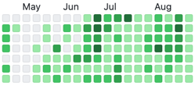
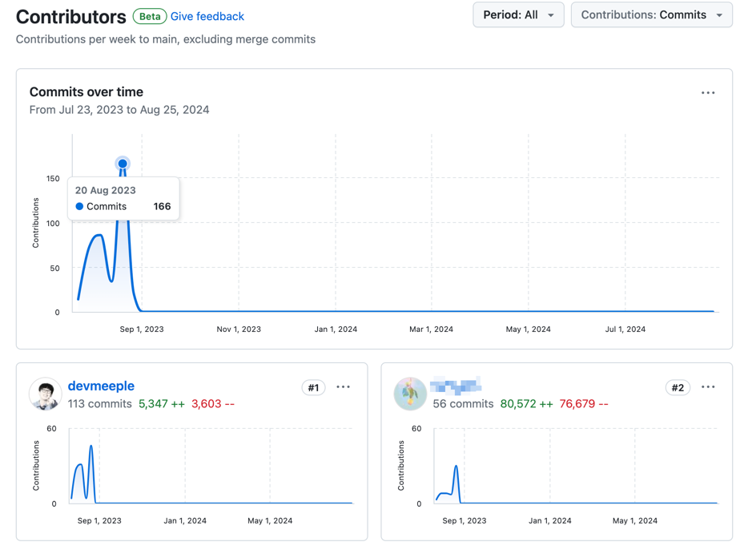
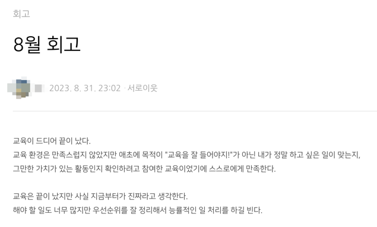
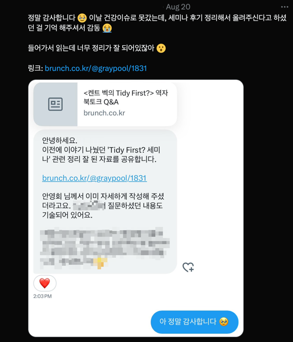

<iframe width="100%" height="400" src="https://www.youtube.com/embed/ALXA72FkkVE?si=p3bnxTbYWTEAOuUU" title="YouTube video player" frameborder="0" allow="accelerometer; autoplay; clipboard-write; encrypted-media; gyroscope; picture-in-picture; web-share" referrerpolicy="strict-origin-when-cross-origin" allowfullscreen></iframe>

벌써 국비 교육이 끝난 지 1년 지났다. 지난 회고를 짧게 돌아보며 어떤 변화가 일어났는지 알아보자.

## 회상

밥 없이는 살아도 커피 없이는 못 살았다. 문제가 풀리지 않으면 달달한 음식을 찾았다.
몸이 힘들어하는 것도 모르고 계속 뛰었다. 어떻게 이렇게 지냈는지 의아하다.[^1]

오랜만에 코드를 다시 봤다. 객체를 만들고 습관적으로 getter/setter를 선언했다. 무엇인가 잘못됨이 느껴져도 설득이 어려워서 급히 구현하던 모습이 떠오른다.
문제를 해결하는 구현 능력도 물론 중요하지만 마지막 리뷰 때라도 '다른 방법으로 구현할 수 있다' 언급정도만 하고 넘어갔어도 좋지 않았을까. 거듭 생각해도 아쉽다.

> 덕분에 스스로 생각할 수 있는 기회가 있었으니 오히려 좋았다.

지금과 별반 다르지 않다. 다행인 건 이번달에 드디어 이력서를 넣었다. 결과는 기대하지 않지만 도전을 해서 기분 좋다.
가장 경계해야 하는 검열을 하느라 시도하지 않았는데 결제 같았다. 버튼 한 번에 끝나는 게 웃겼다. 그동안 무겁게 마음을 먹었었는데
이제는 조금 더 가벼운 마음으로 지속적으로 두드릴 수 있을 것 같다. 처음이 어렵다.

## 좋은날

당연히 해야 하는 일이라고 생각했는데 긍정적으로 말씀해 주셔서 감사했다. 오픈소스의 영향인지 주위에 선한 영향력을 주시는 분들이 많다.
그동안 받기만 했는데 아주 작은 일이라도 선한 영향력을 줄 수 있어서 좋았다. 좋아하는 일을 관심 가지고 했을 뿐인데 과분하다. 계속해서 작은 시도를 하자.

## 마치며

작년보다 다양한 사고를 할 수 있어서 좋다. 부족하지만 가만히 지내지는 않았구나. 스스로 대견하다.
실무에 가면 지금까지 생각하지 못했던 부분까지 고려할 수 있다는 사실이 기대된다. 지금의 내가 하지 못하는 사고를 확장하고 싶다.

> 삶이 절망스럽고 괴롭다면, 그만큼 자기 삶에 진심을 다했다는 뜻이다. 그래서 당신이 단 한 번만이라도 좋으니 극도로 절망했으면 좋겠다.
>
> <출처: 프리드리히 니체>

한 달 중 보름을 쉬었다. 보통은 아쉬움을 남기고 다음을 기약한다. 그런데 이번달은 다르다.
지친 몸을 받아들인다. 쉬어도 금방 다시 일어나서 할 수 있다는 믿음이 생겼다. 내일이 기다려진다.

다음 달은 정리한 글을 더 많이 공개하고 기술블로그의 색채가 느껴지길 바란다. 더불어 감각을 잃지 않고 계속 지원하고 도전하는 내가 되길 바란다.
안주하지 말자.

[^1]: 그래서 9월에 바로 쓰러졌다.
