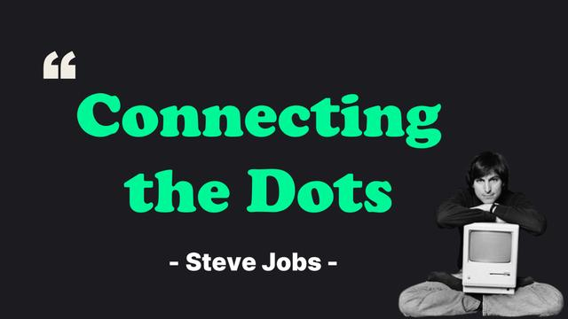
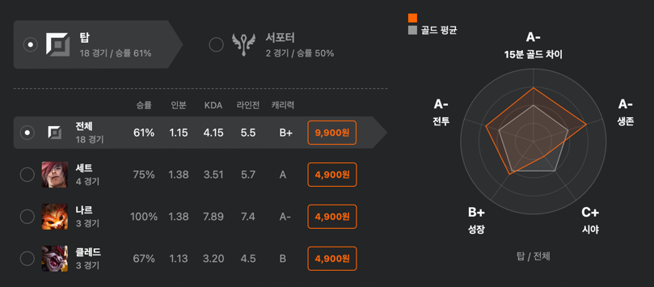

<iframe width="100%" height="400" src="https://www.youtube.com/embed/iGWKNrtbF9I?si=-oGCDSpgG9XJvbnv" title="YouTube video player" frameborder="0" allow="accelerometer; autoplay; clipboard-write; encrypted-media; gyroscope; picture-in-picture; web-share" referrerpolicy="strict-origin-when-cross-origin" allowfullscreen></iframe>

**"살아있음을 느낄 때면, 난 산송장처럼 눕기 싫어!"**

2024년도 이제 100일이 남지 않았다. '올해 가장 행복할 때가 언제였어?' 자문했을 때 9월을 뺄 수 없다.
시원한 바람, 바람막이, 헤드셋과 함께한 행복을 공유한다.

## Connecting the dots

'과거와 연결되어 있다'는 생각을 유독 많이 했다. 다시 개발을 시작하게 된 이유가 무엇일까, 어떤 포인트에 재미를 느낄까
질문에 답을 할 수 있지만 시작이 어디인지는 알 수 없었다. 그런데 생각해 보면 모든 일은 경험에서 시작됐다.

### 데이터 분석

김나헌 님[^1]께서 만들어 주셨다. 참여하기 전까지는 별다른 생각 없었다. 다른 밋업처럼 흥미로워 참여했다.
그런데 온라인 밋업을 보면서 느꼈다. 데이터를 어떻게 바라보시는지 기술적인 내용과 질문, 답변, 운영 모두 좋았다. 하지만 가장 좋았던 점은 다른 부분이다.

사회에서 개발자를 바라보는 시선은 처음 개발자를 접했을 때와는 전혀 다르다. 멀티버스가 아닌가 싶다.
지금에서야 넘어갈 수 있는 주제지만 '컴공은 3D 업종이다', '개발의 끝은 치킨집이다'라는 내용을 숨 쉬듯이 들었다.

개발자 인식이 좋아져서 돌아오고 싶었던 것은 전혀 아니었다. 관심도 없었다. 코로나 덕분에 오히려 활성화 됐는지도 몰랐다.
당시에 하는 일은 하나밖에 없었다.

관전 분석만 했다. 게임은 안 했다. 대회를 보고 분석하는 영상은 모두 챙겨봤다. 정리한 지식을 친구에게 알려줬다.[^2]
오랜만에 삶이 재밌어서 데이터 분석가, 데이터 엔지니어를 찾아봤다. 잊고 살았다.

나헌 님께서 풀어주신 이야기 덕분에 '스스로 개발자를 바라보는 인식'이 왜 변화했는지, 잃어버린 단서를 얻었다.
다시 해석해 보면 한 가지를 깊게 알아갈 때의 재미와 반복을 버티는 방법을 배웠다.

## 두 개의 심장

### 1. SEF2024

오프라인 팝업스토어에 다녀왔다. 성수에 위치해서 그런지, 코딩을 전혀 몰라도 부담 없이 참여할 수 있는 분위기였다.
블록코딩으로 문제를 해결하며 사진도 찍고 소망 편지도 담고 소소한 즐거움을 안겨줬다.

온라인은 EO 영상으로 유명하신 조은님의 ['비즈니스하는 개발자'](https://youtu.be/173WJ6depMY?si=1WpnL8Hon5mtn1jJ) 세션이 괜찮았다.

### 2. 개발바닥 밋업

앞서 이야기한 개발자 인식 변화에 도움을 받은 개발바닥을 마주했다. 짧게 요약하기 힘들다.
자세한 후기는 [이전 글](https://devmeeple.github.io/pangyo-evening-special-meet-up-with-devbadak-240925/)로 대신한다.

### 3. 학습과 성장 컨퍼런스 2024

개발자에 도전하기 전에 마주했던 발표자의 발표를 들었다. 사실 모두 해당된다. 라디오 재밌게 들었던 기억,
친구들과 사용하던 기억이 떠올랐다. 이 외에도 다양한 경험을 했다. 자세한 이야기는 후기로 알아보자.

### 그래서?

콘퍼런스를 다녀올 때마다 기분이 좋다. 온라인으로도 정보를 얻을 수 있지만, 오프라인에서 느껴지는 현장감이 있다.
직관을 가서 야구 경기를 보는 것과 모니터로 보는 것의 차이와 유사하다.

무엇인가를 배우러 가기보단, 쉬러 가는 시간[^3] 같다. 다녀오면 기진맥진이다. 다음날에 집중을 도와주는 윤활유, 매개체다.

## Halo

글쓰기도 시스템에 들어왔다. 마치 MVP 같다. 공부한 내용을 정리할 때 재밌다. 글쓰기책을 열심히 봤던 덕을 드디어 보고 있다.

아직 검색엔진의 선택을 받지 못해서 아쉽다. 하지만 폭발적인 조회수덕에 도파민을 느꼈다.
앞으로 어떻게 '나만의 글'을 작성할지 지속해서 풀어내고 싶다.

## 마치며

펠리컨적 사고를 실천했을 때 장점을 느꼈다. 마감기한을 잡으니 미룰 수가 없다. '해내야 한다'라는 약속, 사명감으로
시스템을 최적화시켰다.

10월은 예정된 행사가 없다. 하지만 벌여놓은 일이 많다. 무리하지 않되, 어떻게 활용할지 계속 고민해야겠다.
이 또한 추상화가 아닐까. 나에게 무엇이 필요하고, 필요하지 않은지 이해하고 해내보자.

[^1]: [스포티파이에서 데이터직군은 도대체 무슨 일을 하나요?](https://inf.run/uHTU7)
[^2]: 친구는 훈수를 뒀다고 이야기할 수 있다.
[^3]: 배움도 이어진다.

