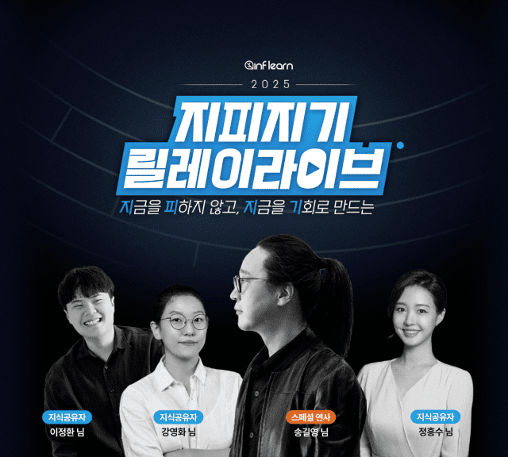

<iframe width="100%" height="400" src="https://www.youtube.com/embed/6z82w0l6kwE?si=J2yrpJ6J96GUfdcY" title="YouTube video player" frameborder="0" allow="accelerometer; autoplay; clipboard-write; encrypted-media; gyroscope; picture-in-picture; web-share" referrerpolicy="strict-origin-when-cross-origin" allowfullscreen></iframe>

2월이 다가왔을 때 나는 안개 자욱한 거리를 마주했다. 과거와 똑같은 모습으로 나를 기다렸다.

## 1. 행사: 항복

### 1.1 2025 지피지기 릴레이 라이브 인프런

> 명령은 커맨더 [<출처: 인프런 '지피지기 릴레이라이브'>](https://www.inflearn.com/tag-curation/common_tag/2025zpzglive)

- 사진
- 불안과 불확실 속 '나의 이름'으로 거뜬히 살아남기

### 1.2 Kotlin Backend Meetup

- SNS를 활보하다 알았다. 경품에 당첨됐었다는 사실을.

## 2. 크림: 무중력

> la crème de la crème <출처: 『일인칭 단수』(무라카미 하루키, 문학동네, 2020)>

- 등대가 꺼졌다.
- 무기력한 공기에 잠식됐다. 음악은 심작박동과 같다. 플레이리스트에 추가한 노래 갯수에 따라 상황을 파악한다.
- 무중력, 지난달 어떤 전조증상이 있었는지 아직 파악하지 못했다.
- 좋아서 했던 일이 전부 허상이 아닐까?
- 형식적으로 어영부영 시간을 죽이고 있던건 아닌가 싶다.
- 어디서 제동이 걸렸는지 파악이 어려울 정도로 답답했다.
- 천재지변
- 답답한 새벽을 보낼 때 마다 울부짖음이 느껴졌고, 바다를 연상했다. 이번달은 고요한 침묵을 지켰다.
- 지저귀는 소리, 층간소음
- 아무것도 손에 잡히지 않았다. 이또한 허상이 아닐까.
- 최근 받은 스트레스 중, 가장 강력했다.
- 잠깐 눈을 감았다 떠보면 많은 것이 이미 사라져버렸음을 깨닫는다. 흔적 하나 남기지 않고 어딘가로 날아가버렸다.
- 감정의 미로를 수확 없이 왕복하는 사이, 의식은 표지판을 놓치고 말았다. 정신을 차리고 보니 숨이 제대로 쉬어지지 않았다.
- 지원했던 모든 활동에서 떨어져서 그랬다?
- 모든 일을 수수께끼의 고대문자처럼 해독하지 못한체 남았다. 아무리 생각해도 불가사의 한, 설명 되지 않는 문제다. '나'를 잃어버릴 정도로 치명적인 독.

> 그건 나도 아직 잘 모르겠어.

## 마치며

정신을 차렸을 때 진한 아쉬움이 남았다.
