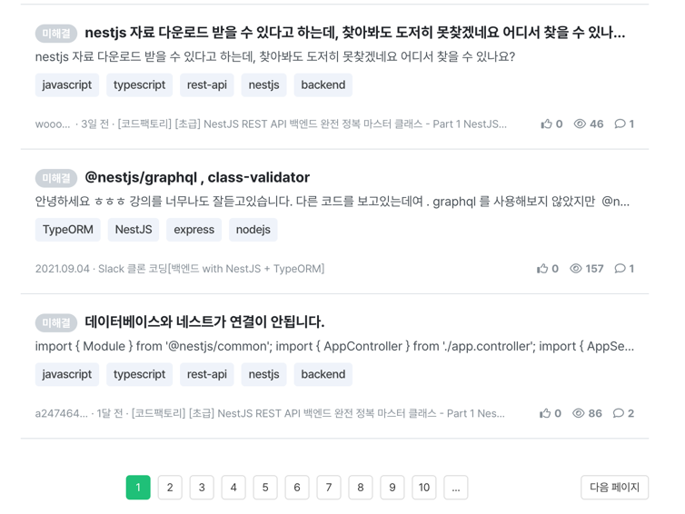

매일 회고를 작성하며 나를 돌아본다. 일일회고를 모아 월간회고를 작성할 때 불편함을 겪어 간단한 서비스를 만들고 있다.

서비스를 개발하며 글은 쌓일텐데 항상 전체 데이터를 가져오는건 비효율적이지 않을까라는 접근으로 페이지네이션을 구현했다. 알고보니 페이지네이션도 다양한 선택지가 있었다. (Offset , No Offset)



오늘 이 시간에는 흔하게 접할 수 있는 Offset 기반의 페이지네이션 구현에 필요한 기본적인 정보와 제공되는 함수에 대해 알아보자.

## 정렬 - ORDER BY

```sql
SELECT 열명
FROM 테이블명
WHERE 조건식
ORDER BY 열명;
```

- ORDER BY는 검색 결과의 행 순서를 바꾸는 데 사용된다.
- 테이블에 저장된 데이터의 순서를 바꾸지 않는다.
- 지정하는 열명을 기준으로 정렬한다.
- 기본은 오름차순(ASC)이고, 내림차순은 DESC 키워드를 사용한다.
- 가능한 정렬 방법을 생략하지 않고 지정하는 방법을 권장한다.

```sql
SELECT 열명
FROM 테이블명
WHERE 조건식
ORDER BY 열명1, 열명2;
```

- 복수의 열을 지정하여 정렬할 수 있다.
- **NULL 값의 정렬순서는 DBMS마다 다르다. MySQL은 NULL 값이 가장 작은 값으로 취급한다.**

> 예를 들어 작성된 최신글을 조회할 때 ORDER BY 열명 DESC를 사용한다.

## 결과 행 제한하기 - LIMIT & OFFSET

```sql
SELECT 열명
FROM 테이블명 LIMIT 행수
OFFSET 위치;
```

- 결과로 반환되는 행 수를 제한하는 데 사용한다.
- LIMIT 구는 표준 SQL이 아니다. MySQL, PostgreSQL에서 사용할 수 있다.
- OFFSET 구는 시작 위치를 지정한다.

## 페이지네이션

예를 들어 글 테이블에서 작성날짜를 기준으로 최신글을 조회하면 다음과 같이 작성할 수 있다.

```sql
SELECT *
FROM posts
ORDER BY created_at DESC LIMIT 10
OFFSET 20;
```

> 21번째 행부터 30번째 행까지 10개의 행을 가져온다.

## 마무리


1년 전이 떠오른다. 팀 프로젝트에서 데이터베이스 관련 작업은 도움이 되지 못했다. 테이블 설계와 SQL에 대해 전혀 몰랐고, 페이지네이션도 자료를 보며 겨우 구현했다.

프로젝트가 끝나고 페이지네이션에 대해 더 많은 자료를 찾아봤지만 의문은 풀리지 않았다. 돌이켜보면 기본기가 부족했다. (물론 아직도 부족하지만)

아무리 봐도 이해되지 않는 부분들이 있었는데 오랜만에 책을 다시 읽으니 의문들이 풀려있었다. 잘 모르지만 일단 해보자라는 접근이 빛을 발하는 순간이다. 처음에는 이해되지 않아도 여러 번 반복해서 읽으니 이해됐다. (
백문이 불여일타)

오랜만에 페이지네이션 기본기를 정리하며 기초체력에 대해 한 번 더 돌아보는 시간을 가져 반가웠다.
