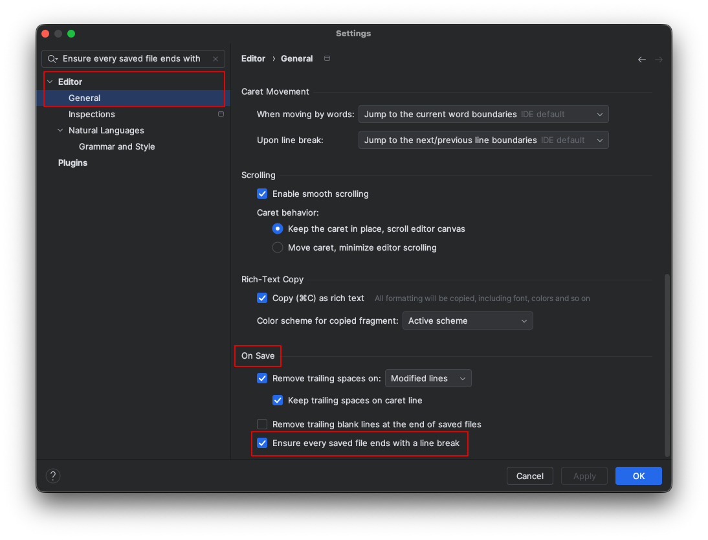

## 문제

IDE(IntelliJ)에서 코드를 작성할 때는 경고가 발생하지 않았다. 하지만 GitHub에 코드를 올렸을 때 경고 메시지를 출력한다.

## 원인

> **3.206 Line** 
> A sequence of zero or more non- <newline> characters plus a terminating <newline> character.

[POSIX(Portable Operating System Interface + X)](https://pubs.opengroup.org/onlinepubs/9699919799/basedefs/V1_chap03.html#tag_03_206)[^1]
표준에서는 호환성, 일관성을 위해 다음과 같이 규칙을 정의했다. 표준에 따르면 텍스트 파일의 마지막 라인은 빈 줄(newline) 문자로 끝나야 한다.

## 해결

- 마지막 줄에 빈 줄 하나를 추가한다.

### IDE 설정하기

매번 파일을 작성할 때마다 직접 개행문자를 작성하는 것은 불편하다. 가장 쉽게 해결하는 방법은 IDE 설정으로 해결하기다.

- IDE 설정을 열어 Editor | General에서 Ensure every saved file ends with a line break(모든 저장된 파일이 줄 바꿈으로 끝나도록 함)을 체크한다.

[^1]: IEEE가 정의한 Unix 애플리케이션 프로그래밍 인터페이스(API) 규격
