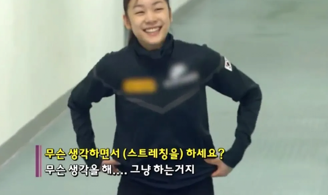

# 4월 1주차 요구사항

- **매일 이력서를 검토한다 지원까지 하면 최고** 👍
- 자바스크립트 기본기에 집중한다. (문법을 활용한 구현, 클린코드, 리팩터링, 오브젝트...)
- [쉽고 자연스럽게 배워보는 Javascript 입문 - 코드스쿼드 마스터즈 코스 레벨1](https://www.inflearn.com/course/javascript-%EC%9E%90%EB%B0%94%EC%8A%A4%ED%81%AC%EB%A6%BD%ED%8A%B8-codesquad-masters_lv1)
    - 학습만큼 정리에 신경 쓴다.
- 욕심부리지 않는다.

# 1일(월)

> 아무래도 좆됐다.  
> 그것이 내가 심사숙고 끝에 내린 결론이다.  
> 나는 좆됐다.
>
> 앤디 위어 <마션> 중

마션의 첫 문장처럼 한주가 시작됐다. 잠에 방해되는 행동을 하지 않았다고 생각했는데 사실은 아니었나 보다. 1시간 30분 동안 사투를 벌였지만 꿈나라 티켓은 주어지지 않았다. 이 또한 패턴이
있지 않을까라는 질문을 던졌다. 무의식 중에 반복하고 있는 행동이 무엇일까?

첫 번째로 잠들기 전 생각이 많다. 마치 소풍전날 밤 같다. 오늘은 이렇게 하고 앞으로 이렇게 하면 되겠다. 스스로 대화를 던지다가 잠에 못 든다. 두 번째는 운동이다. 3일 정도 운동을 쉬었다.
운동으로 하루를 시작할 때 얻는 상쾌함과 성취감이 있다. (물론 힘들다) 휴식이 신체 리듬을 바꾸고 더 많은 질문을 만들지 않았을까 의심된다. 이 외에도 분명 방해되는 행동이 있을 것이다.
진상조사를 통해 늑장대응을 멈출 것이다.

어떤 행동이 신체 리듬을 깨는지 밝혀내지는 못했지만 체험을 하고 느낀 점이 있다.

- 잠을 안 자는 것은 결국 손해다

할당된 임무를 마치지 못했을 때 조금 더 하면 해결할 수 있을 것 같은데, 잠이 안 오네 밤샐까라는 생각을 하곤 했다. 하지만 결과는 손해로 다가왔다. 뇌에서 산소부족이라는 비상벨을 울리고
소화기간마저 불안정했다. 주어진 시간을 더 투자하고 다음 하루를 망치기보다 한정된 시간을 어떻게 효율적으로 쓸 것인지를 고민하는 게 맞다. 임무를 마치지 못 한 이유는 낭비한 시간이 많아서,
연습부족 확률이 더 크다. 일찍 자야 하는 이유와 연습이 필요한 이유를 정의했다.

# 2일(화)

일어나니 좋다는 표현이 연신 나왔다. 남아있는 피곤함도 어제와 비교하니 선녀처럼 느껴진다. 언제 잠들었는지 기억조차 나지 않는다. 자다가 커밋을 하지 않은 점에 깜짝 놀라 시계를 봤는데
하루가 지나가 등골이 서늘했다. 짧은 순간에 노심초사했는데 다행히 커밋한 기록이 있었다. 다시 잠들 수 있을까 또 밤새겠네 생각했는데 바로 잠들어서 다행이다.

40분-20분 휴식 규칙을 유지하며 학습을 해봤다. 휴식시간이 과하지 않나라는 생각도 들었는데 현재까지는 적절한 것 같다. 많지도 적지도 않다. 20분이 있으니 40분을 조금 더 집중하게
되는 것 같다. 시간을 조금씩 조절해 가며 최적화시켜야지.

구현하면서 문법을 알아가는 게 피드백이 빠르고 좋은 것 같다. 내일은 정리까지 끝내면 좋겠다.

# 3일(수)

## 서평 - 더 시스템(THE SYSTEM)

개발바닥 라이브 방송을 시청하다가 책을 한 권 추천받았다. 더 시스템을 읽었다. 19일에 책을 대출했으니 2주가 소요됐다.

> 『더 시스템』을 통해 “성공하려면 열정을 좇으라”는 자기 계발서의 진부한 메시지를 뒤엎는다.
>
> 스콧 애덤스 <더 시스템(THE SYSTEM)>

더 시스템은 하나의 제안서처럼 느껴졌다. 정답이 없는 문제를 저자는 어떤 가치관을 가지고 선택했는지 풀어낸다. 가볍게 읽기 좋은 책이지만 사고를 전환하거나 논리를 더하는 인사이트를
얻게 돼서 만족한다. (물론 공감이 되지 않는 부분도 있었다)

식습관을 이야기하며 커피에 대해 이야기한다. **커피를 먹지 않는 것은 손해다**라고 할 정도로 강력한 어조로 이야기하는데 잠을 잘 못 자고 카페인에 의존까지 했던 나로서는 더욱 가볍게
읽은 내용이었다. 이 외에 부분은 전반적으로 공감됐다. 특히 열정과 시스템에 대해 이야기를 풀어나가는 점이 흥미로웠다. 무의식 중에 행동하고 있던 모습이 시스템을 만들어가는 과정이었나 싶다.

취업준비를 한 지 1년이 지났다. 첫 시작을 할 때 가장 집중한 내용은 언어와 프레임워크, 디자인 패턴등 기술적인 주제가 아니었다.

- 이전에 실패한 패턴은 무엇일까?
- 다시 선택할 정도로 가치가 있는 일인가?
- 스스로 지속적으로 할 수 있을까?

무작정 시작하면서도 3가지 질문을 가슴속에 품고 지냈다. 꾸준하게 두드리니 단순한 열정으로 시작했던 작업이 시스템으로 만들어지고 있었다. 나의 실제 경험을 다른 사람에게 공유하고
이야기하는 느낌이 들어 흥미로웠다.

끝으로 가장 좋아하는 이 짤이 떠올랐다. 아무리 좋은 방법이 있어도 실행으로 옮기지 않으면 어떠한 결과도 얻지 못한다. 오늘도 운이라는 확률을 높이기 위해 실행할 것이다.

에러가 발생했지만 예외처리를 하지 못했다.

학습을 하지 않고 책을 읽거나, 낮잠을 자는 하루를 보냈다. 에러를 처리할 분기가 많았지만 실행으로 옮기지 않았다. 흐름이 끊긴 것 같아 아쉬웠지만 도착한 메일에 위로 받았다.

> 너, 너무 잘하려고 애쓰지 마라  
> 오늘의 일은 오늘의 일로  
> 조금쯤 모자라거나 비뚤어진 구석이 있다면  
> 내일 다시 하거나 내일  
> 다시 고쳐서 하면 된다  
> 조그마한 성공도 성공이다  
> 그만큼에서 그치거나 만족하라는 말이 아니고  
> 작은 성공을 슬퍼하거나  
> 그것을 빌미 삼아 스스로를 나무라거나  
> 힘들게 하지 말자는 말이다  
> 나는 오늘도 많은 일들과 만났고  
> 견딜 수 없는 일들까지 견뎠다  
> 나름대로 최선을 다한 셈이다  
> 그렇다면 나 자신을 오히려 칭찬해주고  
> 보듬어 껴안아줄 일이다  
> 오늘을 믿고 기대한 것처럼  
> 내일을 또 믿고 기대해라  
> 오늘의 일은 오늘의 일로 충분하다  
> 너, 너무도 잘하려고 애쓰지 마라.
>
> 나태주 <너무 잘하려고 애쓰지 마라>

오랜만에 야간에 달렸다. 오전 달리기와 차이점은 사진을 찍으시는 분이 많았다. 어제까지만 해도 벚꽃축제를 벌써 열어도 되나 싶을 정도로 잠잠한 분위기였다. 하지만 오늘은 축제가 당장 열려도 어색하지
않았다. 사람이 많아서 달리기를 즐기기엔 어려움이 있었지만 행복한 사람들의 모습을 보며 따뜻한 기운을 얻었다. 벚꽃과 음악에 몸을 맡기며 천천히 달렸다. 분위기에 심취해서 그럴까? 운동 시작버튼 마저
누르지 않았다. 1km를 마친 후에야 깨달아서 4km 같은 3km를 달렸다. 다행히 숨이 남아있었고 남은 100m에서는 전속력으로 달렸다. 어린 시절 이후로 이렇게 빨리 달린 적이 있었나 싶을 정도로 몸을 제어하지
못했다. 자칫 발을 헛디뎠다면 큰 부상을 입을 수 있었다. 역시 과욕은 금물이다.

비록 아쉬움이 많이 남은 하루지만 내일 더 잘할 거라 믿어 의심치 않는다. 파이팅!