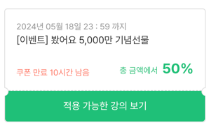
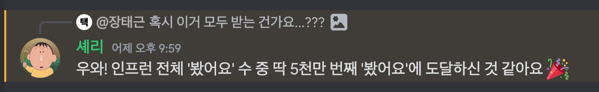

# 1일(수)

일찍 일어나 운동을 하고 하루를 시작했다. 오랜만에 맞이하는 아침 공기에 기분이 좋았다. 운동을 마치고 오랜만에 TV를 켰다.
마침 [EBS에서 완벽주의](https://ebr.ebs.co.kr/classe/detail/446543/40009039)를 주제로 이야기를 풀어냈다. 항상 고민하는 문제인데 가볍게 보기 좋았다. 당분간 일찍
일어나서 주제에 대해 더 배우고 싶다.

운수 좋은 날이 떠올랐다. 할당된 학습량을 마치고 도서관에 다녀왔다. 근로자의 날이 빨간 날이 아니고, 학습관이 운영해서 평소와 같이 흘러감을 예상했다. 하지만 현실은 달랐다.
학습관만 운영하고 도서관은 모두 닫았다. 집에 바로 오지 않고 환승해서 왔는데 처한 상황이 재밌었다.

교보문고를 갔을 때도 같았다. 최근 출간된 [책](https://product.kyobobook.co.kr/detail/S000212999739)을 읽으러 갔는데 웃픈 상황이 이어졌다. 책이 포장되어 있어서 읽을 수
없었다. 지출에
제한이 없다면 바로 구매해서 읽으면 됐겠지만 현실은 녹록지 않았다.

오랜만에 발생한 예외상황들이 어이가 없으면서도 웃겼다. 전혀 다른 자극이었다.

익명 클래스와 람다를 주제로 글을 작성했다. 글을 매번 쓸 때마다 어렵다. 특히 오늘 과제는 추가로 작성하고 싶은 내용이 많았다. 일단 글을 가볍게 작성했다. 나눠서 작성하거나, 이미 작성한 글을 계속
수정해서 완성해야겠다.

오늘도 수고 많았다. 시간이 정말 빠르게 느껴지는데 내일도 한번 해보자.

# 2일(목)

어제에 이어서 일찍 일어났다. 운동을 마치고 EBS 완벽주의를 시청했다. 이전 강의보다 구체적인 사례를 들어 완벽주의란 무엇인지, 어떻게 극복할 수 있는지 이야기를 풀어갔다.
강의를 보면서 잘하고 싶은 마음에 시작을 하지 못했던 상황이 떠올랐다. 욕심이 많았구나. 어떻게 이 문제에서 벗어날 수 있을까 오래 고민했던 사실이 지금의 나를 만들었다고 느꼈다.

완벽주의에서 벗어나는 습관

1. 사과하기
2. 매일의 작은 성공을 기록하기

이전보다 성숙해진 것 같아 흐뭇했다.

과제가 해결되지 않아서 고민이 깊었다. 육안으로 확인했을 때 시나리오대로 구현했다고 생각했는데 정작 실행되지 않았다. 피곤함이 몰려왔다. 무엇을 몰라서 동작하지 않는 걸까? 차분하게 다시 한번
생각해 보자. 아는 것과 모르는 것을 구분할 기회가 주어졌다. 당일에 해내지 못해서 분하다.

# 3일(금)

오늘은 코드를 작성하는 시간보다 쉬는 시간이 많았다. 해결되지 않는 문제를 어떻게든 해결하고 잠들었다. 그런데 눈을 떠보니 저녁이었다. 냉정하게 컨디션을 잘 관리하지 못했다.
정신도 없었다. **금요일인지 몰랐고, 무엇을 해야 하는지 머릿속에 구상되지 않았다. 알고 보니 Live Q & A 참여 이벤트가 있었다.** 정신을 차려야겠다고 생각했다. 일정에 등록해서 알람을 받아야겠다.

오랜만에 저녁에 운동을 했다. 최근 휴대폰을 가지고 나오지 않았는데 오랜만에 가지고 나와서 노래도 들었다. 노래와 함께 달리면 즐거울 줄 알았는데 그건 아니었다. 오히려 휴대폰이 주머니에
있는 게 불편했다. 제일 별로였던 점은 운동을 하며 어떻게 문제를 해결할지, 무엇을 할지 생각을 하는 편인데 노래를 들으니 생각이 멈췄다. (심취해서) 가급적 휴대폰을 들고 나오지 말아야겠다.

이제 주말이다. 글을 많이 작성해야 할 것 같은데 잘해보자!

# 4일(토)

재충전이 필요하다. 아무것도 하고 싶지 않은 날이다. 일의 우선순위를 나누지 못할 때 쉬어야 할 때가 찾아왔다고 느낀다. 하루종일 잠들어서 할 말이 없다. 이런 날도 있는 거지. 평일이 아니라서 다행이다.

# 5일(일)

맘 편하게 오늘까지 쉬었다. 가만있어도 잠이 오고 피곤하다. 푹 잔 것 같은데 아닌가 보다. 다시 게으른 모습을 보이지 않을까 걱정된다.

스터디 회고를 작성했다. 평소회고를 작성하듯 가볍게 작성하면 될 줄 알았는데 의외로 양식이 있었다. 앞으로는 매일 간단하게 정리를 해야겠다. 오늘은 일찍 잠에 들었으면 좋겠다. 다음 주를 버리고 싶지 않다.

# 6일(월)

무기력함을 느낀다. 몸도 좋지 않고 전체적으로 컨디션이 별로다. 오전에 간단한 운동과 공부를 해두고 오후에는 쉬었다. 썩 마음에 들지 않지만 어쩔 수 없다 생각한다. 힘내.

# 7일(화)

여전히 피곤하다. 왜 모든 게 귀찮을까. 오랜만에 운동을 쉬었다. 이렇게 운동도 하지 않은 건 오랜만이다.

옷을 살 때 이제는 몸에 맞게 사야겠다고 느꼈다. 옷을 크게 입는 걸 좋아했다. 그런데 옷이 크니깐 살 걱정 없이 먹기만 한 것 같다. 자기 관리를 위해서라도 맞는 옷을 사야겠다.

# 8일(수)

오래 쉬었는데 몸이 아직 불편하다. 그래도 계속 쉬다 보니깐 피곤함은 많이 덜어냈다. 스터디 진도가 빠르지 않아서 다행이다. NestJS도 해야 하고... 할 일이 많은데 몸관리를 못해서 마음 아프다.
좋은 몸상태로 다시 시작하고 싶다.

# 9일(목)

스터디도 어느새 절반이 지났다. 이번주 행보가 만족스럽지 않다. 약 일주일을 쉬었는데 꾸준하지 못했다. 처음 스터디를 신청했던 의미도 퇴색되고 과제해결에 급급했다.
이미 지나간 하루들은 돌아오지 않는다. 지금 이 순간부터라도 남은 2주를 의미 있게 보내자.

어디서부터 피로가 누적되었는지 모르겠다. 운동도 쉬고 다시 일찍 잠에든 것 같은데 회복되지 않는다. 혼자 생각만 하고 있었는데 미용실에 가서 심각함을 알았다. 디자이너 선생님과 대화를 하며
머리를 자르는게 일상이었다. 그런데 오늘은 피곤함이 드러났는지 말을 별로 걸지 않으셨다. 표내고싶지 않았는데 티 났나보다.

# 10일(금)

오랜만에 강의를 들었다. 어렵다. 할만하다 쉽다는 말을 연신 내뱉어봤지만 실상은 그렇지 않았다. 몸이 여전히 아프다. 오늘 느낀 점은 운동을 쉬는 게 오히려 안 좋은 습관이 생기는 것 같다.
피로도 전혀 회복되지 않고 스트레스 관리를 오히려 못하는 느낌이 든다. 자고 일어나서 가벼운 산책을 하며 하루를 시작해야겠다.

# 11일(토)

오랜만에 푹 자고 일어났다. 지치고 쉬고 싶었지만 더 이상 나태하게 지낼 수는 없다는 생각에 바로 산책을 나갔다. 산책을 하니 응어리가 풀리는 기분이었다. 시작이 좋다.

남은 과제를 풀고 있다. 한 번에 풀리지 않아서 재밌다.

잠이 중요하다고 다시 한번 느꼈다. 푹 자고 일어나서 산책을 해서 그럴까? 기분 좋은 하루를 보냈다. 걱정도 많고 못하겠다는 생각이 많이 들었는데 오늘은 달랐다. 욕심부리지 말아야지.

# 12일(일)

2주 차가 끝이 나고 발바닥(회고)을 작성했다. 시간소모를 고려하여 작성할 내용을 준비한 점이 도움 됐다. 확실히 시간이 많이 줄었다. 이번주에 어려운 내용을 배웠다는 걸 다시 되새길 수 있는
시간이었다. 어렵지만 재밌다. JavaScript, NestJS 환경에서는 어떻게 문제를 해결했는지 녹여내는 과정이 필요하다.

이번주는 오늘 할 일을 내일의 나에게 미루는 상황이 많았다. 스트레스의 연속이었는데 끝내 문제를 발견하고 원상태로 복구시켜서 다행이다. 앞으로도 탐구하며 지내야지.

# 13일(월)

녹슨 기계가 다시 동작하는 기분을 느꼈다. 12시 이전에 잠들고 4시에 일어났더니 개운했다. 뒹굴거리다 가볍게 운동을 하고 다시 달리기를 시작했다. 일주일 만에 달리는 3km는 역시 힘들었다.
하지만 역시 성취감은 엄청났다. 금방 지치기 일쑤였지만 끝내 웃으며 집에 들어왔다.

가슴이 뛰었다. 잠에 들지 않기 위해 쉬는 시간마다 산책을 나갔다. 돌아오는 길이 아름다웠고 친구들이 보고 싶었다. 벽을 허물기 위해 겸손하게 노력해야겠다는 생각이 들었다.

5월들어 손에 꼽을정도로 만족스러운 하루를 보냈다. 수고했어, 오늘도

# 14일(화)

아름다운 하루였다. 시간을 쪼개서 보내니 하루가 길게 느껴졌다. 휴대폰이 없고 통제를 받으니 책이랑 친해졌던 군생활이 떠올랐다. 부작용이 두려워 강하게 통제하고 있지는 않지만 포모도로의
효과는 굉장했다. 1분 1초 흘러가는 게 눈으로 보이니 집중을 안 할 수가 없다. 미루고 하던 일을 하루에 얼마나 해치웠는지 모르겠다. 탈 나지 않았으면 좋겠다.

# 15일(수)

비가 내렸다. 정신없는 하루를 보냈다.

## 비

잡념이 많고 부산했다. 생산성 저하가 눈으로 보였다. 산책을 나가지 못해서 문제가 발생했다고 생각한다. 평소 가볍게 산책을 하며 다음을 준비했다. 하지만 비가 내려서 산책을 나갈 수 없었다.
누워서 쉬는 행동으로 다음을 준비할 수 없었다. 문제를 발견해서 좋은데 어떻게 해결해야 할지 찾지 못했다. 상태가 지속되면 장마가 두려울 것 같다. 해결해야 할 문제가 생겼다.

## 16일(목)

불태웠다. 마지막 과제를 구현하는데 온 신경을 쏟았다. 구현하면서 느낀 점이 많다.

- 구현능력이 의외로 괜찮다.
- [TDD(Test Driven Development)](https://product.kyobobook.co.kr/detail/S000001032985)를 실천할 때 리팩터링의 중요성을 왜 이야기하는지 알았다.
- 기본기를 다져서 언어를 활용하고 싶다.

여유를 가지면서 구현하다가 사실상 하루 만에 다시 전부 구현했다. 시간에 쫓기며 급급하게 개발했는데 즐거웠다. Green 상태를 보니 마음이 편했다.

> 과제가 끝났을 때 리팩터링 하지 않고 중복을 범한 코드를 보고 탄식을 금치 못했다.

운동도 잘하고 있고 현재까지 건강한 습관으로 버티고 있다. 웃음이 많다. 회고만 당일에 작성하면 더 좋을 것 같다!

# 17일(금)

다사다난한 하루를 보냈다. 오전부터 시작해서 밤까지 다양한 이벤트가 찾아왔다.

## 5,000만의 사나이

강의를 듣는데 모달창 떠서 당황했다. 우연히 이벤트에 당첨됐다. 비공개로 진행된 이벤트인 것 같은데 당첨돼서 기분이 좋았다.

물론 전체강의를 50% 할인해 주는 파격적인 쿠폰을 돈 없어서 쓰지 못하는 건 가슴 아프다.

## 공부법

많은 사람들이 조언하는 공부방법에 동감했다. 나만의 공부방법을 만들 때 가장 많이 접했던 이야기는 함께 공부하고, 이력서를 지원하라는 의견이었다. 하지만 의견에 동의하지 않는 부분도 있었다.

1. 함께 공부하라

지식공유를 하며 본인이 무엇을 알고 모르는지에 대해 알고, 문제에 대해 다른 사람은 어떤 의견을 가지고 있는지 나누면서 성장하는 방법이 가장 빠르기 때문에 추천한다고 생각한다.
하지만 **이상적인 스터디**일 경우에만 적합하다고 생각했다. 동아리, 국비 조별프로젝트를 경험하며 이상과 현실의 차이를 느꼈다. 긍정적인 점도 물론 있었지만 부정적인 점이 많았다. 하지만 의견이 조금 바뀌었다.
실무자 또는 본인의 경험을 이야기하는 사람이 단 한 명이라도 있다면 괜찮지 않을까? 지금까지 쇄국정책을 실천하며 공부하지는 않았는가 싶다.

2. 이력서를 지원하라.

전적으로 동의한다. 하지만 용기가 나지 않았다. 문제하나 제대로 풀지 못해서 자신감이 없었다.

### 코드리뷰

인생처음으로 코드리뷰를 받았다. 마지막에 요청드려서 다른 신청자분의 코드를 보는데 한없이 작아졌다. 이해가 잘 안 되는 개념도 있었고 관점에 따라 문제가 발생할 수 있는 코드라는 사실을 들었다. 괜히 신청했나는
생각도 들었고 즐거웠던 한 주의 기세가 한풀 꺾였다.

복합적인 감정이 오갔다. 코드리뷰를 신청하지 않았다면 어땠을까 하는 생각도 들었다. 긍정적으론 무엇을 모르는지 알게 돼서 좋았지만 아직 부족하다는 생각으로 풀이 죽었다. 리뷰받은 내용을 바로 적용하면 가장
이상적이지만 계속하기엔 좌절하고 습관마저 망칠 것 같아 얼른 잠에 들었다.

## 18일(토)

늦잠을 잤다. 일찍 잠들었는데 눈이 떠지지 않았다. 리뷰의 여파가 아침까지 이어졌다. 그대로 하루를 쉴 것 같아서 바로 산책을 나갔다. 의자에 앉아서 여유롭게 산책로를 바라보고 책도 읽으니 한결 기분이 괜찮아졌다.
걱정이 너무 많았다. 광합성이 정답이었다. 이외에도 쇼펜하우어 아포리즘의 문구를 봤다.

> 남들보다 뒤처지는 것 같아도 그냥 해라 - 아르투어 쇼펜하우어 -

위로를 기대하고 찾아본 것도 아니고 우연히 본 게시물이었는데 울림이 있었다. 빨리 털어내서 다행이다.

## 19일(일)

스터디가 끝이 났다. 이제 수료식만 남겨뒀다. 전역을 앞둔 말년병장의 기분이다. 구현하는 과정이 대부분 즐거웠지만 모르는 점을 드러나서 슬프기도 했다. 하지만 다시 생각해 보면 지금 발견해서 다행이다.
이제는 어떤 과정을 선택할지 고민이다. 마음은 취업을 하고 싶은데 어떻게 될지 아무도 모른다. 화이팅!

## 20일(월)

휴식하며 하루를 보냈다. 좋은 말로 휴식이지, 운동 외에는 아무 일도 하지 않았다. 다시 한번 곱씹어봤는데 코드리뷰랑은 상관없는 일이었다. 그동안의 행적을 돌아보면 금요일 저녁부터 월요일까지
쉬어갔다. 좋은 습관이라고 생각하지 않는다. 다시 살아가야지. 어떻게든 구현해서 끝내야겠다. 할 수 있다.

## 21일(화)

운동하는 순간만 행복하다. 재밌는 일 뭐 없나? 뭘 해야 할지 갈피를 못 잡겠다.

## 22일(수)

하루가 24시간이 아니라 6시간으로 느껴진다. 무의미하게 흘러가는 시간이 많다. 집중도 안되고 절망적인 이야기만 하게 된다. 하루 중 제일 의미 있게 보낸 시간은 운동이다. 일어나서 바로 운동을
하지는 않았지만 색다른 장소에서 운동을 하니 기분이 좋았다. 만약 휴대폰을 가지고 나왔다면 운동에 집중하지 못했겠지. 당분간 휴대폰을 더욱 멀리해야겠다. 삶이 답답하다.

## 23일(목)

오랜만에 기분이 좋았다. 하루가 6시간처럼 느껴졌는데 오늘은 10시간으로 느껴졌다. 엄청난 성과다. 일찍 일어나서 운동을 시작했다. 최근 저녁에 운동을 자주 했는데 오랜만에 아침운동으로 하루를 시작하니 산뜻했다.
아침운동이 긍정적인 하루를 보내는데 큰 역할을 한다는 점을 다시 한번 느꼈다.

생산성이 좋지는 않았다. 덤벙거리기도 하고, 귀찮은 일을 미루기도 했다. 하지만 그래도 어제보다 좋아진 모습에 기분이 좋았다.

> 객체지향 설계는 애플리케이션에 필요한 협력을 생각하고 협력에 참여하는 데 필요한 행동을 생각한 후 행동을 수행할 객체를 선택하는 방식으로 수행된다. 행동을 결정한 후에야 행동에 필요한 정보가 무엇인지를 고려하게
> 되며 이 과정에서 필요한 상태가 결정된다. 따라서 먼저 객체의 행동을 결정하고 그 후에 행동에 적절한 상태를 선택하게 된다.

저녁에는 도서관에 다녀왔다. 오고 가는 길에 책을 읽었는데 재밌었다. 시간 때우기로 동영상을 볼 때보다 확실히 좋다. 사회적인 관계만 아니었다면 휴대폰을 없애지 않았을까 싶다.

아무것도 하고 싶지 않고 무기력할 때는 산책을 나가야겠다. 땀 흘리며 재정비해야지.

## 24일(금)

이번달 처음으로 금요일을 생산적으로 보냈다. 리팩터링, 인증과 인가를 학습했는데 어려웠다. 나만의 애플리케이션을 구현할 때 가장 어려워할 것 같다. 하지만 어쩌겠나. 이 또한 이겨내야지. 반복해서
학습하면 결국 해결할 거라고 믿는다. 어려웠지만 재밌었다.
