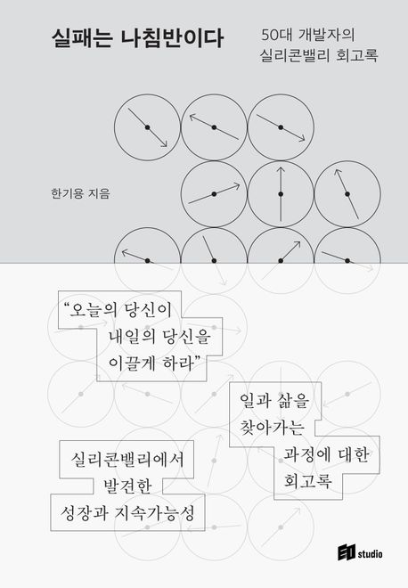

> 인간관계는 수단이 아닌 목적이어야 한다고, 실패는 나침반이라고 나 자신에게 전해주고 싶다.

우아한테크세미나와 컨퍼런스 참여 후기를 접했다. 둘은 한기용님이 발표자라는 공통점을 가지고 있었다.

세미나 시청 전 한기용 님에 대해 소문만 듣고 자료를 접한적은 없었다. 하지만 이야기를 듣는 순간 배경이 궁금해졌다. 연달아 다른 영상도 시청했지만 짧게 느껴졌다. 결국 책을 선택했다.

## 고등학생, 꽃길만 걷게 해 줄게

2012년, 좋지 않은 성적으로 특성화고에 진학했다. 중학교 때 성적관리를 하지 못한 아쉬움에 고등학생 때는 다양한 활동을 하자고 마음먹었다. 돌이켜 생각하면 추상적이고, 구체적인 계획도 없었는데 졸업할 땐
학생대표로 상도 받고 할 수 있는 활동은 다한 것 같아 만족스러웠다. 관심도 많이 받으면서 선생님께서도 신경을 써주셔서 괜찮은 스타트업에 들어갔다.

## 공백의 10년, 운이 좋았지

운이 좋았다. 더할 나위 없는 직장에 취업했다. 걸어서 10분 거리였고 당시 개발자 인식을 생각하면 회사 분위기도 좋았다. 꿈을 펼치기 좋은 환경이었다. 꽃길이 보였다.

하지만 차가운 현실을 마주했다. 재정은 급격하게 어려워졌고 월급이 밀렸다. 결국 권고사직을 당했다. 병역특례를 기대하던 19살, 1년 차의 나에겐 청천벽력 같은 소식이었다.

직무를 살려 이직하는 방법도 있었지만 당시의 나는 이겨낼 힘이 없었다. 한 번도 하고 싶은 일에 대해 고민해 본 적 없고 다른 사람과 비교하며 지냈다. 나에게 집중하기보단 보이는 모습이 중요했다. 특성화고에서
졸업하면 대학보다 취업을 선택하는 게 정석이라고 생각했다. 규격 외의 삶을 살고 싶지 않았다. 결국 직무를 살리지 않고 입대를 선택했다.

군생활을 마치고 본격적인 방황이 시작됐다. 병들고 지친 나를 이끌어주는 사람이 많았지만 굳게 닫힌 마음을 열 수 없었다. 오랜 시간 움츠렸다.

## 2023년, 27살, 안식년

드디어 선택의 갈림길에 섰다. 아르바이트도 즐거웠지만 직업을 가지고 싶었다. 방황을 할 때는 고민이 없었다. 하지만 직업을 선택하기 위해선 대화가 필요했다.

살아생전 처음으로 나와 대화를 시작했다. 다행히도 이미 오랜 방황을 했기 때문에 자료가 충분했다. 처음부터 대화가 잘되지는 않았지만 계속 질문하고 답했다. 결국 무엇을 하며 어떻게 살고 싶은가라는 질문에 답할 수
있었다.

살고자 하는 의지를 보이자 묵묵히 지켜봐 주던 지인의 도움을 받았다. 항상 피하기만 했는데 그날따라 내밀어 주던 손이 반갑게 느껴졌다. 마침내 복귀를 결심했다.

외줄 타기가 시작됐다. 개발자가 아니더라도 다른 직업을 선택하면 그만이다라는 생각을 했다. 걱정과 의심도 많았는데 무식하게라도 했다. 다른 사람들이 보면 전혀 효율적이지 않은 공부방법이다라고 조언할만한
방법들이 나에겐 너무나 소중한 경험들로 남았다.

[이전 글](https://devmeeple.github.io/2023/)에서 배경 없이 핵심만 짧게 작성했는데, 꾸준함을 목표로 잡았다. 목표로 설정한 이유는 방황 덕분이다. 단기 레이스에서는 좋은 성적을
받을 수 있었지만 한 번도 장기 레이스를 완주 한 경험이 없었다. 지금 도전하지 않으면 또 다른 위기가 찾아와도 흔들리고 쓰러질 것 같았다. 이겨낼 힘을 기르기 위해 꾸준함을 선택했다.

## 마치며

기존과 다른 형식으로 서평을 작성한 이유는 책이 나에게 선사해 준 경험 덕분이다. 문장들이 여러 질문을 던져 자연스레 성찰로 이어졌다.취업에 성공하면 담고싶어 미뤘던 내용인데, 구성이 훌륭해서 지금 작성하지 않을
수 없었다.

비슷한 내용의 책들 중 더욱 공감이 됐던 이유가 무엇일지 생각했다. 비슷하다고 생각한 책은 김창준님의 《함께 자라기》다.  
아마 한기용 님께서 20대 중반 본인에게 해주고 싶은 이야기를 담으셔서 그런 것 같다. 공감되는 내용들이 많았고 이후
만나 뵐 수 있는 기회가 생긴다면 감사하다는 말씀을 드리고 싶다.

직무와 상관없이 걱정, 의심등 방황을 하고 있다는 생각이 든다면 가볍게 읽기 좋다. 성찰하는 시간을 보내길 바라며 이 책을 추천한다.

#### <참고 자료>

- [유튜브 '\[6월 우아한테크세미나\] 글로벌 개발자로 성장하는 법'](https://www.youtube.com/live/Nb2RnQzxu4I?si=NZPPBOX-TFBY4Nc6)
- [인프런 '실리콘밸리에서 인정받는 개발자의 특징'](https://inf.run/9SRzN)
