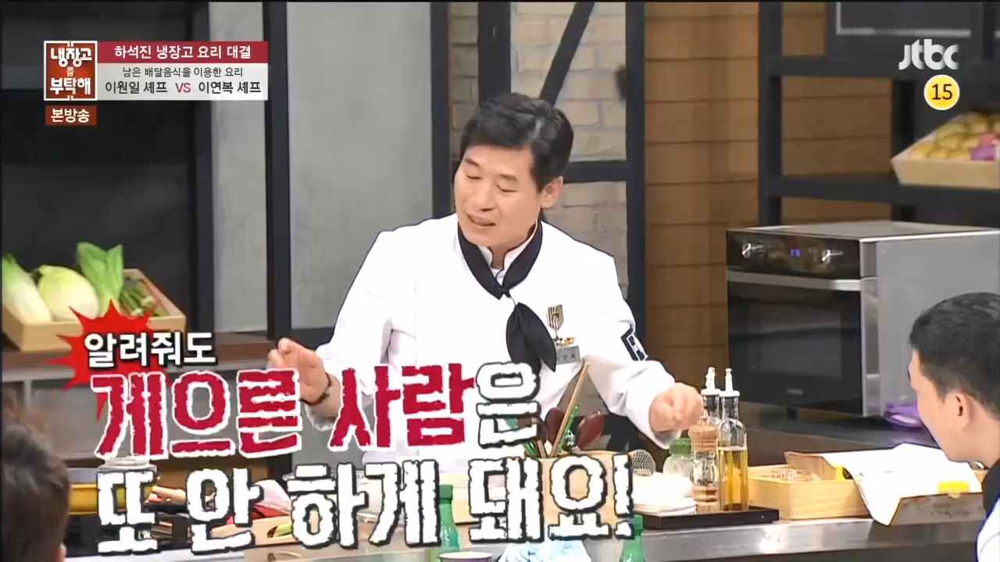

링위에 오른적은 한번도 없지만 여러 직업중에 왜 개발자를 선택하셨나요라는 질문을 던지곤 한다. 이전부터 지금까지 변하지 않은 한가지 사실은 한가지였다.

> 1. 기술로 다른 사람에게 도움이 되고 싶다.
> 2. 내가 조금 더 생각하고 고생하면 나뿐만아니라 미래의 사용자에게 도움이 되지않을까?

돌이켜 생각하면 굉장히 막연하다. 하지만 항상 가슴속에 품고 살았다. 지치고 힘들때 곁에서 묵묵히 도와준 서포터들이 많았다.

개발자를 준비하기 전 근무했던 카페는 반복작업이 많았다.

요일마다 패턴에 맞춰 이벤트 공지가 올라왔다. 패턴이 있었지만 작업은 수동으로 이뤄졌다. 혹여나 실수를 한다면 서비스를 이용하는 고객이 피해를 받는 구조였다.

아르바이트생이 아니라 카페 주인이 된다면 운영하고 싶은 방식이 있었다. 운이 좋게도 비슷한 생각을 가지신 사장님 밑에서 일했다. 일 할때 도움을 많이 받았다.

## 1인개발

신입 개발자를 채용할 때 서비스를 만들고 배포까지해본 경험을 많이 강조한다. 로컬서버에서만 구현해본 사람과 서비스를 운영해본 사람은 사고방식이 다를 수 밖에 없다.

> 1인 개발자로 가장 어려운 점은 동기부여를 유지하는 것이다. 말은 쉽지만 쉽지않다.

운이 좋게 관심 가지는 서비스를 활성화 시킬 수 있는 이벤트가 열렸다. 동기부여를 잃지 않을 도메인을 찾았다. 한번 구현해보자.

## 마치며

최대한 간단하게 구현할 생각이다. 시즌1의 목표는 게시판이다. 최소한의 필수기능만 구현하고 외부서비스를 이용하자.
