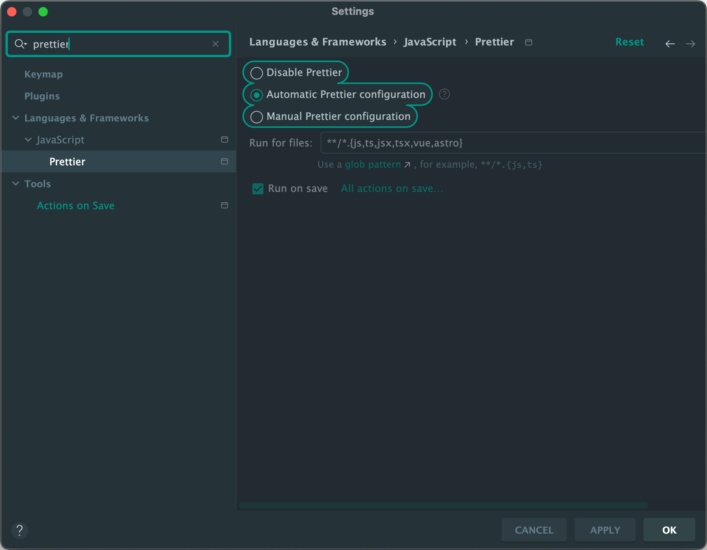
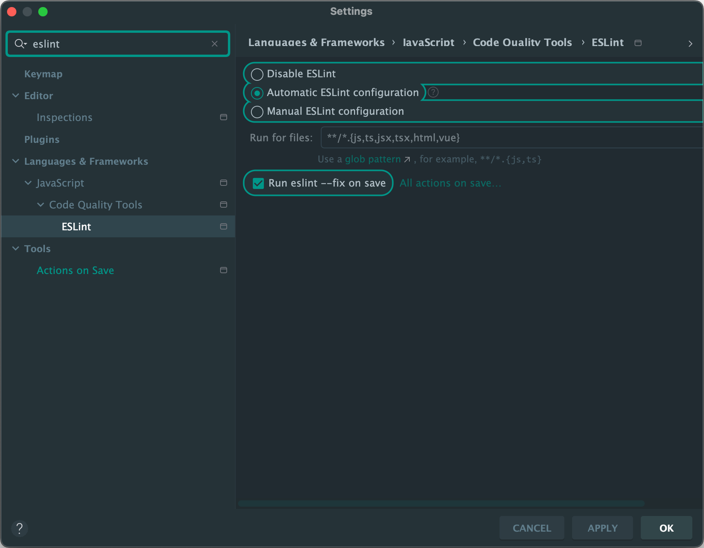

<p></p>

Java & Spring의 강세로 다양한 한글 자료를 찾아볼 수 있었지만 Node 환경에서 작성된 애플리케이션은 쉽게 찾아볼 수 없었다. 혹여 자료를 찾더라도 3가지의 문제에 직면했다.

1. 최신 문법을 지원하지 않거나 JavaScript로만 구현된 코드
2. 클라이언트 코드의 비중이 높음.
3. Express를 사용한다.

TypesScript & NestJS 조합의 웹 서비스 구현코드를 찾기란 하늘에 별따기다.

이제 막 시작하는, 비슷한 경험을 가진 사람들과 경험을 공유하고 도움이 되고자 시리즈를 시작하게 됐다.

## 0. 개발환경

- IDE: IntelliJ IDEA Ultimate
- Git Tools: Source Tree
- OS: Mac OS X
- NestJS 10.2.0
- Node 20
- Yarn

다른 도구를 선택해도 좋다.

VSCode, Window, NPM 조합도 가능하다. 본인에게 편한 도구를 선택하자.

## 1. 프로젝트 시작하기

프로젝트를 시작하는 방법은 다양하다.

1. Nest CLI
2. Git clone
3. 직접 패키지를 다운하기

```shell
yarn add -g @nestjs/cli
nest new project-name
```

> 3가지의 방법 중 Nest CLI를 사용해서 프로젝트를 시작하는 편이다.

Nest CLI를 자주사용하기 때문에 전역으로 설치한다.

프로젝트를 만들었다면 IDE로 불러오자.

- SourceTree, GitHub 연결

## Prettier, ESLint

Nest CLI로 생성한 프로젝트는 이미 Prettier, ESLint가 설치되어 있다.

> ESLint와 Prettier를 사용하면 정적 코드 분석과 포맷팅을 적용할 수 있다.

IntelliJ에서 ESLint와 Prettier를 항상 사용할 수 있도록 추가설정이 필요하다.




프로젝트 전역에서 사용할 수 있도록 Automatic configuration & Run on save를 활성화 시킨자.

## 마치며
